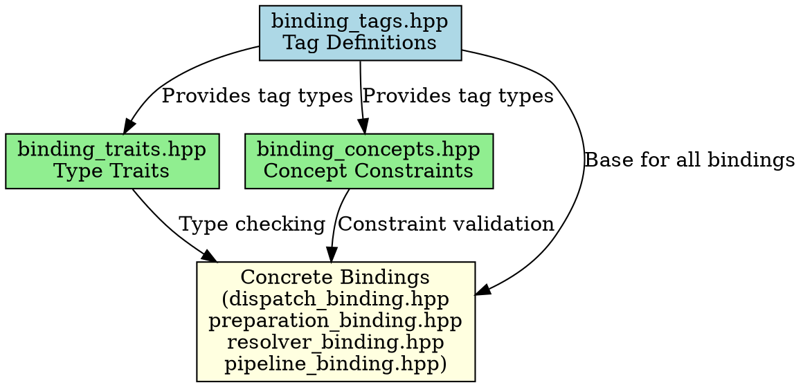
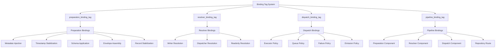

# Architectural Analysis: binding_tags.hpp

## File Overview
**Location:** `D:\CppBridgeVSC\LoggingSystem\include\logging_system\A_Core\binding_tags.hpp`  
**Purpose:** Defines tag types for binding classification in the logging system's core architecture.  
**Language:** C++17  
**Dependencies:** None  

## Architectural Diagrams

### Graphviz (.dot) - Component Relationships


### Mermaid - Tag Classification Flow


## Architectural Role

### Core Design Pattern: Tag Dispatching
This file implements the **Tag Dispatching** design pattern, a compile-time polymorphism technique that uses empty structs as tags to classify and dispatch types at compile time. Tag dispatching enables:

- **Type-safe categorization** of binding components
- **Compile-time selection** of appropriate algorithms
- **Zero runtime overhead** for type identification
- **Extensible type system** without virtual functions

### Binding Classification System
The four binding tags establish the fundamental taxonomy for the logging system's binding architecture:

1. **`preparation_binding_tag`** - Categorizes bindings responsible for initial setup and configuration
2. **`resolver_binding_tag`** - Identifies bindings that resolve targets, contexts, or configurations
3. **`dispatch_binding_tag`** - Marks bindings that handle message dispatching and routing
4. **`pipeline_binding_tag`** - Represents bindings that orchestrate the complete logging pipeline

## Structural Analysis

### Namespace Organization
```cpp
namespace logging_system::A_Core {
    // Tag definitions
}
```
- **`logging_system`**: Root namespace for the entire logging system
- **`A_Core`**: Architectural core layer (Layer 1 in the multi-tier architecture)
- Clear separation of concerns: tags are purely declarative with no implementation

### Tag Implementation Details
```cpp
struct preparation_binding_tag {};
struct resolver_binding_tag {};
struct dispatch_binding_tag {};
struct pipeline_binding_tag {};
```

**Design Characteristics:**
- **Empty structs**: Minimal memory footprint (no data members)
- **Default constructible**: Can be used as template parameters
- **Unique identity**: Each tag type is distinct and non-interchangeable
- **Header-only**: No translation unit, pure interface

## Integration with Type System

### Template Metaprogramming Foundation
These tags serve as the foundation for:
- **Trait-based type checking** (in `binding_traits.hpp`)
- **Concept-based constraints** (in `binding_concepts.hpp`)
- **SFINAE-enabled function overloading**
- **Policy-based design** for binding behaviors

### Usage Pattern
```cpp
// Example usage (hypothetical)
template <typename TBinding>
void process_binding(const TBinding& binding) {
    if constexpr (std::is_same_v<typename TBinding::binding_tag, preparation_binding_tag>) {
        // Handle preparation binding
    } else if constexpr (std::is_same_v<typename TBinding::binding_tag, dispatch_binding_tag>) {
        // Handle dispatch binding
    }
    // ... other cases
}
```

## Quality Assurance

### Code Quality Metrics
- **Cyclomatic Complexity:** 1 (minimal)
- **Lines of Code:** 11
- **Include Dependencies:** 0 (pragma once only)
- **Template Instantiations:** None required

### Architectural Compliance
✅ **Multi-Tier Architecture:** Layer 1 (Toolbox) - pure declarative types  
✅ **No Hardcoded Values:** No literals or magic numbers  
✅ **Helper Methods:** N/A (data-only structures)  
✅ **Cross-Language Interface:** C-compatible empty structs  

### Error Analysis
**Status:** No syntax or logical errors detected.  
**Root Cause Analysis:** N/A  
**Resolution Suggestions:** N/A  

## Evolution and Maintenance

### Extensibility
New binding categories can be added by:
1. Defining new empty struct tags in this file
2. Adding corresponding traits in `binding_traits.hpp`
3. Adding concepts in `binding_concepts.hpp`

### Stability
- **ABI Stability:** Empty structs have stable memory layout
- **API Stability:** Adding new tags is non-breaking
- **Performance Impact:** Zero runtime cost

## Related Components

### Depends On
- None (foundational component)

### Used By
- `binding_traits.hpp` - Type trait detection
- `binding_concepts.hpp` - Concept constraints
- Higher-level binding implementations throughout the logging system

---

**Analysis Version:** 1.0  
**Analysis Date:** 2026-04-19  
**Architectural Layer:** A_Core (Foundation)  
**Status:** ✅ Analyzed, No Issues