# Architectural Analysis: log_envelope.hpp

## Architectural Diagrams

### Graphviz (.dot) - Envelope Model Architecture

```dot
digraph log_envelope_architecture {
    rankdir=TB;
    node [shape=box, style=filled, fillcolor=lightblue];

    log_envelope [label="LogEnvelope<TContent, TMetadata>\nPrepared Envelope Template"];

    node [shape=box, style=filled, fillcolor=lightyellow];
    envelope_components [label="Envelope Components"];

    log_envelope -> envelope_components [label="contains"];

    subgraph cluster_components {
        label="Core Components";
        color=lightgrey;
        content [label="content: TWrappedContent\nTyped content family"];
        metadata [label="metadata: TMetadata\nAdministrative metadata"];
        timestamp [label="content_updated_at_epoch: int64\nContent update timestamp"];
        schema_id [label="content_schema_id: string\nSchema identity"];
    }

    envelope_components -> content;
    envelope_components -> metadata;
    envelope_components -> timestamp;
    envelope_components -> schema_id;

    node [shape=box, style=filled, fillcolor=lightgreen];
    operations [label="Envelope Operations"];

    log_envelope -> operations [label="provides"];

    subgraph cluster_operations {
        label="Operation Methods";
        color=lightgrey;
        constructors [label="Constructors\nDefault + Parameterized"];
        assign_content [label="assign_content(TContent)\nContent replacement"];
        assign_metadata [label="assign_metadata(TMetadata)\nMetadata assignment"];
        assign_schema_id [label="assign_content_schema_id(string)\nSchema identity"];
        refresh_timestamp [label="refresh_content_timestamp()\nTimestamp update"];
    }

    operations -> constructors;
    operations -> assign_content;
    operations -> assign_metadata;
    operations -> assign_schema_id;
    operations -> refresh_timestamp;

    node [shape=box, style=filled, fillcolor=orange];
    type_aliases [label="Type Aliases & Specializations"];

    log_envelope -> type_aliases [label="enables"];

    subgraph cluster_aliases {
        label="Built-in Aliases";
        color=lightgrey;
        level_envelopes [label="Debug/Info/Warn/Error/Fatal/Trace\nLogEnvelope<TSchema, LogMetadata>"];
        default_envelopes [label="DefaultDebug/Info/Warn/Error/Fatal/Trace\nLogEnvelope<DefaultSchema, LogMetadata>"];
    }

    type_aliases -> level_envelopes;
    type_aliases -> default_envelopes;

    node [shape=box, style=filled, fillcolor=lightcyan];
    integration [label="Integration Points"];

    log_envelope -> integration [label="used in"];

    subgraph cluster_integration {
        label="Usage Context";
        color=lightgrey;
        envelope_assembly [label="Envelope Assembly\nEnvelope creation"];
        record_creation [label="Record Creation\nEnvelope containment"];
        registry_admission [label="Registry Admission\nPrepared package"];
    }

    integration -> envelope_assembly;
    integration -> record_creation;
    integration -> registry_admission;
}
```


### Mermaid - Envelope Model Flow
```mermaid
flowchart TD
    A[LogEnvelope<TContent, TMetadata>] --> B[Template Structure]

    B --> C[content: TWrappedContent]
    B --> D[metadata: TMetadata]
    B --> E[content_updated_at_epoch: int64]
    B --> F[content_schema_id: string]

    C --> G[Typed Content Family]
    D --> H[Administrative Metadata]
    E --> I[Content Update Timestamp]
    F --> J[Schema Identity]

    A --> K[Operation Methods]

    K --> L[Constructors]
    K --> M[assign_content()]
    K --> N[assign_metadata()]
    K --> O[assign_content_schema_id()]
    K --> P[refresh_content_timestamp()]

    L --> Q[Default + Parameterized]
    M --> R[Content Replacement + Auto-timestamp]
    N --> S[Metadata Assignment]
    O --> T[Schema Identity Setting]
    P --> U[Manual Timestamp Refresh]

    A --> V[Type Specializations]

    V --> W[Level Envelopes]
    V --> X[Default Envelopes]

    W --> Y[Debug/Info/Warn/Error/Fatal/Trace\nLogEnvelope<TSchema, LogMetadata>]
    X --> Z[DefaultDebug/Info/Warn/Error/Fatal/Trace\nLogEnvelope<DefaultSchema, LogMetadata>]

    A --> AA[Integration Points]

    AA --> BB[Envelope Assembly]
    AA --> CC[Record Creation]
    AA --> DD[Registry Admission]

    BB --> EE[Envelope construction with metadata/timestamp]
    CC --> FF[Envelope contained in LogRecord]
    DD --> GG[Prepared package for registry admission]

    EE --> HH[Prepared semantic package]
    FF --> II[Registry slot entry]
    GG --> JJ[Admission-ready envelope]
```

## File Overview
**Location:** `D:\CppBridgeVSC\LoggingSystem\include\logging_system\B_Models\log_envelope.hpp`  
**Purpose:** Defines the unified envelope model for the consuming pipelines - the prepared package before registry admission.  
**Language:** C++17  
**Dependencies:** `content_contracts.hpp`, `log_metadata.hpp`, `utc_now_iso.hpp`  

## Architectural Role

### Core Design Pattern: Unified Envelope Template
This file implements **Prepared Envelope Pattern**, providing a unified template that represents the semantic prepared package produced by envelope assembly. The `LogEnvelope<TWrappedContent, TMetadata>` serves as:

- **Prepared envelope template** containing content, metadata, timestamp, and schema identity
- **Registry admission package** - the complete prepared entry before record creation
- **Type-safe content specialization** through template parameters while maintaining structural unity
- **Content-update timestamp tracking** that refreshes automatically on content changes

### B_Models Layer Architecture (Data Models)
The `log_envelope.hpp` provides the envelope model that answers:

- **What is the prepared package produced by envelope assembly before registry admission?**
- **How can the envelope remain structurally unified while preserving type-safe level/content-family specialization?**
- **How can content-update time be represented numerically and refreshed automatically when envelope content changes?**
- **What is the boundary between envelope (prepared package) and record (registry slot)?**

## Structural Analysis

### Envelope Template Structure
```cpp
template <typename TWrappedContent, typename TMetadata>
struct LogEnvelope final {
    using WrappedContentType = TWrappedContent;
    using MetadataType = TMetadata;

    TWrappedContent content{};
    TMetadata metadata{};
    std::int64_t content_updated_at_epoch{0};
    std::string content_schema_id{};

    // Constructors and operations...
};
```

**Design Characteristics:**
- **Template parameters**: `TWrappedContent` and `TMetadata` for type-safe specialization
- **Four core fields**: Content, metadata, timestamp, schema identity
- **Automatic timestamp refresh**: Content changes automatically update timestamp
- **Type aliases**: `WrappedContentType` and `MetadataType` for introspection

### Envelope Operations
```cpp
// Construction
LogEnvelope() = default;
LogEnvelope(TWrappedContent, TMetadata, std::string) // Auto-timestamp

// Content management
void assign_content(TWrappedContent) // Auto-refreshes timestamp
void assign_metadata(TMetadata)
void assign_content_schema_id(std::string)
void refresh_content_timestamp() // Manual timestamp refresh

// Internal timestamp helper
static std::int64_t current_epoch_millis() // UTC epoch milliseconds
```

**Operation Design:**
- **Automatic timestamping**: Content assignment automatically refreshes timestamp
- **Manual override**: `refresh_content_timestamp()` for explicit updates
- **Move semantics**: Efficient assignment of content and metadata
- **UTC timing**: Uses `utc_now_epoch_millis()` for consistent timing

### Type Aliases and Specializations
```cpp
// Level-specific envelope templates
template <typename TSchema>
using DebugLogEnvelope = LogEnvelope<LogDebugContent<TSchema>, LogMetadata>;

// Built-in default envelopes
using DefaultDebugLogEnvelope = DebugLogEnvelope<DefaultDebugSchema>;
using DefaultInfoLogEnvelope  = InfoLogEnvelope<DefaultInfoSchema>;
// ... similar for all levels
```

**Specialization Strategy:**
- **Level-specific aliases**: Each logging level has its envelope type
- **Default convenience**: Pre-built aliases using default schemas
- **Template composition**: Combines content families with metadata model
- **Type safety**: Compile-time enforcement of envelope compatibility

### Include Dependencies
```cpp
#include <cstdint>    // For int64_t timestamp type
#include <string>     // For schema_id string type
#include <utility>    // For std::move move semantics

#include "logging_system/B_Models/content_contracts.hpp"  // Content families
#include "logging_system/B_Models/log_metadata.hpp"       // Metadata model
#include "logging_system/B_Models/utc_now_iso.hpp"        // Time utilities
```

**Architectural Dependencies:** Links to other B_Models components for complete envelope definition.

## Integration with Architecture

### Envelope in Pipeline Flow
The envelope model integrates into the pipeline flow as follows:

```
Content Families → Metadata → Envelope Assembly → LogEnvelope → Record Creation
      ↓              ↓              ↓              ↓              ↓
   Typed Content → Admin Metadata → Assembly Process → Prepared Envelope → Registry Slot
   Schema + Data → Writer Identity → Timestamp + Injection → Semantic Package → Admission
```

**Integration Points:**
- **Envelope Assembly**: Creates `LogEnvelope` instances with content, metadata, timestamp
- **Record Creation**: `LogEnvelope` becomes the core content of `LogRecord`
- **Registry Admission**: Prepared envelope is admitted to registry as complete package
- **Pipeline Operations**: May produce or consume envelope instances

### Usage Pattern
```cpp
// Envelope assembly from components
LogInfoContent<MySchema> content{my_schema_data};
LogMetadata metadata{"writer_service_v1"};

LogEnvelope envelope{
    content,
    metadata,
    "my_schema_v1"  // schema_id (timestamp auto-generated)
};

// Content updates automatically refresh timestamp
envelope.assign_content(LogInfoContent<MySchema>{updated_data});

// Manual timestamp refresh if needed
envelope.refresh_content_timestamp();

// Use in record creation
LogRecord record{some_identity, envelope, RecordState::Pending};
```

## Quality Assurance

### Code Quality Metrics
- **Cyclomatic Complexity:** 1 (minimal, data structure with simple operations)
- **Lines of Code:** ~95 (template + aliases + operations)
- **Dependencies:** 6 headers (3 std + 3 internal)
- **Template Complexity:** Single template with type aliases

### Architectural Compliance
✅ **Multi-Tier Architecture:** Layer B (Models) - complex data structures  
✅ **No Hardcoded Values:** All configuration through template parameters  
✅ **Helper Methods:** Envelope operations and timestamp management  
✅ **Cross-Language Interface:** N/A (C++ template system)  

### Error Analysis
**Status:** No syntax or logical errors detected.  

**Architectural Correctness Verification:**
- **Template Design:** Proper template parameter usage and type aliases
- **Move Semantics:** Correct use of `std::move` for efficient assignment
- **Timestamp Logic:** Automatic refresh on content changes, manual override available
- **Type Safety:** Template specialization maintains type relationships
- **Memory Management:** Standard library handles memory automatically

**Potential Issues Considered:**
- **Template Instantiation:** Each envelope type requires explicit instantiation
- **Timestamp Precision:** Millisecond precision may need microsecond extension
- **Time Zone Handling:** UTC-only may need localization support
- **Content Validation**: No validation in envelope (belongs in preparation layer)

**Root Cause Analysis:** N/A (code is architecturally sound)  
**Resolution Suggestions:** N/A  

## Design Rationale

### Unified Envelope Template
**Why Unified Template Structure:**
- **Structural Consistency**: All envelopes have the same fundamental structure
- **Type Safety**: Template parameters enforce content-metadata compatibility
- **Semantic Clarity**: Clear separation between envelope (prepared) and record (slot)
- **Assembly Boundary**: Envelope represents the output of assembly phase

**Template vs Inheritance:**
- **Templates**: Zero runtime overhead, maximum type safety
- **Explicit Types**: Clear content-metadata relationships
- **Specialization**: Level-specific aliases provide convenient naming
- **Defaults**: Pre-built combinations for common use cases

### Content-Update Timestamp
**Why Content-Update Timestamp:**
- **Semantic Accuracy**: Timestamp represents when content was last meaningful
- **Automatic Refresh**: Content changes automatically update timestamp
- **Envelope Reusability**: Envelopes may be updated before registry admission
- **Query Support**: Timestamps enable time-based envelope operations

**Timestamp vs Object Creation:**
- **Content Update**: Represents meaningful content changes
- **Object Creation**: When envelope object was instantiated
- **Envelope Lifecycle**: Envelopes may exist longer than their current content
- **Query Semantics**: Content timestamp more useful for filtering/sorting

### Envelope vs Record Boundary
**Why Separate Envelope and Record:**
- **Semantic Difference**: Envelope is prepared package, record is registry slot
- **Reusability**: Envelopes may be prepared before slot assignment
- **State Separation**: Record adds slot state, envelope is stateless prepared data
- **Assembly Boundary**: Envelope completes assembly, record begins registry lifecycle

**Envelope Responsibilities:**
- **Content Containment**: Holds the typed content family
- **Metadata Integration**: Includes administrative metadata
- **Schema Identity**: Tracks content schema for validation
- **Timestamp Tracking**: Content update time for ordering

## Performance Characteristics

### Compile-Time Performance
- **Template Instantiation:** Per-envelope-type template instantiation
- **Type Resolution:** Complex template relationships require resolution
- **Include Chain:** Dependencies on multiple B_Models components
- **Optimization**: Template specialization enables full inlining

### Runtime Performance
- **Memory Layout:** Predictable memory layout through template specialization
- **Move Operations:** Efficient content and metadata assignment
- **Timestamp Generation:** Fast UTC epoch millisecond calculation
- **No Dynamic Allocation:** All operations use existing memory

## Evolution and Maintenance

### Envelope Extensions
Future expansions may include:
- **Additional Metadata**: Extended metadata fields beyond writer identity
- **Content Validation**: Optional envelope-level validation markers
- **Envelope Annotations**: Processing hints and routing information
- **Schema Evolution**: Version compatibility and migration markers
- **Performance Metadata**: Processing time and resource usage tracking

### Timestamp Enhancements
- **Microsecond Precision**: Support for higher-resolution timestamps
- **Monotonic Timestamps**: Alternative timing for relative measurements
- **Time Zone Support**: Localization beyond UTC-only
- **Timestamp Validation**: Sanity checks for timestamp values

### Type Specialization Evolution
- **Custom Metadata Types**: Beyond LogMetadata for specialized use cases
- **Envelope Traits**: Compile-time envelope property detection
- **Envelope Composition**: Building complex envelopes from simpler ones
- **Envelope Serialization**: Cross-language envelope representation

### What This File Should NOT Contain
This file must NOT:
- **Validate Content**: Validation belongs in preparation layer
- **Inject Metadata**: Metadata injection belongs in assembly
- **Generate Timestamps**: Time generation belongs in utilities
- **Manage State**: State management belongs in records
- **Perform I/O**: Data-only, no external operations

### Testing Strategy
Envelope model testing should verify:
- Template instantiation works for all envelope type combinations
- Constructor operations correctly initialize all fields
- Content assignment automatically refreshes timestamps
- Metadata and schema assignment work correctly
- Move semantics for efficient content/metadata transfer
- Timestamp generation and refresh operations
- Type aliases resolve to correct template specializations
- Integration with envelope assembly and record creation

## Related Components

### Depends On
- `<cstdint>` - For `int64_t` timestamp type
- `<string>` - For schema_id string handling
- `<utility>` - For `std::move` move semantics
- `content_contracts.hpp` - Content family types and traits
- `log_metadata.hpp` - Metadata model for envelope
- `utc_now_iso.hpp` - Time utilities for timestamp generation

### Used By
- **Envelope Assembly**: Creates envelope instances during preparation
- **Record Creation**: Envelopes become core content of LogRecord
- **Registry Operations**: Prepared envelopes admitted to registry
- **Pipeline Operations**: May produce or consume envelope instances
- **Query Operations**: Envelope timestamps used for filtering/sorting

---

**Analysis Version:** 2.0  
**Analysis Date:** 2026-04-20  
**Architectural Layer:** B_Models (Data Models)  
**Status:** ✅ Analyzed, Updated for Current Implementation