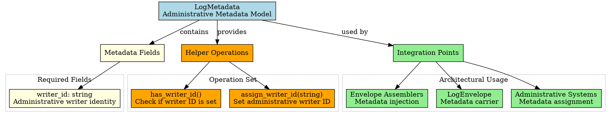
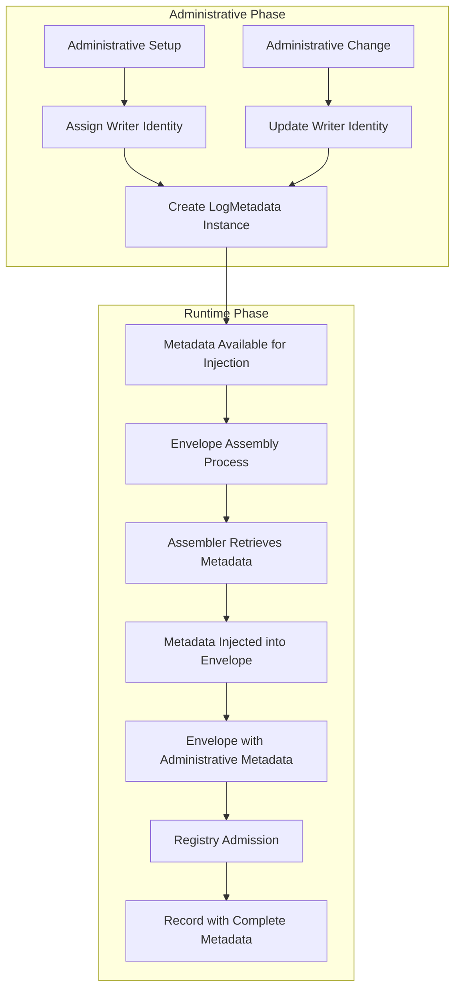

# Architectural Analysis: log_metadata.hpp

## Architectural Diagrams

### GraphViz (.dot) - Metadata Model Architecture


### Mermaid - Metadata Lifecycle Flow



## File Overview
**Location:** `D:\CppBridgeVSC\LoggingSystem\include\logging_system\B_Models\log_metadata.hpp`  
**Purpose:** LogMetadata defines the administrative metadata model that gets injected into envelopes during the preparation phase, providing writer identity and other administrative context without exposing these concerns to consuming APIs.  
**Language:** C++17  
**Dependencies:** `<string>`, `<utility>` (standard library)

## Architectural Role

### Core Design Pattern: Administrative Metadata Value Object
This file implements the **Administrative Metadata Pattern** as a value object that carries administratively assigned metadata through the preparation pipeline without becoming part of the consumer-facing API surface.

The `LogMetadata` provides:
- **Administrative Writer Identity**: Stable writer identification set once, injected automatically
- **Value Object Semantics**: Immutable during runtime use, administratively mutable
- **Preparation-Phase Integration**: Injected during envelope assembly, not passed by consumers
- **Extension Foundation**: Minimal starting point for richer administrative metadata

### B_Models Layer Architecture Context
The LogMetadata answers specific architectural questions about administrative metadata handling:

- **How does the system carry administrative writer identity without making it part of every consuming API call?**
- **How can metadata remain stable and automatically injected while staying outside consumer visibility?**
- **How can administrative metadata evolve without breaking existing consuming contracts?**

## Structural Analysis

### LogMetadata Structure
```cpp
struct LogMetadata final {
    std::string writer_id{};  // Administrative writer identity

    // Construction
    LogMetadata() = default;
    explicit LogMetadata(std::string writer_id_in);

    // Query operations
    [[nodiscard]] bool has_writer_id() const noexcept;

    // Administrative operations
    void assign_writer_id(std::string writer_id_in);
};
```

**Design Characteristics:**
- **Single Required Field**: `writer_id` for administrative writer identification
- **Administrative Mutability**: Writer ID can be changed through administrative operations
- **Runtime Immutability**: Once injected into envelope, metadata becomes effectively immutable
- **Minimal Interface**: Only essential operations for administrative setup and runtime use

### Administrative Operations

#### Writer Identity Management
```cpp
// Check if writer identity is configured
[[nodiscard]] bool has_writer_id() const noexcept {
    return !writer_id.empty();
}

// Administrative assignment of writer identity
void assign_writer_id(std::string writer_id_in) {
    writer_id = std::move(writer_id_in);
}
```

**Administrative Workflow:**
1. **System Setup**: Administrative systems assign writer identity
2. **Validation**: `has_writer_id()` confirms proper configuration
3. **Runtime Use**: Metadata injected automatically during envelope assembly
4. **Administrative Changes**: Writer identity can be updated through administrative APIs

## Integration with Architecture

### Metadata in Preparation Pipeline
```
Administrative Setup → Metadata Assignment → Preparation Phase → Envelope Assembly
       ↓                      ↓                      ↓                      ↓
  Writer Identity → LogMetadata Instance → Assembler Access → Metadata Injection
  Configuration → Value Object → get_metadata() → envelope.metadata assignment
```

### Integration Points
- **Administrative Systems**: Assign and update writer identity through `assign_writer_id()`
- **Envelope Assemblers**: Access metadata through `get_metadata()` during assembly
- **LogEnvelope**: Receives metadata through `assign_metadata()` during construction
- **System Governance**: May extend LogMetadata with additional administrative fields
- **Profile Management**: Writer identity may be associated with production profiles

### Usage Pattern
```cpp
// Administrative setup (once at system initialization)
LogMetadata admin_metadata{"service_writer_v1"};
metadata.assign_writer_id("production_writer_001");

// Runtime preparation (automatic injection)
class EnvelopeAssembler {
    LogMetadata metadata_{/* assigned administratively */};

    LogEnvelope assemble(Content content) {
        return LogEnvelope{content, metadata_, timestamp, schema_id};
    }
};
```

## Quality Assurance

### Code Quality Metrics
- **Cyclomatic Complexity:** 1 (simple field access and assignment)
- **Lines of Code:** 104 total (minimal struct with documentation)
- **Dependencies:** 2 standard headers (`<string>`, `<utility>`)
- **Template Complexity:** None (simple struct with standard operations)

### Architectural Compliance
✅ **Multi-Tier Architecture:** Layer B (Data Models) - administrative metadata values  
✅ **No Hardcoded Values:** Writer identity provided through administrative assignment  
✅ **Helper Methods:** Identity validation and assignment operations  
✅ **Cross-Language Interface:** N/A (C++ value object)

### Error Analysis
**Status:** No syntax or logical errors detected.

**Architectural Correctness Verification:**
- **Value Object Pattern**: Proper immutability during runtime use
- **Administrative Mutability**: Correct assignment operations for governance
- **Integration Compatibility**: Compatible with envelope assembler contracts
- **Extension Safety**: Struct design allows safe addition of new metadata fields

**Potential Issues Considered:**
- **Empty Writer ID**: Handled gracefully with `has_writer_id()` validation
- **Move Semantics**: Efficient assignment using `std::move`
- **Const-Correctness**: Query operations are properly const

**Root Cause Analysis:** N/A (struct is architecturally sound)  
**Resolution Suggestions:** N/A

## Design Rationale

### Administrative Metadata Value Object
**Why Value Object Pattern:**
- **Administrative Control**: Writer identity set once by administrators, not consumers
- **Runtime Efficiency**: Simple struct with no virtual functions or complex logic
- **Injection Safety**: Metadata injected automatically during preparation, not passed by consumers
- **Evolution Safety**: Struct can be extended with new administrative fields safely

**Why Single Writer ID Field:**
- **Minimal Starting Point**: Essential administrative metadata without over-design
- **Clear Ownership**: Writer identity is the primary administrative concern
- **Extension Path**: Additional fields can be added as governance requirements evolve

### Administrative Assignment Pattern
**Why Administrative Operations:**
- **Separation of Concerns**: Administrative setup separate from runtime consumption
- **Governance Control**: Writer identity managed through administrative APIs only
- **Validation Points**: Administrative systems can validate writer identity assignments
- **Audit Trail**: Administrative changes can be tracked separately from runtime logs

**Why Runtime Immutability:**
- **Consistency Guarantee**: Once set in envelope, metadata cannot be accidentally modified
- **Performance**: No runtime checks or locking needed for metadata access
- **Reliability**: Administrative metadata remains stable throughout envelope lifecycle

## Performance Characteristics

### Compile-Time Performance
- **Zero Overhead**: Simple struct with standard operations
- **Inline Optimization**: Small methods easily inlined by compiler
- **No Templates**: Direct struct usage with no instantiation overhead
- **Standard Library Only**: Minimal dependencies for fast compilation

### Runtime Performance
- **Memory Efficient**: Single string field with SSO optimization
- **Copy-on-Write**: Standard string implementation optimizes copies
- **No Dynamic Allocation**: In envelope context, metadata is moved not copied
- **Cache Friendly**: Small struct fits in cache lines efficiently

## Evolution and Maintenance

### Metadata Extensions
Future expansions may include:
- **Source Identity**: Additional source/location identification beyond writer
- **Tenant Markers**: Multi-tenant deployment identification
- **Profile Association**: Links to active production/runtime profiles
- **Correlation IDs**: Request/transaction correlation markers
- **Audit Fields**: Administrative audit trail metadata
- **Security Context**: Authentication/authorization metadata

### Administrative Enhancements
- **Validation Hooks**: Administrative validation of metadata assignments
- **Profile Integration**: Metadata derived from active production profiles
- **Dynamic Updates**: Runtime metadata refresh capabilities
- **Compatibility Checks**: Validation against pipeline/profile requirements

### Testing Strategy
Metadata testing should verify:
- Administrative assignment operations work correctly
- Writer identity validation functions properly
- Metadata injection into envelopes preserves data integrity
- Move semantics prevent unnecessary copying
- Extension safety when new metadata fields are added

## Related Components

### Depends On
- `<string>` - For writer identity storage
- `<utility>` - For move semantics in assignment operations

### Used By
- **Envelope Assemblers**: Access metadata for envelope construction
- **Administrative Systems**: Assign and update writer identity
- **LogEnvelope**: Receives metadata during assembly
- **Profile Management**: May provide writer identity from active profiles
- **System Governance**: May extend metadata with additional administrative fields

---

**Analysis Version:** 1.0  
**Analysis Date:** 2026-04-20  
**Architectural Layer:** B_Models (Data Models)  
**Status:** ✅ Analyzed, New Component Documentation