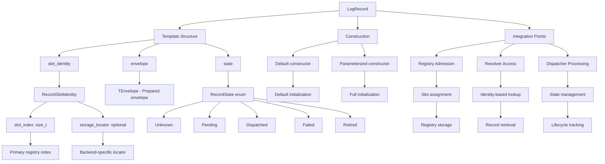

# Architectural Analysis: log_record.hpp

## Architectural Diagrams

### Graphviz (.dot) - Record Model Architecture

```dot
digraph log_record_architecture {
    rankdir=TB;
    node [shape=box, style=filled, fillcolor=lightblue];

    log_record [label="LogRecord<TEnvelope>\nRegistry Slot Template"];

    node [shape=box, style=filled, fillcolor=lightyellow];
    record_components [label="Record Components"];

    log_record -> record_components [label="contains"];

    subgraph cluster_components {
        label="Core Components";
        color=lightgrey;
        slot_identity [label="slot_identity: RecordSlotIdentity\nRegistry slot locator"];
        envelope [label="envelope: TEnvelope\nPrepared envelope"];
        state [label="state: RecordState\nSlot lifecycle state"];
    }

    record_components -> slot_identity;
    record_components -> envelope;
    record_components -> state;

    node [shape=box, style=filled, fillcolor=lightgreen];
    identity_components [label="Identity Components"];

    slot_identity -> identity_components [label="composed of"];

    subgraph cluster_identity {
        label="Identity Structure";
        color=lightgrey;
        slot_index [label="slot_index: size_t\nPrimary registry index"];
        storage_locator [label="storage_locator: optional<StorageLocator>\nBackend-specific locator"];
    }

    identity_components -> slot_index;
    identity_components -> storage_locator;

    node [shape=box, style=filled, fillcolor=orange];
    state_enumeration [label="State Enumeration"];

    state -> state_enumeration [label="typed as"];

    subgraph cluster_states {
        label="Record States";
        color=lightgrey;
        unknown [label="Unknown - Initial state"];
        pending [label="Pending - Awaiting processing"];
        dispatched [label="Dispatched - Sent for execution"];
        failed [label="Failed - Processing failed"];
        retired [label="Retired - Processing complete"];
    }

    state_enumeration -> unknown;
    state_enumeration -> pending;
    state_enumeration -> dispatched;
    state_enumeration -> failed;
    state_enumeration -> retired;

    node [shape=box, style=filled, fillcolor=lightcyan];
    integration [label="Integration Points"];

    log_record -> integration [label="used in"];

    subgraph cluster_integration {
        label="Usage Context";
        color=lightgrey;
        registry_operations [label="Registry Operations\nSlot management"];
        resolver_access [label="Resolver Access\nIdentity-based lookup"];
        dispatcher_processing [label="Dispatcher Processing\nState transitions"];
    }

    integration -> registry_operations;
    integration -> resolver_access;
    integration -> dispatcher_processing;
}
```


### Mermaid - Record Model Flow


## File Overview
**Location:** `D:\CppBridgeVSC\LoggingSystem\include\logging_system\B_Models\log_record.hpp`  
**Purpose:** Defines the log record as the registry slot model of the logging system.  
**Language:** C++17  
**Dependencies:** `log_envelope.hpp` (standard library containers)  

## Architectural Role

### Core Design Pattern: Registry Slot Model
This file implements **Registry Slot Pattern**, providing the record structure that represents a slot entry in the logging registry containing envelope and state. The `LogRecord<TEnvelope>` serves as:

- **Registry slot template** containing prepared envelope and slot state
- **Composite identity model** with primary index and optional storage locator
- **Stateful record wrapper** around stateless prepared envelopes
- **Registry admission unit** - the complete entry after envelope preparation

### B_Models Layer Architecture (Data Models)
The `log_record.hpp` provides the record model that answers:

- **What is the runtime/storage entry that holds a prepared envelope after admission into the log registry?**
- **How can the record carry both the envelope and the slot/record state without pretending to be a semantic successor of the envelope?**
- **How can the record expose a composite slot identity with primary registry index and optional storage-local locator for specialized backends?**

## Structural Analysis

### Record Template Structure
```cpp
template <typename TEnvelope>
struct LogRecord final {
    using EnvelopeType = TEnvelope;

    RecordSlotIdentity slot_identity{};
    TEnvelope envelope{};
    RecordState state{RecordState::Unknown};

    LogRecord() = default;

    LogRecord(
        RecordSlotIdentity slot_identity_in,
        TEnvelope envelope_in,
        RecordState state_in = RecordState::Unknown)
        : slot_identity(std::move(slot_identity_in)),
          envelope(std::move(envelope_in)),
          state(state_in) {}
};
```

**Design Characteristics:**
- **Template parameter**: `TEnvelope` for type-safe envelope containment
- **Three core fields**: Identity, envelope, and state
- **Type alias**: `EnvelopeType` for envelope type introspection
- **Move constructors**: Efficient ownership transfer of complex objects
- **Default state**: `RecordState::Unknown` as initial state

### Identity and State Structures
```cpp
struct RecordSlotIdentity final {
    std::size_t slot_index{0};
    std::optional<RecordStorageLocator> storage_locator{std::nullopt};
};

struct RecordStorageLocator final {
    std::size_t value{0};
};

enum class RecordState {
    Unknown,
    Pending,
    Dispatched,
    Failed,
    Retired
};
```

**Identity Design:**
- **Primary Index**: `slot_index` as main registry identifier
- **Optional Locator**: `storage_locator` for specialized backends
- **Composite Identity**: Supports both simple and complex registry architectures

**State Design:**
- **Lifecycle States**: Five states covering record lifecycle
- **Processing Flow**: Unknown → Pending → Dispatched → (Failed|Retired)
- **State Transitions**: Managed by dispatcher and registry operations

### Include Dependencies
```cpp
#include <cstddef>    // For std::size_t
#include <optional>   // For optional storage locator
#include <utility>    // For std::move move semantics

#include "logging_system/B_Models/log_envelope.hpp"  // Envelope dependency
```

**Standard Library Usage:** Essential utilities for size types, optional values, and move semantics.

## Integration with Architecture

### Record in Registry Flow
The record model integrates into the registry flow as follows:

```
Envelope Creation → Registry Admission → LogRecord Creation → Registry Storage
      ↓              ↓                       ↓              ↓
   Prepared Package → Slot Assignment → Record Construction → Identity-Based Access
   TEnvelope → RecordSlotIdentity → LogRecord<T> → Registry Operations
```

**Integration Points:**
- **Registry Admission**: Envelopes become records when admitted to registry
- **Resolver Access**: Records accessed by slot identity for processing
- **Dispatcher Processing**: Records transition through state lifecycle
- **Registry Operations**: Records stored and managed by registry backends

### Usage Pattern
```cpp
// Record creation from envelope
LogEnvelope<MyContent, MyMetadata> envelope{/*...*/};
RecordSlotIdentity identity{registry.assign_slot(), std::nullopt};

LogRecord record{
    identity,
    std::move(envelope),
    RecordState::Pending
};

// Identity-based access
auto& envelope_ref = record.envelope;
auto slot_index = record.slot_identity.slot_index;

// State transitions
record.state = RecordState::Dispatched;  // Processing started
record.state = RecordState::Retired;     // Processing complete
```

## Quality Assurance

### Code Quality Metrics
- **Cyclomatic Complexity:** 1 (minimal, data structure with simple constructors)
- **Lines of Code:** ~55 (template + supporting structs + enum)
- **Dependencies:** 4 headers (3 std + 1 internal)
- **Template Complexity:** Single template with type aliases

### Architectural Compliance
✅ **Multi-Tier Architecture:** Layer B (Models) - complex data structures  
✅ **No Hardcoded Values:** All values provided through parameters  
✅ **Helper Methods:** N/A (data-only structures)  
✅ **Cross-Language Interface:** N/A (C++ template system)  

### Error Analysis
**Status:** No syntax or logical errors detected.  

**Architectural Correctness Verification:**
- **Template Design:** Proper template parameter usage and type aliases
- **Move Semantics:** Correct use of `std::move` for ownership transfer
- **Identity Design:** Composite identity supports multiple registry architectures
- **State Design:** Enum covers complete record lifecycle
- **Memory Management:** Standard library handles memory automatically

**Potential Issues Considered:**
- **Template Instantiation:** Each record type requires explicit instantiation
- **State Machine**: No built-in state transitions (belongs in dispatcher layer)
- **Identity Validation**: No validation of identity values (belongs elsewhere)
- **Envelope Compatibility**: Template ensures type-safe envelope containment

**Root Cause Analysis:** N/A (code is architecturally sound)  
**Resolution Suggestions:** N/A  

## Design Rationale

### Registry Slot vs Envelope
**Why Separate Record and Envelope:**
- **Semantic Difference**: Envelope is prepared package, record is registry slot
- **State Addition**: Record adds slot state and identity to envelope
- **Reusability**: Envelopes may exist before slot assignment
- **Registry Boundary**: Record represents registry admission unit

**Envelope Responsibilities:**
- **Content + Metadata + Timestamp**: Prepared semantic package
- **Stateless**: No slot-specific state or identity
- **Preparation Output**: Result of envelope assembly

**Record Responsibilities:**
- **Slot Identity**: Registry location and access mechanism
- **Lifecycle State**: Processing state and transitions
- **Envelope Containment**: Wraps prepared envelope for registry

### Composite Identity Design
**Why Composite Slot Identity:**
- **Primary Index**: Simple numeric slot index for most use cases
- **Optional Locator**: Support for complex registry backends (shared memory, etc.)
- **Backend Flexibility**: Allows different storage architectures
- **Identity Evolution**: Can add more identity components as needed

**Identity Components:**
- **Slot Index**: Primary registry identifier, used by resolvers and dispatchers
- **Storage Locator**: Backend-specific locator for specialized registries
- **Optional Design**: Simple registries use only slot index

### State Enumeration Design
**Why Five-State Lifecycle:**
- **Unknown**: Initial state before processing begins
- **Pending**: Awaiting dispatcher assignment
- **Dispatched**: Sent to execution backend
- **Failed**: Processing encountered errors
- **Retired**: Successfully processed and complete

**State Transition Flow:**
- **Linear Success**: Unknown → Pending → Dispatched → Retired
- **Failure Path**: Any state → Failed (terminal)
- **State Management**: Transitions managed by dispatcher and registry operations

## Performance Characteristics

### Compile-Time Performance
- **Template Instantiation:** Per-record-type template instantiation
- **Type Resolution:** Complex template relationships with envelope types
- **Include Chain:** Dependencies on envelope and identity structures
- **Optimization**: Template specialization enables full inlining

### Runtime Performance
- **Memory Layout:** Predictable memory layout for identity, envelope, and state
- **Move Operations:** Efficient transfer of envelope and identity objects
- **Access Performance:** Direct member access with no indirection
- **State Operations**: Simple enum assignments and comparisons

## Evolution and Maintenance

### Record Extensions
Future expansions may include:
- **Additional Identity Components**: More complex identity schemes
- **Extended State Information**: Sub-states and state metadata
- **Record Metadata**: Record-level timestamps and audit information
- **Backend-Specific Extensions**: Registry backend customization

### State Machine Enhancements
- **State Transition Validation**: Rules for valid state changes
- **State Transition Callbacks**: Hooks for state change events
- **State Persistence**: State recovery across system restarts
- **State Analytics**: Processing statistics and metrics

### Identity Evolution
- **Hierarchical Identities**: Nested or compound identity structures
- **Identity Namespaces**: Partitioned identity spaces
- **Identity Resolution**: Identity lookup and validation services
- **Identity Migration**: Support for identity scheme changes

### What This File Should NOT Contain
This file must NOT:
- **Manage State Transitions**: State machine logic belongs in dispatcher
- **Validate Identities**: Identity validation belongs elsewhere
- **Perform I/O**: Data-only, no external operations
- **Implement Registry Logic**: Registry operations belong in higher layers
- **Handle Envelope Preparation**: Envelope assembly belongs elsewhere

### Testing Strategy
Record model testing should verify:
- Template instantiation works for all record type combinations
- Constructor operations correctly initialize all fields
- Identity structures work correctly with and without storage locators
- State enum values are properly defined and accessible
- Move semantics for efficient envelope and identity transfer
- Type aliases correctly expose template parameter types
- Integration with envelope and registry operations

## Related Components

### Depends On
- `<cstddef>` - For `std::size_t` type definitions
- `<optional>` - For optional storage locator values
- `<utility>` - For `std::move` move semantics
- `log_envelope.hpp` - Envelope template dependency

### Used By
- **Registry Operations**: Records stored and managed in registries
- **Resolver Access**: Records accessed by identity for processing
- **Dispatcher Processing**: Records transition through processing states
- **Query Operations**: Records accessed for filtering and retrieval
- **Export Operations**: Records serialized for external consumption

---

**Analysis Version:** 1.0  
**Analysis Date:** 2026-04-20  
**Architectural Layer:** B_Models (Data Models)  
**Status:** ✅ Analyzed, No Issues