# Architectural Analysis: utc_now_iso.hpp

## Architectural Diagrams

### Graphviz (.dot) - Time Utilities Architecture

```dot
digraph utc_now_iso_architecture {
    rankdir=TB;
    node [shape=box, style=filled, fillcolor=lightblue];

    utc_utilities [label="UTC Time Utilities\nTime Extraction Helpers"];

    node [shape=box, style=filled, fillcolor=lightyellow];
    time_functions [label="Time Functions"];

    utc_utilities -> time_functions [label="provides"];

    subgraph cluster_functions {
        label="Function Set";
        color=lightgrey;
        epoch_millis [label="utc_now_epoch_millis()\nNumeric UTC timestamp"];
        iso_string [label="utc_now_iso()\nHuman-readable UTC string"];
    }

    time_functions -> epoch_millis;
    time_functions -> iso_string;

    node [shape=box, style=filled, fillcolor=lightgreen];
    time_formats [label="Time Formats"];

    utc_utilities -> time_formats [label="supports"];

    subgraph cluster_formats {
        label="Format Types";
        color=lightgrey;
        numeric_epoch [label="Epoch Milliseconds\nint64_t for ordering/querying"];
        iso_8601 [label="ISO-8601 String\n\"YYYY-MM-DDTHH:MM:SSZ\" format"];
    }

    time_formats -> numeric_epoch;
    time_formats -> iso_8601;

    node [shape=box, style=filled, fillcolor=orange];
    integration [label="Integration Points"];

    utc_utilities -> integration [label="used in"];

    subgraph cluster_integration {
        label="Usage Context";
        color=lightgrey;
        envelope_timestamps [label="Envelope Timestamps\nContent update tracking"];
        model_timestamps [label="Model Timestamps\nData model time fields"];
        preparation_layer [label="Preparation Layer\nTimestamp injection"];
    }

    integration -> envelope_timestamps;
    integration -> model_timestamps;
    integration -> preparation_layer;
}
```


### Mermaid - Time Utilities Flow
```mermaid
flowchart TD
    A[UTC Time Utilities] --> B[Core Functions]

    B --> C[utc_now_epoch_millis()]
    B --> D[utc_now_iso()]

    C --> E[Numeric UTC Timestamp]
    D --> F[ISO-8601 UTC String]

    E --> G[int64_t milliseconds]
    F --> H[string "YYYY-MM-DDTHH:MM:SSZ"]

    A --> I[Format Purposes]

    I --> J[Machine Processing]
    I --> K[Human Display]

    J --> L[Ordering & Querying]
    J --> M[Arithmetic Operations]
    K --> N[Export & Diagnostics]

    A --> O[Integration Points]

    O --> P[Envelope Models]
    O --> Q[Timestamp Injection]
    O --> R[Time-Stamped Operations]

    P --> S[LogEnvelope timestamps]
    Q --> T[Preparation layer injection]
    R --> U[Event time recording]

    S --> V[Content update tracking]
    T --> W[Automatic timestamping]
    U --> X[Time-based operations]
```

## File Overview
**Location:** `D:\CppBridgeVSC\LoggingSystem\include\logging_system\B_Models\utc_now_iso.hpp`  
**Purpose:** Provides UTC time extraction helpers for the logging system models and preparation components.  
**Language:** C++17  
**Dependencies:** `<chrono>`, `<ctime>`, `<iomanip>`, `<sstream>`, `<string>` (standard library)  

## Architectural Role

### Core Design Pattern: Isolated Time Extraction
This file implements **Time Extraction Isolation Pattern**, providing low-level UTC time utilities that isolate timestamp generation from higher-level model and preparation logic. The UTC time helpers serve as:

- **UTC timestamp extraction** in both numeric and string formats
- **Time utility isolation** keeping time logic separate from business logic
- **Standard time source** ensuring consistent timing across the system
- **Cross-platform time handling** with proper UTC conversion

### B_Models Layer Architecture (Data Models)
The `utc_now_iso.hpp` provides the time utilities that answer:

- **How does the system obtain the current UTC time in a machine-friendly numeric form for ordering, querying, and time arithmetic?**
- **How does the system obtain a human-readable UTC ISO-8601 string when presentation or export requires it?**
- **How can timestamp extraction remain isolated from envelope, record, and assembler logic?**

## Structural Analysis

### Time Function Implementations
```cpp
[[nodiscard]] inline std::int64_t utc_now_epoch_millis() {
    const auto now = std::chrono::system_clock::now();
    const auto millis =
        std::chrono::duration_cast<std::chrono::milliseconds>(
            now.time_since_epoch());
    return static_cast<std::int64_t>(millis.count());
}

[[nodiscard]] inline std::string utc_now_iso() {
    const auto now = std::chrono::system_clock::now();
    const std::time_t now_c = std::chrono::system_clock::to_time_t(now);

    std::tm utc_tm{};
#if defined(_WIN32)
    gmtime_s(&utc_tm, &now_c);
#else
    gmtime_r(&now_c, &utc_tm);
#endif

    std::ostringstream oss{};
    oss << std::put_time(&utc_tm, "%Y-%m-%dT%H:%M:%SZ");
    return oss.str();
}
```

**Design Characteristics:**
- **`utc_now_epoch_millis()`**: Returns milliseconds since Unix epoch as `int64_t`
- **`utc_now_iso()`**: Returns ISO-8601 formatted string "YYYY-MM-DDTHH:MM:SSZ"
- **Platform-specific UTC conversion**: Handles Windows `gmtime_s` vs POSIX `gmtime_r`
- **Exception-free design**: Uses `[[nodiscard]]` to prevent silent discarding
- **Inline functions**: Zero overhead when inlined by compiler

### Include Dependencies
```cpp
#include <chrono>    // For std::chrono time utilities
#include <ctime>     // For time_t and tm structures
#include <iomanip>   // For std::put_time formatting
#include <sstream>   // For std::ostringstream string building
#include <string>    // For std::string return type
```

**Standard Library Usage:** Comprehensive use of C++ chrono and time utilities for robust time handling.

## Integration with Architecture

### Time Utilities in System Flow
The time utilities integrate into the system flow as follows:

```
Model Creation → Timestamp Generation → Envelope Assembly → Record Creation
      ↓              ↓                       ↓              ↓
   Data Models → UTC Time Extraction → Timestamp Injection → Time-Stamped Records
   Time Fields → Numeric/String Formats → Automatic/Manual → Query-Ready Data
```

**Integration Points:**
- **Envelope Models**: Use `utc_now_epoch_millis()` for content update timestamps
- **Preparation Layer**: Timestamp stabilizers inject time using these utilities
- **Model Construction**: Envelopes and records initialize time fields
- **Time-Based Operations**: Querying and ordering use numeric timestamps

### Usage Pattern
```cpp
// Numeric timestamp for envelope models
std::int64_t envelope_timestamp = utc_now_epoch_millis();
LogEnvelope envelope{content, metadata, envelope_timestamp, schema_id};

// ISO string for display/export
std::string display_time = utc_now_iso();
// Output: "2024-01-01T12:34:56Z"

// In preparation layer timestamp injection
class TimestampStabilizer {
    void inject_timestamp(LogEnvelope& envelope) {
        envelope.content_updated_at_epoch = utc_now_epoch_millis();
    }
};
```

## Quality Assurance

### Code Quality Metrics
- **Cyclomatic Complexity:** 1 (minimal, straight-line time conversion)
- **Lines of Code:** ~35 (two inline functions with platform handling)
- **Dependencies:** 5 standard library headers
- **Platform Compatibility:** Cross-platform UTC conversion

### Architectural Compliance
✅ **Multi-Tier Architecture:** Layer B (Models) - utility functions  
✅ **No Hardcoded Values:** All time handling uses standard library  
✅ **Helper Methods:** Time extraction utilities  
✅ **Cross-Language Interface:** N/A (C++ utilities)  

### Error Analysis
**Status:** No syntax or logical errors detected.  

**Architectural Correctness Verification:**
- **Platform Handling:** Correct use of platform-specific UTC functions
- **Time Zone Handling:** Explicit UTC conversion (not local time)
- **Type Safety:** Proper use of `int64_t` for epoch milliseconds
- **Exception Safety:** No exceptions thrown, `[[nodiscard]]` prevents silent discarding
- **Performance**: Inline functions with minimal overhead

**Potential Issues Considered:**
- **Platform Compatibility:** Handles Windows vs POSIX differences correctly
- **Thread Safety:** Standard library functions are thread-safe
- **Time Precision:** Millisecond precision appropriate for logging use cases
- **Leap Seconds:** UTC handling may not account for leap seconds (acceptable for logging)

**Root Cause Analysis:** N/A (code is architecturally sound)  
**Resolution Suggestions:** N/A  

## Design Rationale

### Dual Format Time Utilities
**Why Both Numeric and String Formats:**
- **Numeric Timestamps**: Essential for machine processing (ordering, querying, arithmetic)
- **String Timestamps**: Necessary for human readability (display, export, diagnostics)
- **Use Case Separation**: Different formats serve different consumption patterns
- **Performance Trade-offs**: Numeric faster for computation, string better for presentation

**Format Choice Rationale:**
- **Epoch Milliseconds**: Standard Unix timestamp, widely supported, arithmetic-friendly
- **ISO-8601 String**: Human-readable, internationally standardized, unambiguous
- **UTC Only**: Avoids timezone confusion, ensures global consistency
- **No Timezone Support**: Simplifies implementation, logging typically UTC-focused

### Platform-Specific UTC Handling
**Why Platform-Specific Code:**
- **Windows Compatibility**: `gmtime_s` is Windows secure version of `gmtime`
- **POSIX Compatibility**: `gmtime_r` is thread-safe reentrant version
- **Security**: Avoids deprecated unsafe functions
- **Cross-Platform**: Ensures consistent behavior across platforms

**Safety vs Performance:**
- **Thread Safety**: Reentrant functions prevent race conditions
- **Security**: Bounds-checked functions prevent buffer overflows
- **Performance**: Minimal overhead for time conversion operations
- **Reliability**: Platform-specific handling ensures correct UTC conversion

### Inline Function Design
**Why Inline Functions:**
- **Zero Overhead**: Compiler can eliminate function call overhead
- **Header-Only**: No translation unit complications
- **Template-like**: Functions behave like templates for optimization
- **Linker Friendly**: No external linkage issues

**Inline Benefits:**
- **Performance**: Direct code insertion at call sites
- **Optimization**: Compiler can optimize across call boundaries
- **Debugging**: Functions remain visible in debug builds
- **Maintenance**: Single implementation point for time logic

## Performance Characteristics

### Compile-Time Performance
- **Header-Only:** No compilation overhead beyond includes
- **Inline Expansion:** Functions expand inline at call sites
- **Type Resolution:** Simple standard library usage
- **No Templates:** Straight function definitions

### Runtime Performance
- **System Call Overhead:** `std::chrono::system_clock::now()` system call
- **Conversion Overhead:** Platform-specific UTC structure conversion
- **String Formatting:** ISO string building with stream operations
- **Memory Allocation:** String return requires heap allocation

## Evolution and Maintenance

### Time Precision Extensions
Future expansions may include:
- **Microsecond Precision**: Support for higher-resolution timestamps
- **Monotonic Clocks**: Alternative timing for relative measurements
- **Time Zone Support**: Localization beyond UTC-only
- **Custom Time Formats**: Domain-specific time string formats

### Platform Support Expansion
- **Additional Platforms**: Support for embedded systems, mobile platforms
- **Alternative Clocks**: High-resolution clocks for performance measurement
- **Time Synchronization**: NTP-aware time sources
- **Time Validation**: Sanity checks for system clock issues

### Time Source Abstraction
- **Configurable Time Sources**: Pluggable time providers for testing
- **Mock Time Utilities**: Deterministic time for unit testing
- **Time Zone Configuration**: Runtime timezone selection
- **Time Format Extensions**: Additional string formats beyond ISO-8601

### What This File Should NOT Contain
This file must NOT:
- **Store Time State**: No persistent time state or caching
- **Perform Time Validation**: Time validation belongs elsewhere
- **Handle Time Zones**: Only UTC support for simplicity
- **Provide Time Arithmetic**: Arithmetic belongs to consuming code
- **Format Time Strings**: Only basic ISO format provided

### Testing Strategy
Time utility testing should verify:
- Numeric timestamp returns reasonable epoch millisecond values
- ISO string follows correct "YYYY-MM-DDTHH:MM:SSZ" format
- UTC conversion produces correct timezone-independent results
- Platform-specific code paths work correctly
- Functions are thread-safe when called concurrently
- Performance meets requirements for logging timestamp generation
- No exceptions thrown under normal operation conditions

## Related Components

### Depends On
- `<chrono>` - System clock and time duration utilities
- `<ctime>` - C time structures and conversion functions
- `<iomanip>` - Time formatting manipulators
- `<sstream>` - String stream for ISO formatting
- `<string>` - String return type for ISO timestamps

### Used By
- **Envelope Models**: Content update timestamp generation
- **Preparation Layer**: Timestamp injection during assembly
- **Record Creation**: Record timestamp initialization
- **Time-Based Operations**: Query filtering and result ordering
- **Export Functions**: Human-readable timestamp formatting

---

**Analysis Version:** 1.0  
**Analysis Date:** 2026-04-20  
**Architectural Layer:** B_Models (Data Models)  
**Status:** ✅ Analyzed, No Issues