# Architectural Analysis: metadata_injector_concept.hpp

## Architectural Diagrams

### GraphViz (.dot) - Metadata Injector Concept Architecture

```dot
digraph metadata_injector_concept_architecture {
    rankdir=TB;
    node [shape=box, style=filled, fillcolor=lightblue];

    metadata_injector_concept [label="MetadataInjectorConcept\nC++17 Contract Definition"];

    node [shape=box, style=filled, fillcolor=lightyellow];
    contract_requirements [label="Contract Requirements"];

    metadata_injector_concept -> contract_requirements [label="defines"];

    subgraph cluster_requirements {
        label="Required Type Traits";
        color=lightgrey;
        metadata_type_trait [label="has_metadata_type<T>\nMetadataType nested alias"];
        get_method_trait [label="has_get_metadata_method<T>\nget_metadata() const"];
        inject_method_trait [label="has_inject_into_method<T>\nTemplated inject_into()"];
        main_contract [label="is_metadata_injector<T>\nCombined contract check"];
        helper_alias [label="is_metadata_injector_v<T>\nHelper variable template"];
    }

    contract_requirements -> metadata_type_trait;
    contract_requirements -> get_method_trait;
    contract_requirements -> inject_method_trait;
    contract_requirements -> main_contract;
    contract_requirements -> helper_alias;

    node [shape=box, style=filled, fillcolor=orange];
    sfinae_implementation [label="SFINAE Implementation"];

    metadata_injector_concept -> sfinae_implementation [label="uses"];

    subgraph cluster_sfinae {
        label="Substitution Failure Techniques";
        color=lightgrey;
        void_t_usage [label="std::void_t<...>\nSFINAE detection"];
        declval_usage [label="std::declval<T&>().method()\nExpression validity"];
        enable_if_t [label="std::enable_if_t<...>\nConditional compilation"];
        is_same_check [label="std::is_same_v<...>\nType compatibility"];
    }

    sfinae_implementation -> void_t_usage;
    sfinae_implementation -> declval_usage;
    sfinae_implementation -> enable_if_t;
    sfinae_implementation -> is_same_check;

    node [shape=box, style=filled, fillcolor=lightgreen];
    composition_integration [label="Composition Integration"];

    metadata_injector_concept -> composition_integration [label="enables"];

    subgraph cluster_integration {
        label="Assembler Composition";
        color=lightgrey;
        envelope_assembler [label="EnvelopeAssemblerBase\nTMetadataInjector parameter"];
        concrete_injectors [label="DefaultMetadataInjector\nContract-compliant implementation"];
        type_safety [label="Compile-time Validation\nTemplate constraints"];
        injection_patterns [label="Injection Strategies\nProvider + Injector patterns"];
    }

    composition_integration -> envelope_assembler;
    composition_integration -> concrete_injectors;
    composition_integration -> type_safety;
    composition_integration -> injection_patterns;
}
```


### Mermaid - Metadata Injector Contract Flow

```mermaid
flowchart TD
    A[Template Type T] --> B{Contract Check}

    B --> C[has_metadata_type<T>]
    B --> D[has_get_metadata_method<T>]
    B --> E[has_inject_into_method<T>]

    C --> F{MetadataType\nnested alias?}
    D --> G{get_metadata()\nmethod exists?}
    E --> H{inject_into<TEnvelope>\nmethod exists?}

    F --> I[Contract Violation] 
    G --> I
    H --> I

    F --> J[✓ Type Check Passed]
    G --> J
    H --> J

    J --> K[is_metadata_injector<T>]
    K --> L[✓ Contract Satisfied]

    I --> M[✗ Contract Failed]
    M --> N[Compilation Error]

    L --> O[Assembler Composition]
    O --> P[Envelope Assembly]
    P --> Q[Metadata Injection]
    Q --> R[Prepared Envelope]

    subgraph "SFINAE Detection"
        F
        G  
        H
    end

    subgraph "Contract Validation"
        K
        L
        M
        N
    end

    subgraph "Composition Benefits"
        O
        P
        Q
        R
    end
```

## File Overview
**Location:** `D:\CppBridgeVSC\LoggingSystem\include\logging_system\C_Contracts\metadata_injector_concept.hpp`  
**Purpose:** MetadataInjectorConcept defines C++17-compatible contract requirements for metadata injector components used in envelope assembler composition, ensuring type-safe metadata provision and injection capabilities.  
**Language:** C++17  
**Dependencies:** `<type_traits>`, `<utility>` (standard library)

## Architectural Role

### Core Design Pattern: C++17 Concept Simulation with SFINAE
This file implements the **Contract Pattern** using C++17 SFINAE techniques to simulate C++20 concepts, providing compile-time validation of metadata injector interfaces for safe assembler composition.

The `MetadataInjectorConcept` system provides:
- **Type-Safe Contracts**: Compile-time verification of component interfaces
- **SFINAE-Based Detection**: Substitution failure techniques for trait detection
- **Composition Safety**: Ensures injectors are compatible with assembler templates
- **Dual Interface Support**: Both metadata provision and envelope injection capabilities

### C_Contracts Layer Architecture Context
The MetadataInjectorConcept answers specific architectural questions about contract-based composition:

- **How can preparation components be validated for compatibility before composition?**
- **What interface requirements must metadata injectors satisfy for assembler integration?**
- **How can C++17 provide concept-like functionality for template constraints?**

## Structural Analysis

### Contract Requirements System

#### Metadata Type Requirement
```cpp
template <typename, typename = void>
struct has_metadata_type : std::false_type {};

template <typename T>
struct has_metadata_type<T, std::void_t<typename T::MetadataType>>
    : std::true_type {};
```

**Type Alias Detection:**
- Uses `std::void_t` for SFINAE detection
- Checks for nested `MetadataType` alias
- Provides clear compile-time errors for missing type definitions

#### Get Metadata Method Requirement
```cpp
template <typename, typename = void>
struct has_get_metadata_method : std::false_type {};

template <typename T>
struct has_get_metadata_method<
    T,
    std::void_t<decltype(std::declval<const T&>().get_metadata())>>
    : std::true_type {};
```

**Method Signature Validation:**
- Detects `get_metadata() const` method existence
- Uses `std::declval` for expression validity testing
- Ensures const-correctness of metadata access

#### Inject Into Method Requirement
```cpp
template <typename, typename = void>
struct has_inject_into_method : std::false_type {};

template <typename T>
struct has_inject_into_method<T,
    std::void_t<decltype(std::declval<T&>().inject_into(
        std::declval<int&>(),  // Placeholder for TEnvelope
        std::declval<const typename T::MetadataType&>()))>>
    : std::true_type {};
```

**Injection Interface Validation:**
- Detects templated `inject_into<TEnvelope>(...)` method
- Validates parameter compatibility with metadata types
- Ensures injection capability for envelope composition

### Main Contract Integration
```cpp
template <typename T>
struct is_metadata_injector
    : std::integral_constant<
          bool,
          has_metadata_type<T>::value &&
              has_get_metadata_method<T>::value &&
              has_inject_into_method<T>::value> {};

template <typename T>
inline constexpr bool is_metadata_injector_v = is_metadata_injector<T>::value;
```

**Combined Validation:**
- Logical AND of all individual requirements
- Provides single boolean result for contract compliance
- Enables template metaprogramming based on contract satisfaction

## Integration with Architecture

### Contract in Assembler Composition
```
Template Instantiation → Contract Validation → Composition Success/Failure
       ↓                        ↓                      ↓
TMetadataInjector → is_metadata_injector_v<T> → EnvelopeAssemblerBase<..., T>
Contract Violation → Compilation Error → Safe Composition Guarantee
```

### Integration Points
- **EnvelopeAssemblerBase**: Validates TMetadataInjector parameter at compile time
- **DefaultMetadataInjector**: Concrete implementation satisfying all contract requirements
- **Template Metaprogramming**: Enables SFINAE-based template specialization
- **Error Diagnostics**: Clear compile-time messages for contract violations

### Usage Pattern
```cpp
// Contract validation at compile time
template <typename TInjector>
void validate_injector() {
    static_assert(is_metadata_injector_v<TInjector>,
        "TInjector does not satisfy MetadataInjector contract");
}

// Safe assembler composition
template <typename TMetadataInjector>
class SafeEnvelopeAssembler {
    static_assert(is_metadata_injector_v<TMetadataInjector>,
        "TMetadataInjector must satisfy MetadataInjector contract");

    // Safe to use TMetadataInjector.inject_into(...)
};

// Runtime usage with contract guarantees
DefaultMetadataInjector injector{metadata};
LogEnvelope envelope{content, metadata, timestamp, schema};

// Contract ensures this compiles and works correctly
injector.inject_into(envelope, metadata);
```

## Quality Assurance

### Code Quality Metrics
- **Cyclomatic Complexity:** 1 (pure type traits and template metaprogramming)
- **Lines of Code:** 111 total (focused contract definition)
- **Dependencies:** 2 standard headers (`<type_traits>`, `<utility>`)
- **Template Complexity:** Moderate (SFINAE-based trait detection)

### Architectural Compliance
✅ **Multi-Tier Architecture:** Layer C (Contracts) - architectural contract definitions  
✅ **No Hardcoded Values:** Pure type-level validation  
✅ **Helper Methods:** Contract validation and trait detection  
✅ **Cross-Language Interface:** N/A (C++ template contracts)

### Error Analysis
**Status:** No syntax or logical errors detected.

**Architectural Correctness Verification:**
- **SFINAE Correctness**: Void_t and declval usage follows established patterns
- **Trait Composition**: Individual traits combine correctly into main contract
- **Template Safety**: No instantiation issues or circular dependencies
- **Error Messages**: Clear diagnostic paths for contract violations

**Potential Issues Considered:**
- **SFINAE Limitations**: Cannot detect semantic correctness, only syntactic
- **Error Verbosity**: Template errors may be complex but are informative
- **Performance**: Zero runtime cost, compile-time validation only

**Root Cause Analysis:** N/A (contract definition is architecturally sound)  
**Resolution Suggestions:** N/A

## Design Rationale

### C++17 Concept Simulation
**Why SFINAE Over C++20 Concepts:**
- **Compatibility**: Works with existing C++17 codebase and compilers
- **Established Patterns**: Uses proven SFINAE techniques from template metaprogramming
- **Tool Support**: Works with existing IDEs and build systems
- **Learning Curve**: Familiar techniques for experienced C++ developers

**Why Comprehensive Contract:**
- **Safety First**: Prevents runtime errors through compile-time validation
- **Clear Interfaces**: Documents expected behavior for component implementers
- **Evolution Support**: Contract can evolve while maintaining backward compatibility
- **Testing Enablement**: Contract violations caught during compilation, not testing

### Dual Interface Design
**Why Both Provision and Injection:**
- **Flexibility**: Components can use injectors for both getting and setting metadata
- **Composition Patterns**: Supports different usage patterns in assembler hierarchies
- **Backward Compatibility**: Existing code using get_metadata() continues to work
- **Future Evolution**: Injection interface ready for advanced composition patterns

**Why Templated Injection:**
- **Type Safety**: Envelope types validated at compile time
- **Genericity**: Single injector works with multiple envelope types
- **Performance**: Template instantiation provides optimal code generation
- **Extensibility**: Easy to add new envelope types without changing injectors

## Performance Characteristics

### Compile-Time Performance
- **Trait Instantiation**: Lightweight template instantiation for each checked type
- **SFINAE Resolution**: Fast substitution failure detection
- **Error Generation**: Minimal overhead for successful compilations
- **Template Depth**: Shallow template hierarchies for quick resolution

### Runtime Performance
- **Zero Runtime Cost**: Pure compile-time constructs
- **No Memory Allocation**: Type traits evaluated at compile time
- **No Virtual Dispatch**: No runtime polymorphism or indirection
- **Optimal Code Generation**: Template instantiation produces efficient code

## Evolution and Maintenance

### Contract Extensions
Future expansions may include:
- **Additional Method Requirements**: More sophisticated injection patterns
- **Semantic Validation**: Beyond syntactic checks to semantic requirements
- **Version Compatibility**: Contract versioning for API evolution
- **Performance Contracts**: Runtime performance guarantees in contracts
- **Thread Safety Contracts**: Concurrency guarantees in component interfaces

### Implementation Patterns
- **Specialized Contracts**: Domain-specific contract refinements
- **Composite Contracts**: Contracts that combine multiple interface requirements
- **Conditional Contracts**: Contracts that apply based on template parameters
- **Diagnostic Contracts**: Enhanced error messages for contract violations

### Testing Strategy
Contract testing should verify:
- All concrete injectors satisfy the contract requirements
- Contract violations produce clear, actionable error messages
- Template instantiation works correctly with compliant types
- SFINAE detection correctly identifies interface compliance
- No runtime performance impact from contract validation

## Related Components

### Depends On
- `<type_traits>` - For SFINAE and trait implementation
- `<utility>` - For std::declval in expression checking

### Used By
- **EnvelopeAssemblerBase**: Validates TMetadataInjector template parameter
- **DefaultMetadataInjector**: Concrete implementation satisfying contract
- **Template Metaprogramming**: SFINAE-based conditional compilation
- **Static Analysis Tools**: Type checking and interface validation
- **Documentation Generators**: Interface requirement extraction

---

**Analysis Version:** 1.0  
**Analysis Date:** 2026-04-20  
**Architectural Layer:** C_Contracts (Contract Definitions)  
**Status:** ✅ Analyzed, New Contract Definition with Composition Support