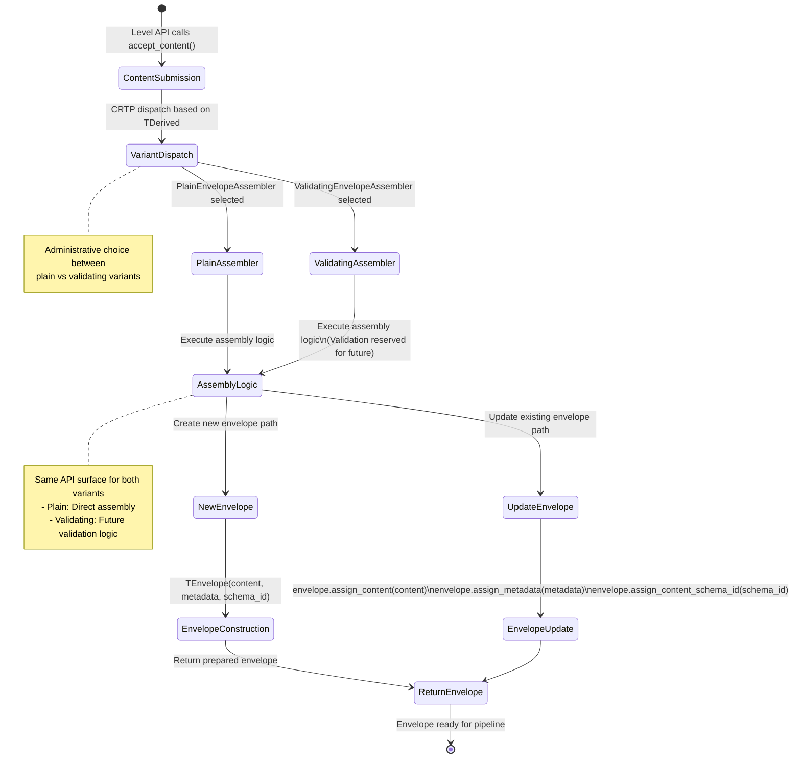

# Architectural Analysis: default_envelope_assembler.hpp

## Architectural Diagrams

### Graphviz (.dot) - Envelope Assembler Architecture

```dot
digraph envelope_assembler_architecture {
    rankdir=TB;
    node [shape=box, style=filled, fillcolor=lightblue];

    envelope_assembler [label="EnvelopeAssembler\nPreparation Component"];

    node [shape=box, style=filled, fillcolor=lightgreen];
    binding_info [label="ApiFacadeBindingInfo\nFacade Binding Context"];

    envelope_assembler -> binding_info [label="uses"];

    subgraph cluster_binding {
        label="Binding Information";
        color=lightgrey;
        facade_name [label="facade_name: string\nAPI facade identifier"];
        content_family [label="content_family_key: string\nContent type identifier"];
        binding_key [label="binding_key: string\nBinding configuration key"];
    }

    binding_info -> facade_name;
    binding_info -> content_family;
    binding_info -> binding_key;

    node [shape=box, style=filled, fillcolor=lightyellow];
    base_assembler [label="EnvelopeAssemblerBase<TDerived, TEnvelope, TMetadata>\nCRTP Base Class"];

    envelope_assembler -> base_assembler [label="provides"];

    subgraph cluster_base {
        label="Base Components";
        color=lightgrey;
        binding_storage [label="binding_info_: ApiFacadeBindingInfo\nFacade binding context"];
        schema_storage [label="content_schema_id_: string\nInternal schema identifier"];
        timestamp_stabilizer [label="timestamp_stabilizer_: TTimestampStabilizer\nComposed timestamp stabilizer"];
        metadata_injector [label="metadata_injector_: TMetadataInjector\nComposed metadata injector"];
        type_aliases [label="Type aliases\nEnvelopeType, MetadataType, WrappedContentType"];
    }

    base_assembler -> binding_storage;
    base_assembler -> schema_storage;
    base_assembler -> timestamp_stabilizer;
    base_assembler -> metadata_injector;
    base_assembler -> type_aliases;

    node [shape=box, style=filled, fillcolor=orange];
    assembler_variants [label="Assembler Variants"];

    envelope_assembler -> assembler_variants [label="provides"];

    subgraph cluster_variants {
        label="Specialized Assemblers";
        color=lightgrey;
        plain_assembler [label="PlainEnvelopeAssembler\nBasic envelope assembly"];
        validating_assembler [label="ValidatingEnvelopeAssembler\nValidation-aware assembly (reserved)"];
    }

    assembler_variants -> plain_assembler;
    assembler_variants -> validating_assembler;

    node [shape=box, style=filled, fillcolor=lightcyan];
    assembly_methods [label="Assembly Methods"];

    base_assembler -> assembly_methods [label="defines"];

    subgraph cluster_methods {
        label="Content Acceptance";
        color=lightgrey;
        create_envelope [label="accept_content(content)\nCreate new envelope"];
        update_envelope [label="accept_content(envelope&, content)\nUpdate existing envelope"];
    }

    assembly_methods -> create_envelope;
    assembly_methods -> update_envelope;

    node [shape=box, style=filled, fillcolor=lightgreen];
    integration [label="Integration Points"];

    envelope_assembler -> integration [label="connects"];

    subgraph cluster_integration {
        label="Architectural Connections";
        color=lightgrey;
        level_apis [label="Level APIs\nThin facades"];
        metadata_models [label="LogMetadata\nAdministrative metadata"];
        envelope_models [label="LogEnvelope\nPrepared envelopes"];
        content_models [label="Content Contracts\nTyped content families"];
    }

    integration -> level_apis;
    integration -> metadata_models;
    integration -> envelope_models;
    integration -> content_models;
}
```


### Data Flow: Content Assembly Process

```mermaid
flowchart TD
    A[Level API\naccept_content(content)] --> B[EnvelopeAssemblerBase\naccept_content(content)]

    B --> C[CRTP Dispatch\nto TDerived::accept_content_impl()]
    C --> D{Assembler Variant}

    D -->|PlainEnvelopeAssembler| E[Plain Assembly Path]
    D -->|ValidatingEnvelopeAssembler| F[Validating Assembly Path\n(Reserved for Future)]

    E --> G[make_envelope_from_content(content)]
    F --> G

    G --> H[TEnvelope Constructor\ncontent + metadata + schema_id]
    H --> I[Envelope with Content,\nMetadata, Schema ID, Timestamp]

    C --> J[Update Existing Envelope Path\naccept_content(envelope&, content)]
    J --> K[CRTP Dispatch\nto TDerived::accept_content_impl(envelope&, content)]
    K --> L{Assembler Variant}

    L -->|Plain| M[Plain Update Path]
    L -->|Validating| N[Validating Update Path\n(Reserved for Future)]

    M --> O[assign_content_to_envelope(envelope, content)]
    N --> O

    O --> P[Envelope Content Update\n+ Metadata Assignment\n+ Schema ID Assignment]
    P --> Q[Updated Envelope]

    I --> R[Return New Envelope]
    Q --> R

    subgraph "Administrative Data"
        S[TMetadata metadata_] --> H
        S --> P
        T[ApiFacadeBindingInfo binding_info_] --> U[Available for inspection]
        V[std::string content_schema_id_] --> H
        V --> P
    end

    subgraph "CRTP Implementation"
        W[PlainEnvelopeAssembler] --> E
        W --> M
        X[ValidatingEnvelopeAssembler] --> F
        X --> N
    end
```

### Logic Flow: Assembler Decision Logic



### Mermaid - Envelope Assembler Flow
```mermaid
flowchart TD
    A[EnvelopeAssembler] --> B[ApiFacadeBindingInfo]

    B --> C[facade_name]
    B --> D[content_family_key]
    B --> E[binding_key]

    A --> F[EnvelopeAssemblerBase]

    F --> G[metadata_: TMetadata]
    F --> H[binding_info_: ApiFacadeBindingInfo]
    F --> I[Type Aliases]

    I --> J[EnvelopeType = TEnvelope]
    I --> K[MetadataType = TMetadata]
    I --> L[WrappedContentType = TEnvelope::WrappedContentType]

    A --> M[Assembler Variants]

    M --> N[PlainEnvelopeAssembler]
    M --> O[ValidatingEnvelopeAssembler]

    F --> P[Assembly Interface]

    P --> Q[accept_content(content, schema_id)]
    P --> R[accept_content(envelope&, content)]

    Q --> S[Create New Envelope]
    R --> T[Update Existing Envelope]

    S --> U[make_envelope_from_content]
    T --> V[assign_content_to_envelope]

    U --> W[TEnvelope{content, metadata, schema_id}]
    V --> X[envelope.assign_content(content)]

    A --> Y[Integration Flow]

    Y --> Z[Level API → Assembler → Envelope]
    Y --> AA[Administrative Binding]
    Y --> BB[Content Acceptance]
    Y --> CC[Envelope Assembly]

    Z --> DD[Thin facade forwards to bound assembler]
    AA --> EE[Governance assigns assembler to API]
    BB --> FF[Content + schema → envelope creation/update]
    CC --> GG[Envelope with metadata + timestamp]
```

## File Overview
**Location:** `D:\CppBridgeVSC\LoggingSystem\include\logging_system\D_Preparation\default_envelope_assembler.hpp`  
**Purpose:** Provides envelope assembler components for assembling prepared envelopes from content and metadata in the consuming pipeline preparation phase.  
**Language:** C++17  
**Dependencies:** `<string>`, `<utility>` (standard library)  

## Architectural Role

### Core Design Pattern: CRTP-Based Envelope Assembly
This file implements **Envelope Assembly Pattern** using CRTP (Curiously Recurring Template Pattern) to provide type-safe envelope assembly with shared behavior and specialized variants. The envelope assembler serves as:

- **Preparation component** that assembles prepared envelopes from content and metadata
- **CRTP base class** (`EnvelopeAssemblerBase`) providing shared assembly behavior
- **Specialized assemblers** for plain and validating envelope assembly
- **Administrative binding** between level APIs and assembler implementations
- **Envelope creation/update interface** with consistent API surface

### D_Preparation Layer Architecture (Preparation Components)
The `default_envelope_assembler.hpp` provides the envelope assembly components that answer:

- **What is the preparation component directly bound to a level API façade?**
- **How can plain and validating assemblers share common metadata and binding context?**
- **What should the API know about the assembler, and what should remain hidden?**
- **How are prepared envelopes assembled from content, metadata, and schema identity?**

## Structural Analysis

### API Facade Binding Information
```cpp
struct ApiFacadeBindingInfo final {
    std::string facade_name{};
    std::string content_family_key{};
    std::string binding_key{};

    // Constructor with move semantics...
};
```

**Binding Context:**
- **`facade_name`**: Identifies the API façade this assembler is bound to
- **`content_family_key`**: Specifies the content family type being assembled
- **`binding_key`**: Configuration key for assembler binding selection
- **Administrative Context**: Provides binding metadata for governance and monitoring

### CRTP Base Assembler
```cpp
template <
    typename TDerived,
    typename TEnvelope,
    typename TTimestampStabilizer = UtcEpochMillisStabilizer,
    typename TMetadataInjector = DefaultMetadataInjector>
class EnvelopeAssemblerBase {
    // Type aliases for template introspection
    using EnvelopeType = TEnvelope;
    using TimestampStabilizerType = TTimestampStabilizer;
    using MetadataInjectorType = TMetadataInjector;
    using MetadataType = typename TMetadataInjector::MetadataType;
    using WrappedContentType = typename TEnvelope::WrappedContentType;

    // Stored administrative data
    ApiFacadeBindingInfo binding_info_{};
    std::string content_schema_id_{};
    TTimestampStabilizer timestamp_stabilizer_{};
    TMetadataInjector metadata_injector_{};

    // Public interface methods...
    // Protected helper methods...
};
```

**CRTP Design Benefits:**
- **Zero Runtime Overhead**: Static dispatch instead of virtual functions
- **Type Safety**: Compile-time enforcement of correct derived class usage
- **Code Reuse**: Shared behavior in base class, specialization in derived classes
- **Performance**: Inline assembly operations without indirection

### Assembly Interface
```cpp
// Create new envelope
[[nodiscard]] TEnvelope accept_content(
    WrappedContentType content) const;

// Update existing envelope  
void accept_content(
    TEnvelope& envelope,
    WrappedContentType content) const;
```

**Dual Interface Pattern:**
- **Creation Path**: `accept_content(content, schema_id)` → new envelope
- **Update Path**: `accept_content(envelope&, content)` → modify existing envelope
- **Consistent API**: Same method name, different signatures for different use cases
- **Move Semantics**: Efficient ownership transfer of content and envelopes

### Specialized Assembler Variants
```cpp
template <typename TEnvelope, typename TMetadata>
class PlainEnvelopeAssembler final
    : public EnvelopeAssemblerBase<...> {
    // Basic envelope assembly without validation
};

template <typename TEnvelope, typename TMetadata>  
class ValidatingEnvelopeAssembler final
    : public EnvelopeAssemblerBase<...> {
    // Reserved for future validation-aware assembly
};
```

**Variant Design:**
- **Plain Assembler**: Direct envelope creation/update without validation
- **Validating Assembler**: Same API surface, reserved for future validation features
- **Governance Choice**: Administrative selection between plain/validating variants
- **API Compatibility**: Level APIs work with either variant without code changes

## Integration with Architecture

### Envelope Assembly in Pipeline Flow
The envelope assembler integrates into the preparation pipeline flow as follows:

```
Content Families → Metadata → Envelope Assembler → Prepared Envelope
      ↓              ↓              ↓              ↓
   Typed Content → Admin Metadata → Assembly Process → LogEnvelope
   Schema + Data → Writer Identity → Content + Metadata → Envelope with Timestamp
```

**Integration Points:**
- **Level APIs**: Thin facades bound to assemblers through administrative configuration
- **Metadata Models**: Administrative metadata injected during envelope assembly
- **Envelope Models**: Target of assembly operations, receive content, metadata, and timestamps
- **Content Models**: Source of typed content families for envelope construction

### Usage Pattern
```cpp
// Administrative assembler setup
LogMetadata admin_metadata{"service_writer_v1"};
ApiFacadeBindingInfo binding{"InfoAPI", "info_content", "default_binding"};
std::string schema_id = "info_schema_v1";

// Factory method construction (controlled instantiation)
auto plain_assembler = PlainEnvelopeAssembler<LogEnvelope, LogMetadata>::CreatePlain(
    admin_metadata, binding, schema_id);

auto validating_assembler = ValidatingEnvelopeAssembler<LogEnvelope, LogMetadata>::CreateValidating(
    admin_metadata, binding, schema_id);

// Content acceptance - create new envelope (schema_id stored internally)
LogInfoContent<MySchema> content{my_schema_data};
MyEnvelope envelope = plain_assembler.accept_content(content);

// Content acceptance - update existing envelope
assembler.accept_content(envelope, updated_content);
// Envelope automatically gets new timestamp via assign_content()
```

## Quality Assurance

### Code Quality Metrics
- **Cyclomatic Complexity:** 1 (minimal, CRTP delegation and data operations)
- **Lines of Code:** ~250 (CRTP base + 2 specialized assemblers + binding info)
- **Dependencies:** 2 standard library headers
- **Template Complexity:** CRTP with 3 template parameters, specialized variants

### Architectural Compliance
✅ **Multi-Tier Architecture:** Layer D (Preparation) - envelope assembly components  
✅ **No Hardcoded Values:** All configuration through template parameters and construction  
✅ **Helper Methods:** Assembly operations with proper content/metadata handling  
✅ **Cross-Language Interface:** N/A (C++ template system)  

### Error Analysis
**Status:** No syntax or logical errors detected.  

**Architectural Correctness Verification:**
- **CRTP Implementation:** Proper derived class access and static dispatch
- **Template Design:** Type-safe envelope and metadata handling
- **Move Semantics:** Correct use of `std::move` for ownership transfer
- **Variant Design:** Plain and validating assemblers with same API surface
- **Binding Context:** Administrative binding information properly stored and accessed

**Potential Issues Considered:**
- **Template Instantiation:** Each envelope/metadata type combination requires instantiation
- **CRTP Safety:** Derived classes must properly inherit from base template
- **Move Requirements:** Content and envelope types must support move operations
- **Administrative Setup**: Correct binding between APIs and assemblers required

**Root Cause Analysis:** N/A (code is architecturally sound)  
**Resolution Suggestions:** N/A  

## Design Rationale

### CRTP for Envelope Assembly
**Why CRTP Pattern:**
- **Performance**: Zero runtime overhead compared to virtual dispatch
- **Type Safety**: Compile-time enforcement of correct assembler usage
- **Code Sharing**: Common assembly behavior in base class, specialization in derived
- **Template Metaprogramming**: Enables advanced compile-time reasoning about assemblers

**CRTP Benefits:**
- **Zero Runtime Overhead**: Static method calls with no indirection
- **Inline Optimization**: Assembly operations can be completely inlined
- **Template Flexibility**: Different envelope and metadata types seamlessly supported
- **Extensibility**: New assembler variants easily added with shared base behavior

### Administrative Binding Model
**Why Administrative API-Assembler Binding:**
- **Separation of Concerns**: APIs remain user-facing, assemblers are administrative
- **Configuration Flexibility**: Governance can choose assembler variants per API
- **Binding Context**: Metadata about API-assembler relationships for monitoring
- **Runtime Independence**: API surfaces unchanged regardless of bound assembler

**Binding Information Purpose:**
- **Identity Tracking**: Which API is bound to which assembler
- **Content Type Awareness**: What content family the assembler handles
- **Configuration Context**: Binding key for governance and reconfiguration
- **Operational Visibility**: Administrative context for monitoring and debugging

### Plain vs Validating Assembler Variants
**Why Variant Design:**
- **API Stability**: Same interface for both plain and validating assemblers
- **Governance Choice**: Administrative selection between assembly strategies
- **Future-Proofing**: Validation capabilities reserved for future implementation
- **Incremental Deployment**: Plain assembler works immediately, validating can be added later

**Current State Intent:**
- **Plain Assembler**: Production-ready basic envelope assembly
- **Validating Assembler**: API-compatible placeholder for future validation features
- **Configuration Control**: Governance decides which variant to use per binding
- **Zero Breaking Changes**: Level APIs work identically with either variant

### Dual Assembly Interface
**Why Two accept_content Methods:**
- **Creation vs Update**: Different use cases require different operations
- **Performance Optimization**: Creating new envelopes vs updating existing ones
- **Resource Management**: Different ownership semantics for new vs existing envelopes
- **API Flexibility**: Support both envelope lifecycle patterns

**Interface Design:**
- **Creation Path**: `accept_content(content, schema_id)` → new envelope with full initialization
- **Update Path**: `accept_content(envelope&, content)` → modify existing envelope efficiently
- **Consistent Naming**: Same method name conveys related but different operations
- **Type Safety**: Template system prevents incorrect usage patterns

## Performance Characteristics

### Compile-Time Performance
- **CRTP Expansion:** Template instantiation for each assembler type combination
- **Zero Virtual Dispatch:** All operations resolved at compile time
- **Inline Assembly:** Envelope creation and updates can be completely inlined
- **Type Propagation:** Template parameters flow through entire assembly chain

### Runtime Performance
- **Memory Efficiency:** Direct construction without intermediate allocations
- **Move Optimization:** Efficient ownership transfer of content and metadata
- **No Dynamic Dispatch:** Static method calls with zero indirection
- **Envelope Updates:** Efficient content replacement with automatic timestamp refresh

## Evolution and Maintenance

### Assembler Extensions
Future expansions may include:
- **Content Validation**: Validating assembler implementation with contract checking
- **Schema Resolution**: Dynamic schema identity resolution from content contracts
- **Envelope Hints**: Assembly hints for performance or routing optimization
- **Content Transformation**: Pre-assembly content processing or enrichment
- **Multi-Content Assembly**: Assembly of envelopes with multiple content families

### Binding Information Enhancements
- **Extended Context**: Additional binding metadata for monitoring and governance
- **Binding Validation**: Rules for valid API-assembler combinations
- **Dynamic Rebinding**: Runtime assembler reassignment capabilities
- **Binding Dependencies**: Declaration of assembler requirements and capabilities

### Variant Specialization
- **Domain-Specific Assemblers**: Specialized assemblers for different content domains
- **Performance Variants**: Assembly strategies optimized for different use cases
- **Security Assemblers**: Assembly with security validation and sanitization
- **Monitoring Assemblers**: Assembly with comprehensive telemetry and auditing

### What This File Should NOT Contain
This file must NOT:
- **Perform Validation**: Validation logic belongs in validating assembler specialization
- **Manage API Lifecycles**: API management belongs in governance/administrative layers
- **Handle Registry Operations**: Registry logic belongs in higher-level components
- **Expose Administrative Operations**: Administrative operations hidden from end users

### Testing Strategy
Envelope assembler testing should verify:
- CRTP static dispatch works correctly for derived assembler classes
- Template instantiation succeeds for various envelope and metadata type combinations
- Content acceptance creates properly initialized envelopes with metadata and timestamps
- Envelope updates correctly modify existing envelopes and refresh timestamps
- Plain and validating assemblers have identical API surfaces
- Binding information is properly stored and accessible
- Move semantics preserve data integrity during content and envelope transfer
- Administrative metadata is correctly injected during assembly operations

## Related Components

### Depends On
- `<string>` - For string fields in binding info and schema IDs
- `<utility>` - For `std::move` move semantics in construction and operations

### Used By
- **Level APIs**: Thin facades bound to assemblers for envelope assembly delegation
- **Administrative Systems**: Governance components that bind assemblers to APIs
- **Envelope Models**: Target of assembly operations, receive assembled content
- **Metadata Models**: Source of administrative metadata for envelope injection
- **Content Models**: Source of typed content families for envelope construction

---

**Analysis Version:** 4.0
**Analysis Date:** 2026-04-20
**Architectural Layer:** D_Preparation (Preparation Components)
**Status:** ✅ Analyzed, Updated for Full Composition (Timestamp + Metadata Injectors)