# Architectural Analysis: default_metadata_injector.hpp

## Architectural Diagrams

### GraphViz (.dot) - Default Metadata Injector Architecture

```dot
digraph default_metadata_injector_architecture {
    rankdir=TB;
    node [shape=box, style=filled, fillcolor=lightblue];

    default_injector [label="DefaultMetadataInjector\nConcrete Implementation"];

    node [shape=box, style=filled, fillcolor=lightyellow];
    inheritance [label="Inheritance Relationship"];

    default_injector -> inheritance [label="inherits from"];

    subgraph cluster_inheritance {
        label="Base Class";
        color=lightgrey;
        base_injector [label="MetadataInjector<LogMetadata>\nGeneric template"];
        metadata_type [label="MetadataType = LogMetadata\nType binding"];
    }

    inheritance -> base_injector;
    inheritance -> metadata_type;

    node [shape=box, style=filled, fillcolor=orange];
    injection_specialization [label="Injection Specialization"];

    default_injector -> injection_specialization [label="overrides"];

    subgraph cluster_specialization {
        label="Custom Injection Behavior";
        color=lightgrey;
        inject_override [label="inject_into<TEnvelope>(...)\nCustom override"];
        assign_metadata [label="envelope.assign_metadata(metadata)\nDefault assignment"];
        return_statement [label="Standard metadata injection\nNo special processing"];
    }

    injection_specialization -> inject_override;
    injection_specialization -> assign_metadata;
    injection_specialization -> return_statement;

    node [shape=box, style=filled, fillcolor=purple];
    contract_satisfaction [label="Contract Satisfaction"];

    default_injector -> contract_satisfaction [label="satisfies"];

    subgraph cluster_contract {
        label="MetadataInjectorConcept Compliance";
        color=lightgrey;
        metadata_type_trait [label="✓ has_metadata_type"];
        get_method_trait [label="✓ has_get_metadata_method"];
        inject_method_trait [label="✓ has_inject_into_method"];
        full_contract [label="✓ is_metadata_injector"];
    }

    contract_satisfaction -> metadata_type_trait;
    contract_satisfaction -> get_method_trait;
    contract_satisfaction -> inject_method_trait;
    contract_satisfaction -> full_contract;

    node [shape=box, style=filled, fillcolor=pink];
    assembler_integration [label="Assembler Integration"];

    default_injector -> assembler_integration [label="used by"];

    subgraph cluster_integration {
        label="EnvelopeAssemblerBase Usage";
        color=lightgrey;
        template_default [label="DefaultMetadataInjector\nTMetadataInjector default"];
        injection_calls [label="inject_into(envelope)\nRuntime injection"];
        type_safety [label="Compile-time validation\nContract compliance"];
    }

    assembler_integration -> template_default;
    assembler_integration -> injection_calls;
    assembler_integration -> type_safety;

    node [shape=box, style=filled, fillcolor=lightcyan];
    extensibility_points [label="Extensibility Points"];

    default_injector -> extensibility_points [label="provides"];

    subgraph cluster_extensibility {
        label="Customization Options";
        color=lightgrey;
        subclass_override [label="Subclass override inject_into\nSpecialized injection"];
        template_specialize [label="Template specialization\nDifferent metadata types"];
        policy_injection [label="Policy-based injection\nAlternative strategies"];
    }

    extensibility_points -> subclass_override;
    extensibility_points -> template_specialize;
    extensibility_points -> policy_injection;
}
```


## File Overview
**Location:** `D:\CppBridgeVSC\LoggingSystem\include\logging_system\D_Preparation\default_metadata_injector.hpp`  
**Purpose:** Provides default metadata injection policy for log preparation operations.  
**Language:** C++17  
**Dependencies:** `<utility>` (standard library)  

## Architectural Role

### Core Design Pattern: Policy-Based Metadata Injection
This file implements **Policy-Based Design** for metadata injection, providing a default strategy that can be specialized or replaced through template instantiation. The `DefaultMetadataInjector` serves as:

- **Metadata injection policy** in the preparation pipeline
- **Template-based injection mechanism** supporting multiple metadata types
- **Composable injection strategy** that works with envelope structures
- **Default implementation** that can be overridden for specific use cases

### Preparation Layer Architecture
The `DefaultMetadataInjector` provides two injection strategies:

- **`inject()`**: Pure metadata transformation (pass-through by default)
- **`inject_into()`**: Envelope-based injection that assigns metadata to envelope structures

## Structural Analysis

### Template Methods
```cpp
template <typename TMetadata>
static TMetadata inject(TMetadata metadata) {
    return metadata;  // Pass-through implementation
}

template <typename TMetadata, typename TEnvelope>
static TEnvelope inject_into(TEnvelope envelope, TMetadata metadata) {
    envelope.metadata = std::move(metadata);
    return envelope;
}
```

**Design Characteristics:**
- **Static methods**: No instance state, pure functional approach
- **Template parameters**: Generic support for any metadata and envelope types
- **Move semantics**: Efficient transfer of ownership using `std::move`
- **Return by value**: Enables method chaining and fluent interfaces

### Include Dependencies
```cpp
#include <utility>  // For std::move
```

**Minimal Dependencies:** Only standard library utility functions required.

## Integration with Architecture

### Metadata Injection Pipeline
The injector fits into the preparation pipeline as follows:

```
Raw Data → Metadata Injection → Envelope Assembly → Schema Application
                   ↓
            DefaultMetadataInjector.inject_into()
                   ↓
            Envelope with injected metadata
```

**Integration Points:**
- **Preparation Binding**: Used as `TMetadataInjector` in `PreparationBinding`
- **Pipeline Flow**: Called during envelope construction phase
- **Type Safety**: Templates ensure compile-time type compatibility

### Usage Pattern
```cpp
// Direct usage
auto enriched_metadata = DefaultMetadataInjector::inject(original_metadata);

// Envelope integration
auto envelope_with_metadata = DefaultMetadataInjector::inject_into(
    envelope, metadata);
```

## Quality Assurance

### Code Quality Metrics
- **Cyclomatic Complexity:** 1 (minimal)
- **Lines of Code:** 16
- **Dependencies:** 1 standard library header
- **Template Complexity:** Simple parameter forwarding

### Architectural Compliance
✅ **Multi-Tier Architecture:** Layer D (Preparation) - concrete policy implementation  
✅ **No Hardcoded Values:** All behavior through template parameters  
✅ **Helper Methods:** Template methods provide injection algorithms  
✅ **Cross-Language Interface:** N/A (compile-time only)  

### Error Analysis
**Status:** No syntax or logical errors detected.  

**Architectural Correctness Verification:**
- **Template Design:** Correct generic parameter handling
- **Move Semantics:** Proper use of `std::move` for efficiency
- **Method Signatures:** Consistent with policy-based design patterns
- **Return Types:** By-value returns enable method chaining

**Potential Issues Considered:**
- **Copy vs Move:** Uses move semantics appropriately
- **Template Constraints:** No constraints needed due to pass-through nature
- **Exception Safety:** Move operations are noexcept by design
- **Performance:** Zero-copy pass-through for inject(), efficient moves for inject_into()

**Root Cause Analysis:** N/A (code is correct)  
**Resolution Suggestions:** N/A  

## Design Rationale

### Pass-Through Default Implementation
**Why Pass-Through:**
- **Default Behavior:** Provides baseline functionality that can be extended
- **Template Specialization:** Allows users to override for specific metadata types
- **Zero Overhead:** No processing when default behavior is sufficient
- **Extensibility:** Foundation for more sophisticated injection strategies

**Override Pattern:**
```cpp
// Custom metadata injector
struct CustomMetadataInjector {
    template <typename TMetadata>
    static TMetadata inject(TMetadata metadata) {
        // Add custom processing here
        return metadata;
    }
    
    // Use in preparation binding
    using MyPreparation = PreparationBinding<
        CustomMetadataInjector,  // Override default
        /* other policies */
    >;
};
```

### Envelope Integration Strategy
**Why inject_into():**
- **Pipeline Integration:** Works seamlessly with envelope-based processing
- **Assignment Semantics:** Direct field assignment for clarity and performance
- **Chainability:** Return-by-value enables fluent pipeline construction
- **Type Safety:** Template ensures envelope has compatible metadata field

## Performance Characteristics

### Compile-Time Performance
- **Template Instantiation:** Minimal overhead for simple forwarding
- **Inlining Opportunity:** Static methods easily inlined by compiler
- **Type Deduction:** Automatic template parameter deduction

### Runtime Performance
- **Zero Overhead Default:** Pass-through has no runtime cost
- **Move Efficiency:** Uses move semantics to avoid copies
- **Memory Layout:** No additional memory allocation or state
- **Optimization:** Compiler can eliminate pass-through operations entirely

## Evolution and Maintenance

### Policy Customization
Extending metadata injection requires:
1. Create new injector struct with custom inject methods
2. Replace `DefaultMetadataInjector` in preparation binding
3. Test integration with envelope types
4. Update documentation for custom behavior

### Alternative Implementations
Common metadata injection strategies:
- **Validation Injection:** Add validation metadata during injection
- **Contextual Injection:** Inject request/session context information
- **Transformation Injection:** Transform metadata format during injection
- **Aggregation Injection:** Combine multiple metadata sources

### Testing Strategy
Metadata injector tests should verify:
- Pass-through behavior for default case
- Move semantics don't corrupt data
- Template instantiation works with various metadata types
- Envelope integration assigns metadata correctly
- Method chaining works with return-by-value design

## Related Components

### Depends On
- `<utility>` - For `std::move` operations

### Used By
- `D_Preparation/info_preparation_binding.hpp` - As `TMetadataInjector` parameter
- Envelope assembly components
- Pipeline preparation stages

---

**Analysis Version:** 2.0
**Analysis Date:** 2026-04-20
**Architectural Layer:** D_Preparation (Preparation Components)
**Status:** ✅ Analyzed, Updated for Contract Compliance and Injection Support