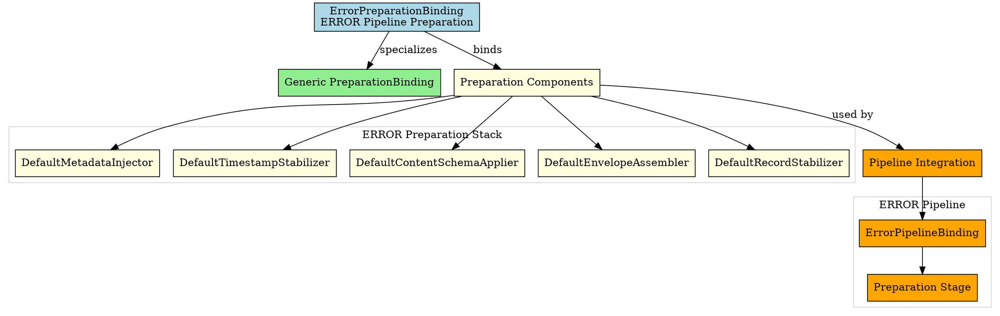

# Architectural Analysis: error_preparation_binding.hpp

## Architectural Diagrams

### Graphviz (.dot) - ERROR Preparation Binding


## File Overview
**Location:** `D:\CppBridgeVSC\LoggingSystem\include\logging_system\D_Preparation\error_preparation_binding.hpp`  
**Purpose:** ErrorPreparationBinding is the ERROR-pipeline specialization of the generic preparation binding family.  
**Language:** C++17  
**Dependencies:** `preparation_binding.hpp`, default preparation component headers  

## Architectural Role

### Core Design Pattern: Pipeline-Specific Preparation Binding
This file implements **Preparation Binding Specialization** providing ERROR-specific preparation component composition. The `ErrorPreparationBinding` serves as:

- **Pipeline specialization alias** for ERROR preparation requirements
- **Component composition explicitness** making ERROR preparation stack clear
- **Default implementation binding** using shared preparation components
- **Preparation contract fulfillment** for ERROR pipeline integration

### Preparation Layer Architecture (D_Preparation)
The `ErrorPreparationBinding` answers the narrow question:

**"Which preparation-stage components constitute the preparation stack for the ERROR pipeline right now?"**

## Structural Analysis

### Preparation Binding Structure
```cpp
using ErrorPreparationBinding = logging_system::A_Core::PreparationBinding<
    DefaultMetadataInjector,
    DefaultTimestampStabilizer,
    DefaultContentSchemaApplier,
    DefaultEnvelopeAssembler,
    DefaultRecordStabilizer>;
```

**Component Integration:**
- **`DefaultMetadataInjector`**: Handles metadata injection into ERROR log records
- **`DefaultTimestampStabilizer`**: Provides timestamp stabilization for ERROR records
- **`DefaultContentSchemaApplier`**: Applies content schema transformations to ERROR data
- **`DefaultEnvelopeAssembler`**: Assembles envelope structures for ERROR records
- **`DefaultRecordStabilizer`**: Provides final record stabilization for ERROR processing

---

**Analysis Version:** 1.0  
**Analysis Date:** 2026-04-19  
**Architectural Layer:** D_Preparation (Preparation Components)  
**Status:** ✅ Analyzed, ERROR Preparation Binding