# Architectural Analysis: metadata_injector.hpp

## Architectural Diagrams

### GraphViz (.dot) - Metadata Injector Base Architecture

```dot
digraph metadata_injector_architecture {
    rankdir=TB;
    node [shape=box, style=filled, fillcolor=lightblue];

    metadata_injector [label="MetadataInjector<TMetadata>\nGeneric Base Class"];

    node [shape=box, style=filled, fillcolor=lightyellow];
    template_parameter [label="Template Parameter"];

    metadata_injector -> template_parameter [label="parameterized by"];

    subgraph cluster_template {
        label="Template Requirements";
        color=lightgrey;
        tmetadata [label="TMetadata\nMetadata value type"];
    }

    template_parameter -> tmetadata;

    node [shape=box, style=filled, fillcolor=orange];
    core_interface [label="Core Interface"];

    metadata_injector -> core_interface [label="provides"];

    subgraph cluster_interface {
        label="Interface Methods";
        color=lightgrey;
        constructor [label="MetadataInjector(TMetadata)\nValue constructor"];
        get_metadata [label="get_metadata() const\nMetadata access"];
        set_metadata [label="set_metadata(TMetadata)\nMetadata update"];
        inject_into [label="inject_into<TEnvelope>(...)\nEnvelope injection"];
    }

    core_interface -> constructor;
    core_interface -> get_metadata;
    core_interface -> set_metadata;
    core_interface -> inject_into;

    node [shape=box, style=filled, fillcolor=lightgreen];
    inheritance_hierarchy [label="Inheritance Hierarchy"];

    metadata_injector -> inheritance_hierarchy [label="base for"];

    subgraph cluster_hierarchy {
        label="Derived Classes";
        color=lightgrey;
        default_injector [label="DefaultMetadataInjector\nConcrete implementation"];
        custom_injectors [label="CustomMetadataInjector\nSpecialized variants"];
    }

    inheritance_hierarchy -> default_injector;
    inheritance_hierarchy -> custom_injectors;

    node [shape=box, style=filled, fillcolor=lightcyan];
    contract_compliance [label="Contract Compliance"];

    metadata_injector -> contract_compliance [label="satisfies"];

    subgraph cluster_contract {
        label="MetadataInjectorConcept";
        color=lightgrey;
        metadata_type_trait [label="✓ has_metadata_type"];
        get_method_trait [label="✓ has_get_metadata_method"];
        inject_method_trait [label="✓ has_inject_into_method"];
        full_contract [label="✓ is_metadata_injector"];
    }

    contract_compliance -> metadata_type_trait;
    contract_compliance -> get_method_trait;
    contract_compliance -> inject_method_trait;
    contract_compliance -> full_contract;
}
```


### Mermaid - Metadata Injector Lifecycle Flow

```mermaid
flowchart TD
    A[Injector Creation] --> B{Construction Type}

    B --> C[Default Construction]
    B --> D[Value Construction\nMetadataInjector(metadata)]

    C --> E[Empty State\nNo metadata assigned]
    D --> F[Initialized State\nMetadata stored internally]

    E --> G[set_metadata(value)]
    G --> F

    F --> H[Usage Operations]

    H --> I[get_metadata() const]
    H --> J[set_metadata(value)]
    H --> K[inject_into<TEnvelope>(envelope, metadata)]
    H --> L[inject_into<TEnvelope>(envelope)]

    I --> M[Return stored metadata]
    J --> N[Update stored metadata]
    K --> O[Inject metadata into envelope]
    L --> P[Inject stored metadata into envelope]

    M --> Q[Metadata Consumer]
    N --> F
    O --> R[Envelope with metadata]
    P --> R

    subgraph "Construction Phase"
        A
        B
        C
        D
        E
        F
        G
    end

    subgraph "Usage Phase"
        H
        I
        J
        K
        L
        M
        N
        O
        P
        Q
        R
    end
```

## File Overview
**Location:** `D:\CppBridgeVSC\LoggingSystem\include\logging_system\D_Preparation\metadata_injector.hpp`  
**Purpose:** MetadataInjector provides the generic base class for metadata injector components, offering both metadata provision and envelope injection capabilities for composition into envelope assemblers.  
**Language:** C++17  
**Dependencies:** None (standard library only)

## Architectural Role

### Core Design Pattern: Generic Metadata Injector Base
This file implements the **Generic Injector Pattern** providing a reusable base class for metadata injection components that can be composed into envelope assemblers while maintaining both provision and injection interfaces.

The `MetadataInjector<TMetadata>` provides:
- **Metadata Storage**: Type-safe storage of metadata values
- **Provision Interface**: Access to stored metadata for external consumers
- **Injection Interface**: Direct injection of metadata into envelope objects
- **Contract Compliance**: Satisfies MetadataInjectorConcept requirements
- **Inheritance Foundation**: Base class for specialized injector implementations

### D_Preparation Layer Architecture Context
The MetadataInjector answers specific architectural questions about preparation component design:

- **How can metadata injection be abstracted while maintaining type safety?**
- **What common functionality should all metadata injectors share?**
- **How can injectors support both provision (get) and injection (set) patterns?**

## Structural Analysis

### Template Class Structure
```cpp
template <typename TMetadata>
class MetadataInjector {
public:
    using MetadataType = TMetadata;

    // Construction and destruction
    MetadataInjector() = default;
    explicit MetadataInjector(TMetadata metadata_in);

    // Provision interface
    [[nodiscard]] const TMetadata& get_metadata() const noexcept;

    // Mutation interface
    void set_metadata(TMetadata metadata_in);

    // Injection interface
    template <typename TEnvelope>
    void inject_into(TEnvelope& envelope, const TMetadata& metadata) const;

    template <typename TEnvelope>
    void inject_into(TEnvelope& envelope) const;

protected:
    TMetadata metadata_{};
};
```

**Design Characteristics:**
- **Template Parameter**: Generic over any metadata type
- **Value Semantics**: Stores metadata by value with move semantics
- **Dual Interface**: Both provision and injection capabilities
- **Protected Storage**: Allows derived classes to access internal metadata
- **Const-Correctness**: Appropriate const qualification for all operations

### Construction and Initialization

#### Default Construction
```cpp
MetadataInjector() = default;
```
**Purpose:** Creates injector in uninitialized state for later metadata assignment

#### Value Construction
```cpp
explicit MetadataInjector(TMetadata metadata_in)
    : metadata_(std::move(metadata_in)) {}
```
**Purpose:** Creates injector with initial metadata value, using move semantics for efficiency

### Provision Interface

#### Metadata Access
```cpp
[[nodiscard]] const TMetadata& get_metadata() const noexcept
```
**Access Semantics:**
- Returns const reference to prevent external modification
- Noexcept guarantee for exception safety
- Allows external consumers to access metadata without copying

### Mutation Interface

#### Metadata Update
```cpp
void set_metadata(TMetadata metadata_in)
```
**Update Semantics:**
- Accepts metadata by value for flexibility
- Uses move assignment internally for efficiency
- Allows runtime reconfiguration of injector metadata

### Injection Interface

#### Direct Injection
```cpp
template <typename TEnvelope>
void inject_into(TEnvelope& envelope, const TMetadata& metadata) const
```
**Injection Semantics:**
- Templated for any envelope type
- Accepts metadata parameter for flexibility
- Calls envelope's assign_metadata method

#### Internal Injection
```cpp
template <typename TEnvelope>
void inject_into(TEnvelope& envelope) const
```
**Injection Semantics:**
- Uses internally stored metadata
- Convenience method for common use cases
- Delegates to direct injection method

## Integration with Architecture

### Injector in Assembler Composition
```
EnvelopeAssemblerBase<T..., TMetadataInjector>
       ↓
injector.inject_into(envelope, metadata)
       ↓
envelope.assign_metadata(metadata)
       ↓
Prepared Envelope with Metadata
```

### Integration Points
- **EnvelopeAssemblerBase**: Composes TMetadataInjector for metadata handling
- **DefaultMetadataInjector**: Concrete implementation for production use
- **LogEnvelope**: Receives metadata through injection interface
- **MetadataInjectorConcept**: Ensures contract compliance for composition
- **Preparation Pipeline**: Metadata injection stage in envelope assembly

### Usage Pattern
```cpp
// Generic injector usage
MetadataInjector<LogMetadata> injector{initial_metadata};

// Provision interface
const auto& metadata = injector.get_metadata();  // Access for external use

// Mutation interface
injector.set_metadata(updated_metadata);  // Update stored metadata

// Injection interface
LogEnvelope envelope{content, empty_metadata, timestamp, schema};
injector.inject_into(envelope, metadata);  // Inject into envelope

// Or use internal metadata
injector.inject_into(envelope);  // Uses stored metadata
```

## Quality Assurance

### Code Quality Metrics
- **Cyclomatic Complexity:** 1 (simple accessor and mutator methods)
- **Lines of Code:** 102 total (focused base class implementation)
- **Dependencies:** None (pure template class)
- **Template Complexity:** Low (single template parameter with simple constraints)

### Architectural Compliance
✅ **Multi-Tier Architecture:** Layer D (Preparation) - generic injector base  
✅ **No Hardcoded Values:** Generic over TMetadata type  
✅ **Helper Methods:** Provision, mutation, and injection interfaces  
✅ **Cross-Language Interface:** N/A (C++ template base class)

### Error Analysis
**Status:** No syntax or logical errors detected.

**Architectural Correctness Verification:**
- **Template Safety**: No constraints on TMetadata, allowing flexibility
- **Interface Consistency**: Provision and injection methods work together
- **Memory Management**: Proper move semantics and const-correctness
- **Contract Compliance**: Satisfies MetadataInjectorConcept requirements

**Potential Issues Considered:**
- **Template Instantiation**: TMetadata must be movable and assignable
- **Envelope Compatibility**: TEnvelope must have assign_metadata method
- **Thread Safety**: Class is not thread-safe (appropriate for composition)

**Root Cause Analysis:** N/A (base class implementation is sound)  
**Resolution Suggestions:** N/A

## Design Rationale

### Generic Base Class Design
**Why Template Base Class:**
- **Type Safety**: Compile-time verification of metadata types
- **Reusability**: Single implementation works for any metadata type
- **Extensibility**: Derived classes can add specialized behavior
- **Performance**: Zero abstraction overhead with templates

**Why Dual Interface:**
- **Provision**: Allows external access to metadata for logging/configuration
- **Injection**: Enables direct envelope modification in assembler composition
- **Flexibility**: Supports different usage patterns in different contexts
- **Completeness**: Covers both read and write access patterns

### Protected Storage Design
**Why Protected Member:**
- **Inheritance Access**: Derived classes can access and modify metadata
- **Encapsulation**: Prevents direct external access to internal storage
- **Extension Points**: Allows derived classes to add validation or transformation
- **Composition Safety**: Maintains internal consistency

**Why Value Storage:**
- **Ownership**: Injector owns its metadata copy
- **Lifetime Management**: No external dependency management
- **Move Optimization**: Efficient transfer during construction and updates
- **Copy on Demand**: External access returns const reference, not copy

## Performance Characteristics

### Compile-Time Performance
- **Template Instantiation**: Lightweight for each TMetadata type used
- **Method Inlining**: Simple accessor methods easily inlined
- **No Complex Dependencies**: Self-contained template class
- **Fast Compilation**: Minimal template metaprogramming

### Runtime Performance
- **Zero Overhead Access**: Direct member access for get/set operations
- **Move Semantics**: Efficient metadata transfer operations
- **Template Instantiation**: Optimal code generation for each metadata type
- **No Dynamic Allocation**: All operations work on existing memory

## Evolution and Maintenance

### Injector Extensions
Future expansions may include:
- **Validation Injectors**: Injectors that validate metadata before injection
- **Transformation Injectors**: Injectors that transform metadata during injection
- **Conditional Injectors**: Injectors that inject based on envelope state
- **Caching Injectors**: Injectors with metadata caching strategies
- **Multi-Metadata Injectors**: Injectors handling multiple metadata types

### Base Class Enhancements
- **Immutable Variants**: Injectors that don't allow metadata mutation
- **Observable Injectors**: Injectors that notify on metadata changes
- **Versioned Injectors**: Injectors with metadata versioning support
- **Profile-Aware Injectors**: Injectors that adapt based on active profiles

### Testing Strategy
Injector testing should verify:
- Template instantiation works with various TMetadata types
- Construction and destruction work correctly
- Provision interface returns correct metadata references
- Mutation interface updates stored metadata properly
- Injection interface calls envelope assign_metadata correctly
- Contract compliance with MetadataInjectorConcept
- Move semantics work correctly for metadata transfer

## Related Components

### Depends On
- None (pure template class with no external dependencies)

### Used By
- **DefaultMetadataInjector**: Inherits from MetadataInjector<LogMetadata>
- **EnvelopeAssemblerBase**: Composes TMetadataInjector for metadata handling
- **Custom Metadata Injectors**: Can inherit for specialized behavior
- **Testing Frameworks**: Base class for mock injector implementations
- **Preparation Components**: Generic metadata handling in preparation pipeline

---

**Analysis Version:** 1.0  
**Analysis Date:** 2026-04-20  
**Architectural Layer:** D_Preparation (Preparation Components)  
**Status:** ✅ Analyzed, New Base Class with Injection Support