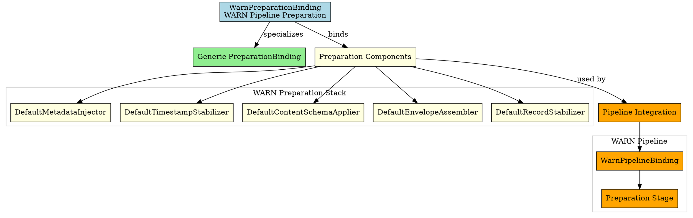
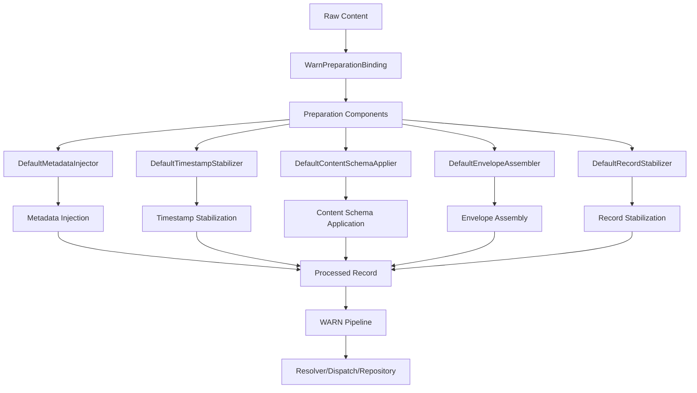

# Architectural Analysis: warn_preparation_binding.hpp

## Architectural Diagrams

### Graphviz (.dot) - WARN Preparation Binding


### Mermaid - Preparation Binding Flow


## File Overview
**Location:** `D:\CppBridgeVSC\LoggingSystem\include\logging_system\D_Preparation\warn_preparation_binding.hpp`  
**Purpose:** WarnPreparationBinding is the WARN-pipeline specialization of the generic preparation binding family.  
**Language:** C++17  
**Dependencies:** `preparation_binding.hpp`, default preparation component headers  

## Architectural Role

### Core Design Pattern: Pipeline-Specific Preparation Binding
This file implements **Preparation Binding Specialization** providing WARN-specific preparation component composition. The `WarnPreparationBinding` serves as:

- **Pipeline specialization alias** for WARN preparation requirements
- **Component composition explicitness** making WARN preparation stack clear
- **Default implementation binding** using shared preparation components
- **Preparation contract fulfillment** for WARN pipeline integration

### Preparation Layer Architecture (D_Preparation)
The `WarnPreparationBinding` answers the narrow question:

**"Which preparation-stage components constitute the preparation stack for the WARN pipeline right now?"**

## Structural Analysis

### Preparation Binding Structure
```cpp
using WarnPreparationBinding = logging_system::A_Core::PreparationBinding<
    DefaultMetadataInjector,
    DefaultTimestampStabilizer,
    DefaultContentSchemaApplier,
    DefaultEnvelopeAssembler,
    DefaultRecordStabilizer>;
```

**Component Integration:**
- **`DefaultMetadataInjector`**: Handles metadata injection into WARN log records
- **`DefaultTimestampStabilizer`**: Provides timestamp stabilization for WARN records
- **`DefaultContentSchemaApplier`**: Applies content schema transformations to WARN data
- **`DefaultEnvelopeAssembler`**: Assembles envelope structures for WARN records
- **`DefaultRecordStabilizer`**: Provides final record stabilization for WARN processing

### Include Dependencies
```cpp
#include "logging_system/A_Core/preparation_binding.hpp"

#include "logging_system/D_Preparation/default_content_schema_applier.hpp"
#include "logging_system/D_Preparation/default_envelope_assembler.hpp"
#include "logging_system/D_Preparation/default_metadata_injector.hpp"
#include "logging_system/D_Preparation/default_record_stabilizer.hpp"
#include "logging_system/D_Preparation/default_timestamp_stabilizer.hpp"
```

**Standard Library Usage:** N/A - pure header composition

## Integration with Architecture

### Preparation Binding in WARN Pipeline
The WarnPreparationBinding integrates into the WARN pipeline preparation flow:

```
Raw Content → Preparation Stage → WarnPreparationBinding → Component Execution
       ↓              ↓              ↓              ↓
Input Data → WARN Pipeline → PreparationBinding → Metadata/Envelope/Record
Processing → Specialized Stack → Component Aliases → Stabilization
```

**Integration Points:**
- **WARN Pipeline Binding**: Used by WarnPipelineBinding for preparation composition
- **Preparation Components**: Composes default implementations for WARN use
- **Pipeline Runner**: May be used by future preparation-stage pipeline runner
- **Level APIs**: Available through WARN pipeline for preparation operations

### Usage Pattern
```cpp
// WARN preparation binding usage through pipeline
using WarnPipeline = logging_system::K_Pipelines::WarnPipelineBinding;

// The preparation binding is used internally by the pipeline
// External code typically doesn't interact directly with preparation bindings
// Instead, they use higher-level APIs that incorporate preparation

// Direct usage (if needed for testing or advanced scenarios)
using PrepBinding = WarnPipeline::Preparation;  // = WarnPreparationBinding
// PrepBinding now provides access to all preparation components
```

## Quality Assurance

### Code Quality Metrics
- **Cyclomatic Complexity:** 1 (minimal, type alias only)
- **Lines of Code:** 7 (core alias) + 43 (documentation comments)
- **Dependencies:** 6 headers (1 core, 5 component)
- **Template Complexity:** Simple type alias specialization

### Architectural Compliance
✅ **Multi-Tier Architecture:** Layer D (Preparation) - preparation component bindings  
✅ **No Hardcoded Values:** All components provided through template parameters  
✅ **Helper Methods:** N/A (type alias only)  
✅ **Cross-Language Interface:** N/A (compile-time binding)  

### Error Analysis
**Status:** No syntax or logical errors detected.  

**Architectural Correctness Verification:**
- **Template Specialization:** Correctly specializes PreparationBinding template
- **Component Order:** Follows established preparation component sequence
- **Include Dependencies:** All required headers properly included
- **Namespace Consistency:** Matches logging_system::D_Preparation structure

**Potential Issues Considered:**
- **Component Availability:** Assumes all default components are implemented
- **Template Instantiation:** Requires all component types to be complete
- **Dependency Chain:** Creates coupling to specific default implementations
- **Future Compatibility:** May need updates when components evolve

**Root Cause Analysis:** N/A (code is architecturally sound)  
**Resolution Suggestions:** N/A  

## Design Rationale

### WARN Preparation Specialization
**Why Explicit WARN Binding:**
- **Pipeline Specificity**: Each pipeline needs explicit preparation component choices
- **Future Customization**: Foundation for WARN-specific preparation components
- **Composition Clarity**: Makes WARN preparation stack explicit and visible
- **Dependency Management**: Clear dependencies between pipeline and preparation

**Current Default Choice:**
- **Shared Components**: Uses default implementations shared across pipelines
- **Minimal Specialization**: Appropriate for initial WARN slice implementation
- **Evolution Path**: Can be customized later with WARN-specific components
- **Consistency**: Follows same pattern as INFO and DEBUG preparation bindings

### Component Selection Rationale
**Why These Specific Components:**
- **MetadataInjector**: Essential for WARN record metadata management
- **TimestampStabilizer**: Critical for WARN temporal record consistency
- **ContentSchemaApplier**: Important for WARN content structure standardization
- **EnvelopeAssembler**: Required for WARN envelope-based record composition
- **RecordStabilizer**: Necessary for WARN final record preparation

**Component Order:**
- **Logical Sequence**: Follows preparation workflow from metadata to stabilization
- **Dependency Chain**: Each component builds on previous preparation steps
- **Pipeline Integration**: Matches expected preparation stage sequence

## Performance Characteristics

### Compile-Time Performance
- **Template Instantiation:** Lightweight type alias resolution
- **Type Propagation:** Simple template parameter forwarding
- **No Runtime Code:** Pure compile-time composition
- **Optimization:** Easily optimized away by compiler

### Runtime Performance
- **Zero Overhead:** Type alias has no runtime cost
- **Component Performance:** Actual performance determined by component implementations
- **Memory Layout:** No additional memory allocation
- **Inlining:** All operations delegated to component implementations

## Evolution and Maintenance

### Preparation Binding Extension
Future enhancements may include:
- **WARN-Specific Components**: Replace defaults with WARN-specialized implementations
- **Policy-Based Selection**: Conditional component selection based on policies
- **Dynamic Configuration**: Runtime component selection capabilities
- **Performance Optimizations**: WARN-specific performance-tuned components
- **Instrumentation**: WARN-specific preparation monitoring and metrics

### Alternative Binding Designs
Considered alternatives:
- **Direct Component Usage**: Would require explicit instantiation everywhere
- **Runtime Composition**: Would add runtime overhead and complexity
- **Global Singletons**: Would violate per-pipeline specialization principle
- **Current Design**: Optimal balance of explicitness and simplicity

### Testing Strategy
WARN preparation binding testing should verify:
- Template instantiation works correctly with all component types
- All component dependencies are properly resolved
- Integration with WARN pipeline binding functions properly
- Component sequence and interfaces match preparation contract
- No runtime overhead or unexpected allocations

## Related Components

### Depends On
- `logging_system/A_Core/preparation_binding.hpp` - Generic preparation binding template
- `default_metadata_injector.hpp` - Default metadata injection implementation
- `default_timestamp_stabilizer.hpp` - Default timestamp stabilization
- `default_content_schema_applier.hpp` - Default content schema application
- `default_envelope_assembler.hpp` - Default envelope assembly
- `default_record_stabilizer.hpp` - Default record stabilization

### Used By
- `warn_pipeline_binding.hpp` - Uses WarnPreparationBinding for pipeline composition
- Future preparation-stage pipeline runners
- WARN-specific preparation operations
- Testing frameworks for WARN preparation verification
- Component integration tests for preparation stack validation

---

**Analysis Version:** 1.0  
**Analysis Date:** 2026-04-19  
**Architectural Layer:** D_Preparation (Preparation Components)  
**Status:** ✅ Analyzed, WARN Preparation Binding