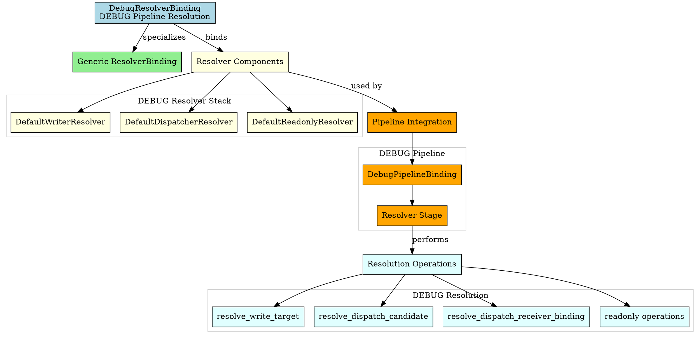
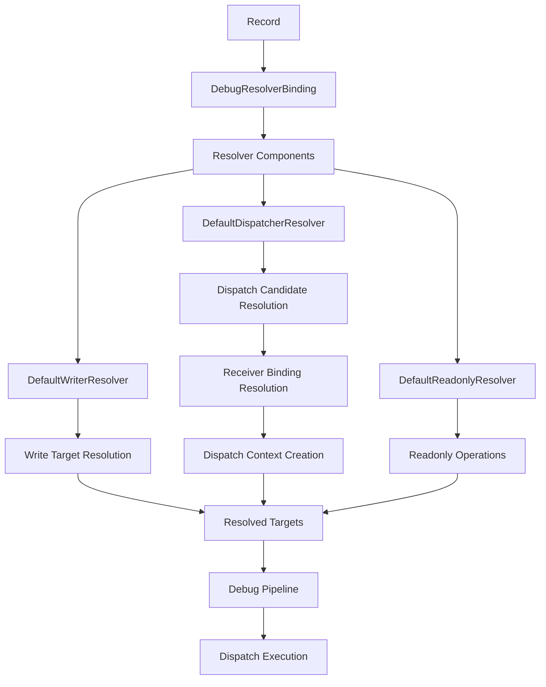

# Architectural Analysis: debug_resolver_binding.hpp

## Architectural Diagrams

### Graphviz (.dot) - DEBUG Resolver Binding


### Mermaid - Resolver Binding Flow


## File Overview
**Location:** `D:\CppBridgeVSC\LoggingSystem\include\logging_system\E_Resolvers\debug_resolver_binding.hpp`  
**Purpose:** DebugResolverBinding is the DEBUG-pipeline specialization of the generic resolver binding family.  
**Language:** C++17  
**Dependencies:** `resolver_binding.hpp`, default resolver component headers  

## Architectural Role

### Core Design Pattern: Pipeline-Specific Resolver Binding
This file implements **Resolver Binding Specialization** providing DEBUG-specific resolver component composition. The `DebugResolverBinding` serves as:

- **Pipeline specialization alias** for DEBUG resolver requirements
- **Component composition explicitness** making DEBUG resolver stack clear
- **Default implementation binding** using shared resolver components
- **Resolver contract fulfillment** for DEBUG pipeline integration

### Resolvers Layer Architecture (E_Resolvers)
The `DebugResolverBinding` answers the narrow question:

**"Which resolver implementations constitute the resolver stack for the DEBUG pipeline right now?"**

## Structural Analysis

### Resolver Binding Structure
```cpp
using DebugResolverBinding = logging_system::A_Core::ResolverBinding<
    DefaultWriterResolver,
    DefaultDispatcherResolver,
    DefaultReadonlyResolver>;
```

**Component Integration:**
- **`DefaultWriterResolver`**: Handles write target resolution for DEBUG records
- **`DefaultDispatcherResolver`**: Provides dispatch candidate and receiver binding resolution
- **`DefaultReadonlyResolver`**: Supports readonly operations and queries

### Include Dependencies
```cpp
#include "logging_system/A_Core/resolver_binding.hpp"

#include "logging_system/E_Resolvers/default_dispatcher_resolver.hpp"
#include "logging_system/E_Resolvers/default_readonly_resolver.hpp"
#include "logging_system/E_Resolvers/default_writer_resolver.hpp"
```

**Standard Library Usage:** N/A - pure header composition

## Integration with Architecture

### Resolver Binding in DEBUG Pipeline
The DebugResolverBinding integrates into the DEBUG pipeline resolver flow:

```
Record → Resolver Stage → DebugResolverBinding → Component Resolution
    ↓            ↓              ↓              ↓
Input Record → DEBUG Pipeline → ResolverBinding → WriteTarget/DispatchCandidate
Processing → Specialized Stack → Component Aliases → ReceiverBinding
```

**Integration Points:**
- **DEBUG Pipeline Binding**: Used by DebugPipelineBinding for resolver composition
- **Pipeline Runner**: Uses resolver components for write target and dispatch resolution
- **Resolver Components**: Provide actual resolution logic for DEBUG-specific routing
- **Level APIs**: Available through DEBUG pipeline for resolution operations

### Usage Pattern
```cpp
// DEBUG resolver binding usage through pipeline
using DebugPipeline = logging_system::K_Pipelines::DebugPipelineBinding;

// The resolver binding is used internally by the pipeline and runner
// External code typically doesn't interact directly with resolver bindings
// Instead, they use higher-level APIs that incorporate resolution

// Direct usage (if needed for testing or advanced scenarios)
using ResolverBinding = DebugPipeline::Resolver;  // = DebugResolverBinding
// ResolverBinding now provides access to all resolver components

// Resolution through pipeline runner
auto result = DebugPipelineRunner::run_single(
    module, "DEBUG", record, adapter);
// Internally uses DebugResolverBinding components
```

## Quality Assurance

### Code Quality Metrics
- **Cyclomatic Complexity:** 1 (minimal, type alias only)
- **Lines of Code:** 7 (core alias) + 42 (documentation comments)
- **Dependencies:** 4 headers (1 core, 3 component)
- **Template Complexity:** Simple type alias specialization

### Architectural Compliance
✅ **Multi-Tier Architecture:** Layer E (Resolvers) - resolver component bindings  
✅ **No Hardcoded Values:** All components provided through template parameters  
✅ **Helper Methods:** N/A (type alias only)  
✅ **Cross-Language Interface:** N/A (compile-time binding)  

### Error Analysis
**Status:** No syntax or logical errors detected.  

**Architectural Correctness Verification:**
- **Template Specialization:** Correctly specializes ResolverBinding template
- **Component Order:** Follows established resolver component sequence (Writer, Dispatcher, Readonly)
- **Include Dependencies:** All required headers properly included
- **Namespace Consistency:** Matches logging_system::E_Resolvers structure

**Potential Issues Considered:**
- **Component Availability:** Assumes all default resolver components are implemented
- **Template Instantiation:** Requires all resolver component types to be complete
- **Resolution Logic:** Delegates to default implementations without DEBUG-specific logic
- **Future Compatibility:** May need updates when resolver components evolve

**Root Cause Analysis:** N/A (code is architecturally sound)  
**Resolution Suggestions:** N/A  

## Design Rationale

### DEBUG Resolver Specialization
**Why Explicit DEBUG Binding:**
- **Pipeline Specificity**: Each pipeline needs explicit resolver component choices
- **Future Customization**: Foundation for DEBUG-specific resolver implementations
- **Composition Clarity**: Makes DEBUG resolver stack explicit and visible
- **Dependency Management**: Clear dependencies between pipeline and resolvers

**Current Default Choice:**
- **Shared Components**: Uses default implementations shared across pipelines
- **Minimal Specialization**: Appropriate for initial DEBUG slice implementation
- **Evolution Path**: Can be customized later with DEBUG-specific resolvers
- **Consistency**: Follows same pattern as INFO resolver binding

### Component Selection Rationale
**Why These Specific Components:**
- **WriterResolver**: Essential for determining where DEBUG records should be written
- **DispatcherResolver**: Critical for routing DEBUG records to appropriate dispatchers
- **ReadonlyResolver**: Important for read operations and debugging queries

**Component Order:**
- **Logical Sequence**: Writer first (write targets), then Dispatcher (dispatch routing), finally Readonly (queries)
- **Dependency Chain**: Each resolver builds on the resolution context
- **Pipeline Integration**: Matches expected resolver stage sequence in pipelines

## Performance Characteristics

### Compile-Time Performance
- **Template Instantiation:** Lightweight type alias resolution
- **Type Propagation:** Simple template parameter forwarding
- **No Runtime Code:** Pure compile-time composition
- **Optimization:** Easily optimized away by compiler

### Runtime Performance
- **Zero Overhead:** Type alias has no runtime cost
- **Component Performance:** Actual performance determined by resolver implementations
- **Memory Layout:** No additional memory allocation
- **Resolution Speed:** Depends on the complexity of resolution logic in components

## Evolution and Maintenance

### Resolver Binding Extension
Future enhancements may include:
- **DEBUG-Specific Resolvers**: Replace defaults with DEBUG-specialized implementations
- **Route-Aware Resolvers**: Conditional resolution based on routing requirements
- **Policy-Based Resolution**: Configurable resolution strategies for DEBUG
- **Performance Optimizations**: DEBUG-specific performance-tuned resolvers
- **Instrumentation**: DEBUG-specific resolution monitoring and metrics

### Alternative Binding Designs
Considered alternatives:
- **Direct Component Usage**: Would require explicit instantiation everywhere
- **Runtime Composition**: Would add runtime overhead and complexity
- **Global Singletons**: Would violate per-pipeline specialization principle
- **Current Design**: Optimal balance of explicitness and simplicity

### Testing Strategy
DEBUG resolver binding testing should verify:
- Template instantiation works correctly with all resolver types
- All resolver dependencies are properly resolved
- Integration with DEBUG pipeline binding functions properly
- Component sequence and interfaces match resolver contract
- Resolution operations work correctly for DEBUG-specific scenarios
- No runtime overhead or unexpected allocations

## Related Components

### Depends On
- `logging_system/A_Core/resolver_binding.hpp` - Generic resolver binding template
- `default_writer_resolver.hpp` - Default write target resolution implementation
- `default_dispatcher_resolver.hpp` - Default dispatch candidate/receiver binding resolution
- `default_readonly_resolver.hpp` - Default readonly operations implementation

### Used By
- `debug_pipeline_binding.hpp` - Uses DebugResolverBinding for pipeline composition
- `pipeline_runner.hpp` - Uses resolver components for write target and dispatch resolution
- DEBUG-specific resolution operations
- Testing frameworks for DEBUG resolver verification
- Component integration tests for resolver stack validation

---

**Analysis Version:** 1.0  
**Analysis Date:** 2026-04-19  
**Architectural Layer:** E_Resolvers (Resolver Components)  
**Status:** ✅ Analyzed, DEBUG Resolver Binding