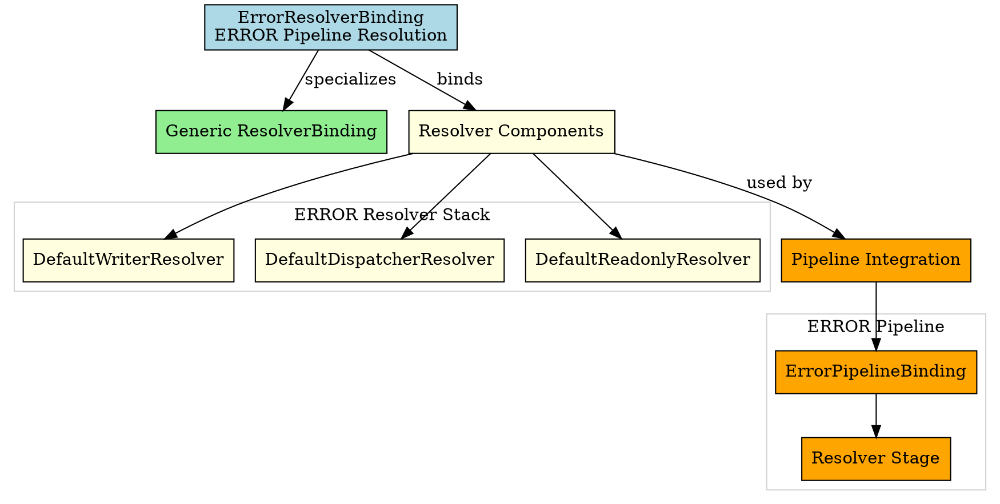

# Architectural Analysis: error_resolver_binding.hpp

## Architectural Diagrams

### Graphviz (.dot) - ERROR Resolver Binding

## File Overview
**Location:** `D:\CppBridgeVSC\LoggingSystem\include\logging_system\E_Resolvers\error_resolver_binding.hpp`  
**Purpose:** ErrorResolverBinding is the ERROR-pipeline specialization of the generic resolver binding family.  
**Language:** C++17  
**Dependencies:** `resolver_binding.hpp`, default resolver component headers  

## Architectural Role

### Core Design Pattern: Pipeline-Specific Resolver Binding
This file implements **Resolver Binding Specialization** providing ERROR-specific resolver component composition. The `ErrorResolverBinding` serves as:

- **Pipeline specialization alias** for ERROR resolver requirements
- **Component composition explicitness** making ERROR resolver stack clear
- **Default implementation binding** using shared resolver components
- **Resolver contract fulfillment** for ERROR pipeline integration

---

**Analysis Version:** 1.0  
**Analysis Date:** 2026-04-19  
**Architectural Layer:** E_Resolvers (Resolver Components)  
**Status:** ✅ Analyzed, ERROR Resolver Binding