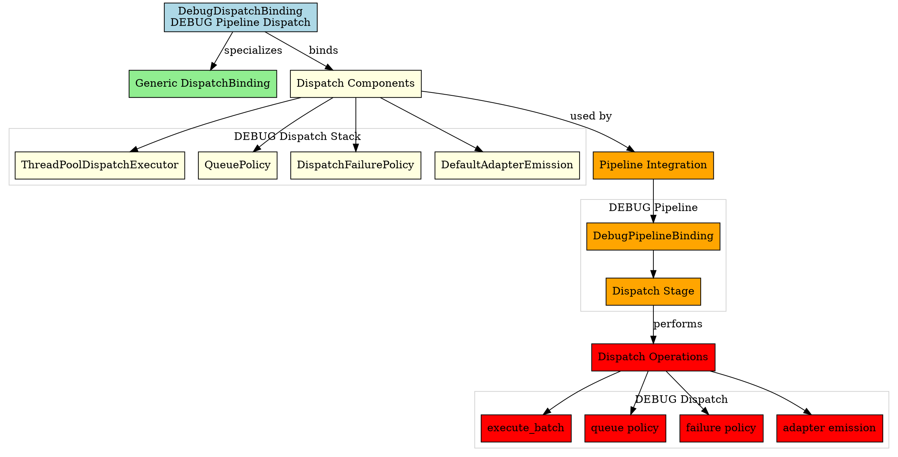
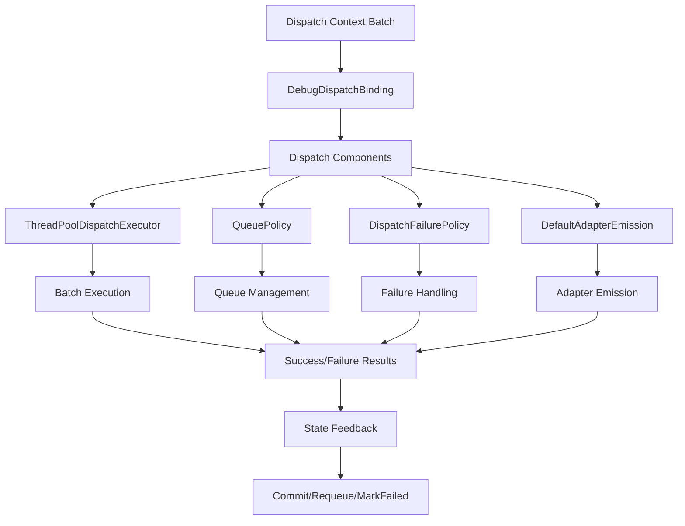

# Architectural Analysis: debug_dispatch_binding.hpp

## Architectural Diagrams

### Graphviz (.dot) - DEBUG Dispatch Binding


### Mermaid - Dispatch Binding Flow


## File Overview
**Location:** `D:\CppBridgeVSC\LoggingSystem\include\logging_system\F_Dispatch\debug_dispatch_binding.hpp`  
**Purpose:** DebugDispatchBinding is the DEBUG-pipeline specialization of the generic dispatch binding family.  
**Language:** C++17  
**Dependencies:** `dispatch_binding.hpp`, dispatch component headers  

## Architectural Role

### Core Design Pattern: Pipeline-Specific Dispatch Binding
This file implements **Dispatch Binding Specialization** providing DEBUG-specific dispatch component composition. The `DebugDispatchBinding` serves as:

- **Pipeline specialization alias** for DEBUG dispatch requirements
- **Component composition explicitness** making DEBUG dispatch stack clear
- **Default implementation binding** using shared dispatch components
- **Dispatch contract fulfillment** for DEBUG pipeline integration

### Dispatch Layer Architecture (F_Dispatch)
The `DebugDispatchBinding` answers the narrow question:

**"Which dispatch-layer components constitute the dispatch stack for the DEBUG pipeline right now?"**

## Structural Analysis

### Dispatch Binding Structure
```cpp
using DebugDispatchBinding = logging_system::A_Core::DispatchBinding<
    ThreadPoolDispatchExecutor,
    QueuePolicy,
    DispatchFailurePolicy,
    DefaultAdapterEmission>;
```

**Component Integration:**
- **`ThreadPoolDispatchExecutor`**: Handles asynchronous batch execution for DEBUG records
- **`QueuePolicy`**: Defines batch sizing and queue management policies
- **`DispatchFailurePolicy`**: Specifies failure handling strategies (Requeue/MarkFailed/AbortBatch)
- **`DefaultAdapterEmission`**: Provides adapter interface bridging for emission

### Include Dependencies
```cpp
#include "logging_system/A_Core/dispatch_binding.hpp"

#include "logging_system/F_Dispatch/default_adapter_emission.hpp"
#include "logging_system/F_Dispatch/dispatch_failure_policy.hpp"
#include "logging_system/F_Dispatch/queue_policy.hpp"
#include "logging_system/F_Dispatch/thread_pool_dispatch_executor.hpp"
```

**Standard Library Usage:** N/A - pure header composition

## Integration with Architecture

### Dispatch Binding in DEBUG Pipeline
The DebugDispatchBinding integrates into the DEBUG pipeline dispatch flow:

```
Dispatch Context Batch → Dispatch Stage → DebugDispatchBinding → Component Execution
            ↓                    ↓              ↓              ↓
      Batch Records → DEBUG Pipeline → DispatchBinding → ThreadPool Execution
   Resolution Complete → Specialized Stack → Component Aliases → Adapter Emission
```

**Integration Points:**
- **DEBUG Pipeline Binding**: Used by DebugPipelineBinding for dispatch composition
- **Pipeline Runner**: Uses dispatch components for batch execution and state feedback
- **Dispatch Components**: Provide actual execution, queuing, and failure handling logic
- **State Modules**: Receive execution results for commit/requeue/mark-failed feedback

### Usage Pattern
```cpp
// DEBUG dispatch binding usage through pipeline
using DebugPipeline = logging_system::K_Pipelines::DebugPipelineBinding;

// The dispatch binding is used internally by the pipeline and runner
// External code typically doesn't interact directly with dispatch bindings
// Instead, they use higher-level APIs that incorporate dispatch

// Direct usage (if needed for testing or advanced scenarios)
using DispatchBinding = DebugPipeline::Dispatch;  // = DebugDispatchBinding
// DispatchBinding now provides access to all dispatch components

// Dispatch through pipeline runner
auto result = DebugPipelineRunner::admit_and_run(
    module, "DEBUG", record, adapter);
// Internally uses DebugDispatchBinding components for batch execution
```

## Quality Assurance

### Code Quality Metrics
- **Cyclomatic Complexity:** 1 (minimal, type alias only)
- **Lines of Code:** 7 (core alias) + 51 (documentation comments)
- **Dependencies:** 5 headers (1 core, 4 component)
- **Template Complexity:** Simple type alias specialization

### Architectural Compliance
✅ **Multi-Tier Architecture:** Layer F (Dispatch) - dispatch component bindings  
✅ **No Hardcoded Values:** All components provided through template parameters  
✅ **Helper Methods:** N/A (type alias only)  
✅ **Cross-Language Interface:** N/A (compile-time binding)  

### Error Analysis
**Status:** No syntax or logical errors detected.  

**Architectural Correctness Verification:**
- **Template Specialization:** Correctly specializes DispatchBinding template
- **Component Order:** Follows established dispatch component sequence (Executor, Queue, Failure, Emission)
- **Include Dependencies:** All required headers properly included
- **Namespace Consistency:** Matches logging_system::F_Dispatch structure

**Potential Issues Considered:**
- **Component Availability:** Assumes all dispatch components are implemented and compatible
- **Template Instantiation:** Requires all dispatch component types to be complete
- **Threading Model:** ThreadPoolDispatchExecutor implies asynchronous execution requirements
- **Failure Policy Integration:** DispatchFailurePolicy must be compatible with state feedback

**Root Cause Analysis:** N/A (code is architecturally sound)  
**Resolution Suggestions:** N/A  

## Design Rationale

### DEBUG Dispatch Specialization
**Why Explicit DEBUG Binding:**
- **Pipeline Specificity**: Each pipeline needs explicit dispatch component choices
- **Future Customization**: Foundation for DEBUG-specific dispatch implementations
- **Composition Clarity**: Makes DEBUG dispatch stack explicit and visible
- **Execution Control**: Allows DEBUG-specific execution policies and failure handling

**Current Default Choice:**
- **ThreadPool Execution**: Asynchronous batch processing suitable for DEBUG workloads
- **Standard Policies**: Shared queue and failure policies appropriate for initial implementation
- **Default Emission**: Generic adapter bridging sufficient for DEBUG slice
- **Evolution Path**: Can be customized later with DEBUG-specific dispatch components

### Component Selection Rationale
**Why These Specific Components:**
- **ThreadPoolDispatchExecutor**: Essential for asynchronous batch processing of DEBUG records
- **QueuePolicy**: Critical for controlling batch sizes and queue management
- **DispatchFailurePolicy**: Important for handling execution failures appropriately
- **DefaultAdapterEmission**: Necessary for bridging to various adapter implementations

**Component Order:**
- **Execution Sequence**: Executor first (handles execution), then policies (control behavior), finally emission (output)
- **Dependency Chain**: Each component builds on the previous in the dispatch pipeline
- **Pipeline Integration**: Matches expected dispatch stage sequence

## Performance Characteristics

### Compile-Time Performance
- **Template Instantiation:** Lightweight type alias resolution
- **Type Propagation:** Simple template parameter forwarding
- **No Runtime Code:** Pure compile-time composition
- **Optimization:** Easily optimized away by compiler

### Runtime Performance
- **ThreadPool Overhead:** Asynchronous execution provides parallelism for batch processing
- **Queue Management:** Policy-based batch sizing affects memory usage and throughput
- **Failure Handling:** Policy-driven feedback impacts state management performance
- **Adapter Emission:** Performance depends on target adapter implementation

## Evolution and Maintenance

### Dispatch Binding Extension
Future enhancements may include:
- **DEBUG-Specific Policies**: Replace generic policies with DEBUG-specialized queue/failure handling
- **Custom Executors**: Specialized dispatch executors for DEBUG performance requirements
- **Enhanced Emission**: DEBUG-specific adapter emission bridges with custom formatting
- **Instrumentation**: DEBUG-specific dispatch monitoring and performance metrics
- **Policy Variants**: Conditional dispatch behavior based on DEBUG configuration

### Alternative Binding Designs
Considered alternatives:
- **Direct Component Usage**: Would require explicit instantiation everywhere
- **Runtime Composition**: Would add runtime overhead and complexity
- **Global Singletons**: Would violate per-pipeline specialization principle
- **Current Design**: Optimal balance of explicitness and performance

### Testing Strategy
DEBUG dispatch binding testing should verify:
- Template instantiation works correctly with all dispatch component types
- All dispatch dependencies are properly resolved
- Integration with DEBUG pipeline binding functions properly
- Component sequence and interfaces match dispatch contract
- ThreadPool execution works correctly for DEBUG batch processing
- Failure policy integration with state feedback functions properly
- Adapter emission compatibility with DEBUG adapters

## Related Components

### Depends On
- `logging_system/A_Core/dispatch_binding.hpp` - Generic dispatch binding template
- `thread_pool_dispatch_executor.hpp` - Asynchronous batch execution implementation
- `queue_policy.hpp` - Batch sizing and queue management policy
- `dispatch_failure_policy.hpp` - Failure handling strategy definitions
- `default_adapter_emission.hpp` - Generic adapter interface bridging

### Used By
- `debug_pipeline_binding.hpp` - Uses DebugDispatchBinding for pipeline composition
- `pipeline_runner.hpp` - Uses dispatch components for batch execution and state feedback
- DEBUG-specific dispatch operations and batch processing
- Testing frameworks for DEBUG dispatch verification
- Component integration tests for dispatch stack validation

---

**Analysis Version:** 1.0  
**Analysis Date:** 2026-04-19  
**Architectural Layer:** F_Dispatch (Dispatch Components)  
**Status:** ✅ Analyzed, DEBUG Dispatch Binding