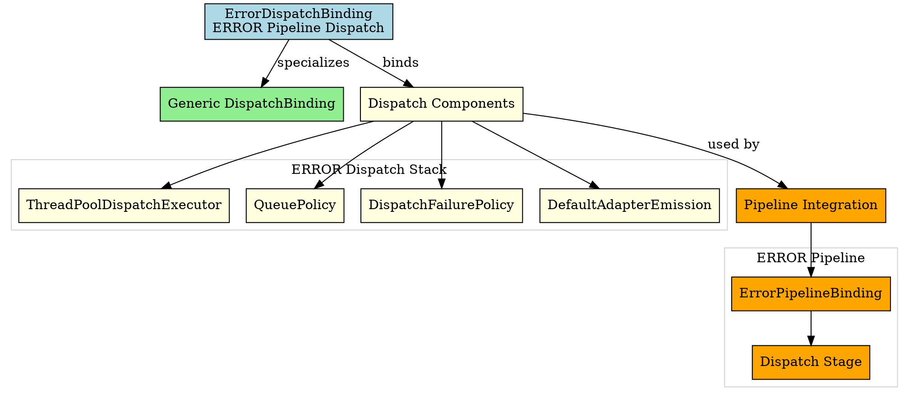

# Architectural Analysis: error_dispatch_binding.hpp

## Architectural Diagrams

### Graphviz (.dot) - ERROR Dispatch Binding

## File Overview
**Location:** `D:\CppBridgeVSC\LoggingSystem\include\logging_system\F_Dispatch\error_dispatch_binding.hpp`  
**Purpose:** ErrorDispatchBinding is the ERROR-pipeline specialization of the generic dispatch binding family.  
**Language:** C++17  
**Dependencies:** `dispatch_binding.hpp`, dispatch component headers  

---

**Analysis Version:** 1.0  
**Analysis Date:** 2026-04-19  
**Architectural Layer:** F_Dispatch (Dispatch Components)  
**Status:** ✅ Analyzed, ERROR Dispatch Binding