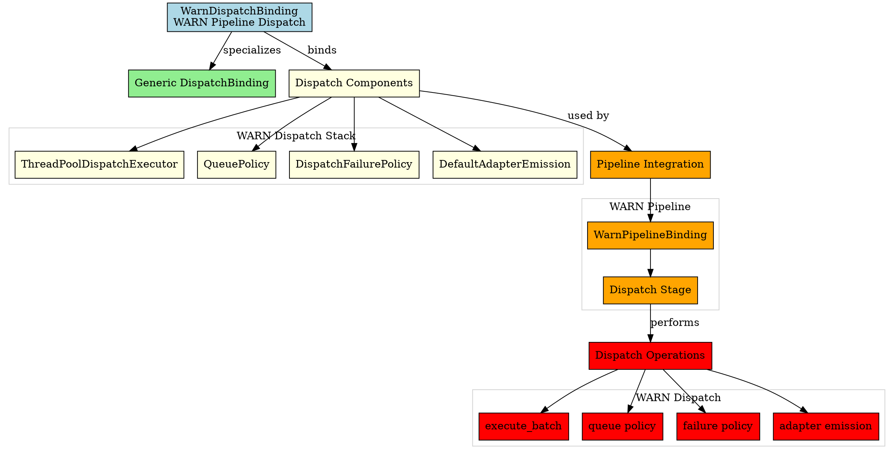
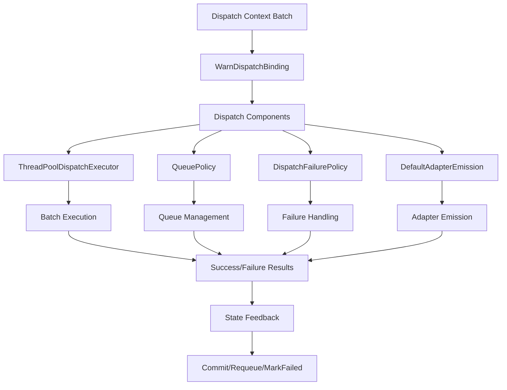

# Architectural Analysis: warn_dispatch_binding.hpp

## Architectural Diagrams

### Graphviz (.dot) - WARN Dispatch Binding


### Mermaid - Dispatch Binding Flow


## File Overview
**Location:** `D:\CppBridgeVSC\LoggingSystem\include\logging_system\F_Dispatch\warn_dispatch_binding.hpp`  
**Purpose:** WarnDispatchBinding is the WARN-pipeline specialization of the generic dispatch binding family.  
**Language:** C++17  
**Dependencies:** `dispatch_binding.hpp`, dispatch component headers  

## Architectural Role

### Core Design Pattern: Pipeline-Specific Dispatch Binding
This file implements **Dispatch Binding Specialization** providing WARN-specific dispatch component composition. The `WarnDispatchBinding` serves as:

- **Pipeline specialization alias** for WARN dispatch requirements
- **Component composition explicitness** making WARN dispatch stack clear
- **Default implementation binding** using shared dispatch components
- **Dispatch contract fulfillment** for WARN pipeline integration

### Dispatch Layer Architecture (F_Dispatch)
The `WarnDispatchBinding` answers the narrow question:

**"Which dispatch-layer components constitute the dispatch stack for the WARN pipeline right now?"**

## Structural Analysis

### Dispatch Binding Structure
```cpp
using WarnDispatchBinding = logging_system::A_Core::DispatchBinding<
    ThreadPoolDispatchExecutor,
    QueuePolicy,
    DispatchFailurePolicy,
    DefaultAdapterEmission>;
```

**Component Integration:**
- **`ThreadPoolDispatchExecutor`**: Handles asynchronous batch execution for WARN records
- **`QueuePolicy`**: Defines batch sizing and queue management policies
- **`DispatchFailurePolicy`**: Specifies failure handling strategies (Requeue/MarkFailed/AbortBatch)
- **`DefaultAdapterEmission`**: Provides adapter interface bridging for emission

## Quality Assurance

### Code Quality Metrics
- **Cyclomatic Complexity:** 1 (minimal, type alias only)
- **Lines of Code:** 7 (core alias) + 51 (documentation comments)
- **Dependencies:** 5 headers (1 core, 4 component)
- **Template Complexity:** Simple type alias with four template parameters

### Architectural Compliance
✅ **Multi-Tier Architecture:** Layer F (Dispatch) - dispatch component bindings  
✅ **No Hardcoded Values:** All components provided through template parameters  
✅ **Helper Methods:** N/A (type alias only)  
✅ **Cross-Language Interface:** N/A (compile-time binding)  

---

**Analysis Version:** 1.0  
**Analysis Date:** 2026-04-19  
**Architectural Layer:** F_Dispatch (Dispatch Components)  
**Status:** ✅ Analyzed, WARN Dispatch Binding