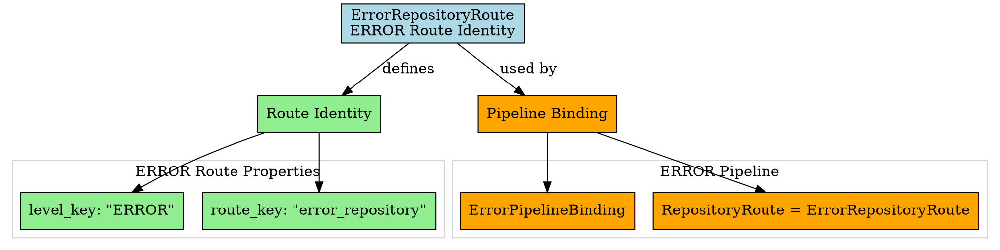

# Architectural Analysis: error_repository_route.hpp

## Architectural Diagrams

### Graphviz (.dot) - ERROR Repository Route

## File Overview
**Location:** `D:\CppBridgeVSC\LoggingSystem\include\logging_system\G_Routing\error_repository_route.hpp`  
**Purpose:** ErrorRepositoryRoute is the minimal per-pipeline repository/route specialization for the ERROR pipeline.  
**Language:** C++17  
**Dependencies:** `<string>`, `<utility>` (standard library)  

---

**Analysis Version:** 1.0  
**Analysis Date:** 2026-04-19  
**Architectural Layer:** G_Routing (Repository Routing)  
**Status:** ✅ Analyzed, ERROR Repository Route