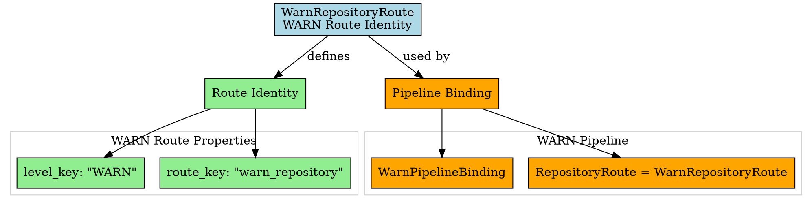

# Architectural Analysis: warn_repository_route.hpp

## Architectural Diagrams

### Graphviz (.dot) - WARN Repository Route


## File Overview
**Location:** `D:\CppBridgeVSC\LoggingSystem\include\logging_system\G_Routing\warn_repository_route.hpp`  
**Purpose:** WarnRepositoryRoute is the minimal per-pipeline repository/route specialization for the WARN pipeline.  
**Language:** C++17  
**Dependencies:** `<string>`, `<utility>` (standard library)  

## Architectural Role

### Core Design Pattern: Pipeline-Specific Route Identity
This file implements **Route Identity Definition** providing WARN-specific repository targeting. The `WarnRepositoryRoute` serves as:

- **Pipeline route identifier** specifying WARN repository ownership
- **Route metadata carrier** containing level and repository keys
- **Default route factory** for standard WARN repository targeting
- **Repository contract fulfillment** for WARN pipeline integration

### Routing Layer Architecture (G_Routing)
The `WarnRepositoryRoute` answers the narrow question:

**"When a record belongs to the WARN pipeline, what repository/route identity should the pipeline bind to by default?"**

## Structural Analysis

### Repository Route Structure
```cpp
struct WarnRepositoryRoute final {
    std::string level_key{"WARN"};
    std::string route_key{"warn_repository"};

    WarnRepositoryRoute() = default;

    WarnRepositoryRoute(std::string level_key_in, std::string route_key_in)
        : level_key(std::move(level_key_in)),
          route_key(std::move(route_key_in)) {}

    static WarnRepositoryRoute make_default() {
        return WarnRepositoryRoute{"WARN", "warn_repository"};
    }
};
```

**Structural Characteristics:**
- **Level Association**: `level_key` identifies WARN pipeline ownership
- **Repository Targeting**: `route_key` specifies "warn_repository" target
- **Default Construction**: Provides standard WARN route configuration
- **Parameterized Construction**: Allows custom route key specification
- **Factory Method**: `make_default()` for consistent instantiation

---

**Analysis Version:** 1.0  
**Analysis Date:** 2026-04-19  
**Architectural Layer:** G_Routing (Repository Routing)  
**Status:** ✅ Analyzed, WARN Repository Route