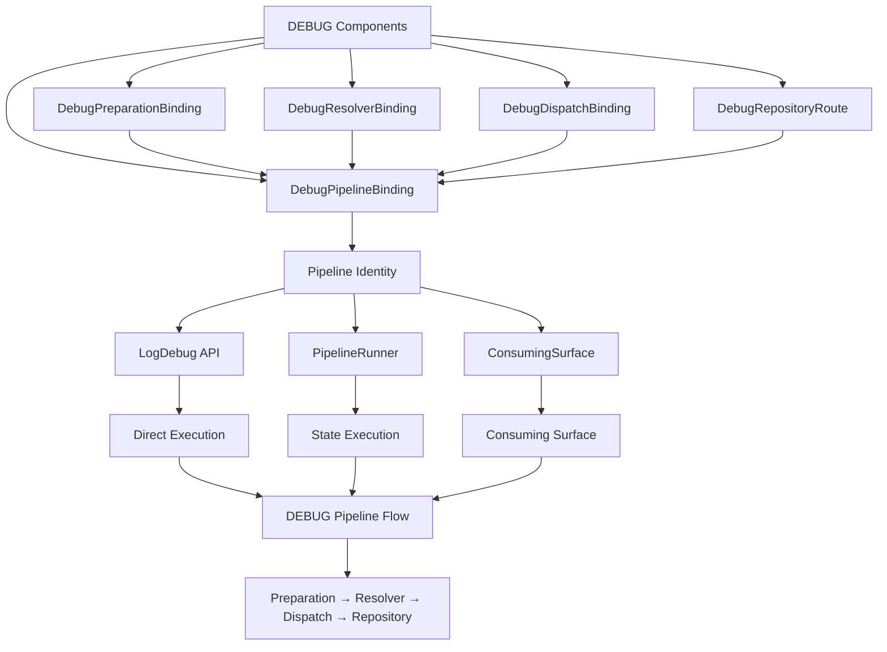

# Architectural Analysis: debug_pipeline_binding.hpp

## Architectural Diagrams

### Graphviz (.dot) - DEBUG Pipeline Binding

```dot
digraph debug_pipeline_binding {
    rankdir=TB;
    node [shape=box, style=filled, fillcolor=lightblue];
    
    debug_pipeline_binding [label="DebugPipelineBinding\nDEBUG Pipeline Assembly"];
    
    node [shape=box, style=filled, fillcolor=lightgreen];
    generic_binding [label="Generic PipelineBinding"];
    
    debug_pipeline_binding -> generic_binding [label="specializes"];
    
    node [shape=box, style=filled, fillcolor=lightyellow];
    pipeline_components [label="Pipeline Components"];
    
    debug_pipeline_binding -> pipeline_components [label="assembles"];
    
    subgraph cluster_components {
        label="DEBUG Pipeline Pillars";
        color=lightgrey;
        preparation [label="Preparation:\nDebugPreparationBinding"];
        resolver [label="Resolver:\nDebugResolverBinding"];
        dispatch [label="Dispatch:\nDebugDispatchBinding"];
        route [label="RepositoryRoute:\nDebugRepositoryRoute"];
    }
    
    pipeline_components -> preparation;
    pipeline_components -> resolver;
    pipeline_components -> dispatch;
    pipeline_components -> route;
    
    node [shape=box, style=filled, fillcolor=orange];
    pipeline_identity [label="Pipeline Identity"];
    
    debug_pipeline_binding -> pipeline_identity [label="provides"];
    
    subgraph cluster_identity {
        label="DEBUG Pipeline";
        color=lightgrey;
        level_api [label="LogDebug\nLevel API"];
        runner [label="PipelineRunner<DebugPipelineBinding>\nPipeline Runner"];
        surface [label="ConsumingSurface\nConsuming Surface"];
    }
    
    pipeline_identity -> level_api;
    pipeline_identity -> runner;
    pipeline_identity -> surface;
    
    node [shape=box, style=filled, fillcolor=red];
    pipeline_execution [label="Pipeline Execution"];
    
    pipeline_identity -> pipeline_execution [label="enables"];
    
    subgraph cluster_execution {
        label="DEBUG Execution Path";
        color=lightgrey;
        record_flow [label="Record → Preparation → Resolver → Dispatch → Repository"];
        state_flow [label="State Admission → Batch Drain → Feedback"];
        adapter_flow [label="Adapter Emission → Storage/Transmission"];
    }
    
    pipeline_execution -> record_flow;
    pipeline_execution -> state_flow;
    pipeline_execution -> adapter_flow;
}
```


### Mermaid - DEBUG Pipeline Assembly


## File Overview
**Location:** `D:\CppBridgeVSC\LoggingSystem\include\logging_system\K_Pipelines\debug_pipeline_binding.hpp`  
**Purpose:** DebugPipelineBinding is the final compile-time assembly of the DEBUG ingest/runtime pipeline.  
**Language:** C++17  
**Dependencies:** `pipeline_binding.hpp`, all DEBUG component binding headers  

## Architectural Role

### Core Design Pattern: Pipeline Final Assembly
This file implements **Pipeline Assembly Pattern** providing the complete DEBUG pipeline identity. The `DebugPipelineBinding` serves as:

- **Pipeline final assembly** combining all DEBUG component bindings
- **Compile-time pipeline identity** defining the complete DEBUG processing chain
- **Four-pillar integration** uniting preparation, resolver, dispatch, and routing
- **Pipeline contract fulfillment** enabling DEBUG-specific execution and consumption

### Pipelines Layer Architecture (K_Pipelines)
The `DebugPipelineBinding` answers the narrow question:

**"What are the four binding pillars that define the DEBUG pipeline?"**

## Structural Analysis

### Pipeline Binding Structure
```cpp
using DebugPipelineBinding = logging_system::A_Core::PipelineBinding<
    logging_system::D_Preparation::DebugPreparationBinding,
    logging_system::E_Resolvers::DebugResolverBinding,
    logging_system::F_Dispatch::DebugDispatchBinding,
    logging_system::G_Routing::DebugRepositoryRoute>;
```

**Component Integration:**
- **`DebugPreparationBinding`**: Provides DEBUG-specific record preparation stack
- **`DebugResolverBinding`**: Supplies DEBUG-specific write target and dispatch resolution
- **`DebugDispatchBinding`**: Delivers DEBUG-specific batch execution and failure handling
- **`DebugRepositoryRoute`**: Defines DEBUG-specific repository targeting and routing

### Include Dependencies
```cpp
#include "logging_system/A_Core/pipeline_binding.hpp"

#include "logging_system/D_Preparation/debug_preparation_binding.hpp"
#include "logging_system/E_Resolvers/debug_resolver_binding.hpp"
#include "logging_system/F_Dispatch/debug_dispatch_binding.hpp"
#include "logging_system/G_Routing/debug_repository_route.hpp"
```

**Standard Library Usage:** N/A - pure header composition and type assembly

## Integration with Architecture

### Pipeline Binding in DEBUG System
The DebugPipelineBinding integrates as the central identity for the complete DEBUG pipeline:

```
Component Bindings → DebugPipelineBinding → Pipeline Identity → Execution Points
         ↓                     ↓                     ↓              ↓
   DEBUG Components → Final Assembly → Type Identity → Level API/Runner/Surface
   Per-Layer Specializations → Single Pipeline Type → Compile-Time Contract → Runtime Execution
```

**Integration Points:**
- **Level APIs**: `LogDebug` uses DebugPipelineBinding as its pipeline type
- **Pipeline Runner**: `PipelineRunner<DebugPipelineBinding>` provides execution
- **Consuming Surfaces**: Access DEBUG pipeline through unified consuming interfaces
- **System Composition**: Enables DEBUG pipeline inclusion in larger system assemblies

### Usage Pattern
```cpp
// DEBUG pipeline binding as central type identity
using DebugPipeline = logging_system::K_Pipelines::DebugPipelineBinding;

// The pipeline binding provides access to all component types
using DebugPreparation = DebugPipeline::Preparation;     // DebugPreparationBinding
using DebugResolver = DebugPipeline::Resolver;           // DebugResolverBinding
using DebugDispatch = DebugPipeline::Dispatch;           // DebugDispatchBinding
using DebugRoute = DebugPipeline::RepositoryRoute;       // DebugRepositoryRoute

// Enables pipeline-specific execution
using DebugRunner = logging_system::K_Pipelines::PipelineRunner<DebugPipeline>;

// Enables level-specific APIs
auto debug_level = logging_system::L_Level_api::LogDebug::level_key(); // "DEBUG"
```

## Quality Assurance

### Code Quality Metrics
- **Cyclomatic Complexity:** 1 (minimal, type alias only)
- **Lines of Code:** 7 (core alias) + 35 (documentation comments)
- **Dependencies:** 5 headers (1 core, 4 component bindings)
- **Template Complexity:** Simple type alias with four template parameters

### Architectural Compliance
✅ **Multi-Tier Architecture:** Layer K (Pipelines) - pipeline final assemblies  
✅ **No Hardcoded Values:** All components provided through binding composition  
✅ **Helper Methods:** N/A (type alias only)  
✅ **Cross-Language Interface:** N/A (compile-time binding assembly)  

### Error Analysis
**Status:** No syntax or logical errors detected.  

**Architectural Correctness Verification:**
- **Template Specialization:** Correctly specializes PipelineBinding with four component types
- **Component Dependencies:** All required DEBUG component bindings are included
- **Type Assembly:** Proper namespace qualification for all component types
- **Binding Order:** Follows established pipeline component sequence (Preparation, Resolver, Dispatch, Route)

**Potential Issues Considered:**
- **Component Availability:** Assumes all DEBUG component bindings are properly implemented
- **Template Instantiation:** Requires all component types to be complete and compatible
- **Binding Consistency:** DEBUG components must be compatible with each other
- **Future Compatibility:** May need updates when component bindings evolve

**Root Cause Analysis:** N/A (code is architecturally sound)  
**Resolution Suggestions:** N/A  

## Design Rationale

### DEBUG Pipeline Final Assembly
**Why Explicit DEBUG Pipeline Binding:**
- **Pipeline Identity**: Each logging level needs a distinct pipeline identity
- **Component Integration**: Unites all DEBUG-specific components into a single contract
- **Type Safety**: Compile-time enforcement of DEBUG pipeline composition
- **Execution Enablement**: Required for pipeline runner and level API specialization

**Assembly Benefits:**
- **Single Source of Truth**: One type that defines the complete DEBUG pipeline
- **Component Coordination**: Ensures all DEBUG components work together
- **Extensibility Points**: Foundation for future DEBUG-specific pipeline features
- **System Integration**: Enables DEBUG pipeline inclusion in larger architectures

### Four-Pillar Architecture
**Why Four Component Bindings:**
- **Preparation Binding**: Defines how DEBUG records are prepared and enriched
- **Resolver Binding**: Specifies how DEBUG records are routed and targeted
- **Dispatch Binding**: Controls how DEBUG records are executed and handled
- **Repository Route**: Identifies where DEBUG records should be stored

**Pillar Interdependencies:**
- **Preparation → Resolver**: Prepared records need resolution for targeting
- **Resolver → Dispatch**: Resolved targets enable proper dispatch execution
- **Dispatch → Route**: Route information guides storage and transmission decisions
- **Route → Preparation**: Repository context may influence preparation policies

## Performance Characteristics

### Compile-Time Performance
- **Template Instantiation:** Lightweight type alias resolution
- **Type Propagation:** Simple template parameter forwarding through pipeline
- **No Runtime Code:** Pure compile-time pipeline identity
- **Optimization:** Easily optimized away by compiler

### Runtime Performance
- **Zero Overhead:** Type alias has no runtime cost
- **Component Performance:** Actual performance determined by bound component implementations
- **Pipeline Efficiency:** Enables optimized execution paths for DEBUG-specific workflows
- **Memory Layout:** No additional memory allocation or state

## Evolution and Maintenance

### Pipeline Binding Extension
Future enhancements may include:
- **Pipeline Traits**: Compile-time validation traits for DEBUG pipeline contracts
- **Helper Aliases**: Convenient type aliases for common DEBUG pipeline operations
- **Integration Hooks**: Optional hooks for pipeline monitoring and instrumentation
- **Documentation Support**: Enhanced metadata for pipeline pack composition
- **Policy Integration**: Pipeline-level policies that span multiple components

### Alternative Assembly Designs
Considered alternatives:
- **Individual Component Usage**: Would require manual coordination everywhere
- **Runtime Composition**: Would add runtime overhead and lose compile-time safety
- **Global Pipeline Registry**: Would violate per-pipeline specialization principle
- **Current Design**: Optimal balance of type safety and component integration

### Testing Strategy
DEBUG pipeline binding testing should verify:
- Template instantiation works correctly with all component binding types
- All component type aliases are properly accessible (Preparation, Resolver, Dispatch, RepositoryRoute)
- Integration with PipelineRunner template instantiation functions correctly
- Integration with LogDebug level API functions correctly
- Component bindings are compatible and work together as a pipeline
- Pipeline identity enables proper DEBUG-specific execution paths

## Related Components

### Depends On
- `logging_system/A_Core/pipeline_binding.hpp` - Generic pipeline binding template
- `debug_preparation_binding.hpp` - DEBUG preparation component binding
- `debug_resolver_binding.hpp` - DEBUG resolver component binding
- `debug_dispatch_binding.hpp` - DEBUG dispatch component binding
- `debug_repository_route.hpp` - DEBUG repository route definition

### Used By
- `log_debug.hpp` - Uses DebugPipelineBinding as pipeline type for level API
- `pipeline_runner.hpp` - PipelineRunner<DebugPipelineBinding> provides execution
- Consuming surfaces for DEBUG-specific pipeline access
- System composition layers that include DEBUG pipeline
- Testing frameworks for DEBUG pipeline verification
- Monitoring and instrumentation systems for DEBUG pipeline tracking

---

**Analysis Version:** 1.0  
**Analysis Date:** 2026-04-19  
**Architectural Layer:** K_Pipelines (Pipeline Assemblies)  
**Status:** ✅ Analyzed, DEBUG Pipeline Final Assembly