# Architectural Analysis: error_pipeline_binding.hpp

## Architectural Diagrams

### Graphviz (.dot) - ERROR Pipeline Binding

```dot
digraph error_pipeline_binding {
    rankdir=TB;
    node [shape=box, style=filled, fillcolor=lightblue];
    
    error_pipeline_binding [label="ErrorPipelineBinding\nERROR Pipeline Assembly"];
    
    node [shape=box, style=filled, fillcolor=lightgreen];
    generic_binding [label="Generic PipelineBinding"];
    
    error_pipeline_binding -> generic_binding [label="specializes"];
    
    node [shape=box, style=filled, fillcolor=lightyellow];
    pipeline_components [label="Pipeline Components"];
    
    error_pipeline_binding -> pipeline_components [label="assembles"];
    
    subgraph cluster_components {
        label="ERROR Pipeline Pillars";
        color=lightgrey;
        preparation [label="Preparation:\nErrorPreparationBinding"];
        resolver [label="Resolver:\nErrorResolverBinding"];
        dispatch [label="Dispatch:\nErrorDispatchBinding"];
        route [label="RepositoryRoute:\nErrorRepositoryRoute"];
    }
    
    pipeline_components -> preparation;
    pipeline_components -> resolver;
    pipeline_components -> dispatch;
    pipeline_components -> route;
    
    node [shape=box, style=filled, fillcolor=orange];
    pipeline_identity [label="Pipeline Identity"];
    
    error_pipeline_binding -> pipeline_identity [label="provides"];
    
    subgraph cluster_identity {
        label="ERROR Pipeline";
        color=lightgrey;
        level_api [label="LogError\nLevel API"];
        runner [label="PipelineRunner<ErrorPipelineBinding>\nPipeline Runner"];
        surface [label="ConsumingSurface\nConsuming Surface"];
    }
    
    pipeline_identity -> level_api;
    pipeline_identity -> runner;
    pipeline_identity -> surface;
    
    node [shape=box, style=filled, fillcolor=red];
    pipeline_execution [label="Pipeline Execution"];
    
    pipeline_identity -> pipeline_execution [label="enables"];
    
    subgraph cluster_execution {
        label="ERROR Execution Path";
        color=lightgrey;
        record_flow [label="Record → Preparation → Resolver → Dispatch → Repository"];
        state_flow [label="State Admission → Batch Drain → Feedback"];
        adapter_flow [label="Adapter Emission → Storage/Transmission"];
    }
    
    pipeline_execution -> record_flow;
    pipeline_execution -> state_flow;
    pipeline_execution -> adapter_flow;
}
```

## File Overview
**Location:** `D:\CppBridgeVSC\LoggingSystem\include\logging_system\K_Pipelines\error_pipeline_binding.hpp`  
**Purpose:** ErrorPipelineBinding is the final compile-time assembly of the ERROR ingest/runtime pipeline.  
**Language:** C++17  
**Dependencies:** `pipeline_binding.hpp`, all ERROR component binding headers  

---

**Analysis Version:** 1.0  
**Analysis Date:** 2026-04-19  
**Architectural Layer:** K_Pipelines (Pipeline Assemblies)  
**Status:** ✅ Analyzed, ERROR Pipeline Final Assembly