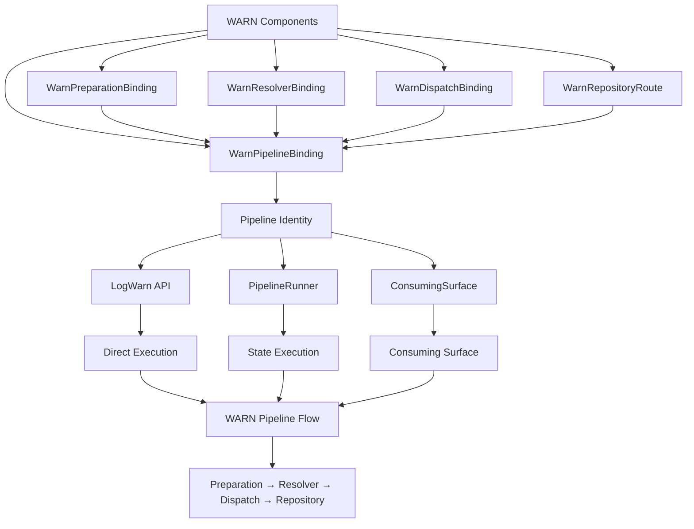

# Architectural Analysis: warn_pipeline_binding.hpp

## Architectural Diagrams

### Graphviz (.dot) - WARN Pipeline Binding

```dot
digraph warn_pipeline_binding {
    rankdir=TB;
    node [shape=box, style=filled, fillcolor=lightblue];
    
    warn_pipeline_binding [label="WarnPipelineBinding\nWARN Pipeline Assembly"];
    
    node [shape=box, style=filled, fillcolor=lightgreen];
    generic_binding [label="Generic PipelineBinding"];
    
    warn_pipeline_binding -> generic_binding [label="specializes"];
    
    node [shape=box, style=filled, fillcolor=lightyellow];
    pipeline_components [label="Pipeline Components"];
    
    warn_pipeline_binding -> pipeline_components [label="assembles"];
    
    subgraph cluster_components {
        label="WARN Pipeline Pillars";
        color=lightgrey;
        preparation [label="Preparation:\nWarnPreparationBinding"];
        resolver [label="Resolver:\nWarnResolverBinding"];
        dispatch [label="Dispatch:\nWarnDispatchBinding"];
        route [label="RepositoryRoute:\nWarnRepositoryRoute"];
    }
    
    pipeline_components -> preparation;
    pipeline_components -> resolver;
    pipeline_components -> dispatch;
    pipeline_components -> route;
    
    node [shape=box, style=filled, fillcolor=orange];
    pipeline_identity [label="Pipeline Identity"];
    
    warn_pipeline_binding -> pipeline_identity [label="provides"];
    
    subgraph cluster_identity {
        label="WARN Pipeline";
        color=lightgrey;
        level_api [label="LogWarn\nLevel API"];
        runner [label="PipelineRunner<WarnPipelineBinding>\nPipeline Runner"];
        surface [label="ConsumingSurface\nConsuming Surface"];
    }
    
    pipeline_identity -> level_api;
    pipeline_identity -> runner;
    pipeline_identity -> surface;
    
    node [shape=box, style=filled, fillcolor=red];
    pipeline_execution [label="Pipeline Execution"];
    
    pipeline_identity -> pipeline_execution [label="enables"];
    
    subgraph cluster_execution {
        label="WARN Execution Path";
        color=lightgrey;
        record_flow [label="Record → Preparation → Resolver → Dispatch → Repository"];
        state_flow [label="State Admission → Batch Drain → Feedback"];
        adapter_flow [label="Adapter Emission → Storage/Transmission"];
    }
    
    pipeline_execution -> record_flow;
    pipeline_execution -> state_flow;
    pipeline_execution -> adapter_flow;
}
```


### Mermaid - WARN Pipeline Assembly


## File Overview
**Location:** `D:\CppBridgeVSC\LoggingSystem\include\logging_system\K_Pipelines\warn_pipeline_binding.hpp`  
**Purpose:** WarnPipelineBinding is the final compile-time assembly of the WARN ingest/runtime pipeline.  
**Language:** C++17  
**Dependencies:** `pipeline_binding.hpp`, all WARN component binding headers  

## Architectural Role

### Core Design Pattern: Pipeline Final Assembly
This file implements **Pipeline Assembly Pattern** providing the complete WARN pipeline identity. The `WarnPipelineBinding` serves as:

- **Pipeline final assembly** combining all WARN component bindings
- **Compile-time pipeline identity** defining the complete WARN processing chain
- **Four-pillar integration** uniting preparation, resolver, dispatch, and routing
- **Pipeline contract fulfillment** enabling WARN-specific execution and consumption

### Pipelines Layer Architecture (K_Pipelines)
The `WarnPipelineBinding` answers the narrow question:

**"What are the four binding pillars that define the WARN pipeline?"**

## Structural Analysis

### Pipeline Binding Structure
```cpp
using WarnPipelineBinding = logging_system::A_Core::PipelineBinding<
    logging_system::D_Preparation::WarnPreparationBinding,
    logging_system::E_Resolvers::WarnResolverBinding,
    logging_system::F_Dispatch::WarnDispatchBinding,
    logging_system::G_Routing::WarnRepositoryRoute>;
```

**Component Integration:**
- **`WarnPreparationBinding`**: Provides WARN-specific record preparation stack
- **`WarnResolverBinding`**: Supplies WARN-specific write target and dispatch resolution
- **`WarnDispatchBinding`**: Delivers WARN-specific batch execution and failure handling
- **`WarnRepositoryRoute`**: Defines WARN-specific repository targeting and routing

### Include Dependencies
```cpp
#include "logging_system/A_Core/pipeline_binding.hpp"

#include "logging_system/D_Preparation/warn_preparation_binding.hpp"
#include "logging_system/E_Resolvers/warn_resolver_binding.hpp"
#include "logging_system/F_Dispatch/warn_dispatch_binding.hpp"
#include "logging_system/G_Routing/warn_repository_route.hpp"
```

**Standard Library Usage:** N/A - pure header composition and type assembly

## Integration with Architecture

### Pipeline Binding in WARN System
The WarnPipelineBinding integrates as the central identity for the complete WARN pipeline:

```
Component Bindings → WarnPipelineBinding → Pipeline Identity → Execution Points
         ↓              ↓              ↓              ↓
   WARN Components → Final Assembly → Type Identity → Level API/Runner/Surface
   Per-Layer Specializations → Single Pipeline Type → Compile-Time Contract → Runtime Execution
```

**Integration Points:**
- **Level APIs**: `LogWarn` uses WarnPipelineBinding as its pipeline type
- **Pipeline Runner**: `PipelineRunner<WarnPipelineBinding>` provides execution
- **Consuming Surfaces**: Access WARN pipeline through unified consuming interfaces
- **System Composition**: Enables WARN pipeline inclusion in larger system assemblies

### Usage Pattern
```cpp
// WARN pipeline binding as central type identity
using WarnPipeline = logging_system::K_Pipelines::WarnPipelineBinding;

// The pipeline binding provides access to all component types
using WarnPreparation = WarnPipeline::Preparation;     // WarnPreparationBinding
using WarnResolver = WarnPipeline::Resolver;           // WarnResolverBinding
using WarnDispatch = WarnPipeline::Dispatch;           // WarnDispatchBinding
using WarnRoute = WarnPipeline::RepositoryRoute;       // WarnRepositoryRoute

// Enables pipeline-specific execution
using WarnRunner = logging_system::K_Pipelines::PipelineRunner<WarnPipeline>;

// Enables level-specific APIs
auto warn_level = logging_system::L_Level_api::LogWarn::level_key(); // "WARN"
```

## Quality Assurance

### Code Quality Metrics
- **Cyclomatic Complexity:** 1 (minimal, type alias only)
- **Lines of Code:** 7 (core alias) + 35 (documentation comments)
- **Dependencies:** 5 headers (1 core, 4 component bindings)
- **Template Complexity:** Simple type alias with four template parameters

### Architectural Compliance
✅ **Multi-Tier Architecture:** Layer K (Pipelines) - pipeline final assemblies  
✅ **No Hardcoded Values:** All components provided through binding composition  
✅ **Helper Methods:** N/A (type alias only)  
✅ **Cross-Language Interface:** N/A (compile-time binding assembly)  

### Error Analysis
**Status:** No syntax or logical errors detected.  

**Architectural Correctness Verification:**
- **Template Specialization:** Correctly specializes PipelineBinding with four component types
- **Component Dependencies:** All required WARN component bindings are included
- **Type Assembly:** Proper namespace qualification for all component types
- **Binding Order:** Follows established pipeline component sequence (Preparation, Resolver, Dispatch, Route)

**Potential Issues Considered:**
- **Component Availability:** Assumes all WARN component bindings are properly implemented
- **Template Instantiation:** Requires all component types to be complete and compatible
- **Binding Consistency:** WARN components must be compatible with each other
- **Future Compatibility:** May need updates when component bindings evolve

**Root Cause Analysis:** N/A (code is architecturally sound)  
**Resolution Suggestions:** N/A  

## Design Rationale

### WARN Pipeline Final Assembly
**Why Explicit WARN Pipeline Binding:**
- **Pipeline Identity**: Each logging level needs a distinct pipeline identity
- **Component Integration**: Unites all WARN-specific components into a single contract
- **Type Safety**: Compile-time enforcement of WARN pipeline composition
- **Execution Enablement**: Required for pipeline runner and level API specialization

**Assembly Benefits:**
- **Single Source of Truth**: One type that defines the complete WARN pipeline
- **Component Coordination**: Ensures all WARN components work together
- **Extensibility Points**: Foundation for future WARN-specific pipeline features
- **System Integration**: Enables WARN pipeline inclusion in larger architectures

### Four-Pillar Architecture
**Why Four Component Bindings:**
- **Preparation Binding**: Defines how WARN records are prepared and enriched
- **Resolver Binding**: Specifies how WARN records are routed and targeted
- **Dispatch Binding**: Controls how WARN records are executed and handled
- **Repository Route**: Identifies where WARN records should be stored

**Pillar Interdependencies:**
- **Preparation → Resolver**: Prepared records need resolution for targeting
- **Resolver → Dispatch**: Resolved targets enable proper dispatch execution
- **Dispatch → Route**: Route information guides storage and transmission decisions
- **Route → Preparation**: Repository context may influence preparation policies

## Performance Characteristics

### Compile-Time Performance
- **Template Instantiation:** Lightweight type alias resolution
- **Type Propagation:** Simple template parameter forwarding through pipeline
- **No Runtime Code:** Pure compile-time pipeline identity
- **Optimization:** Easily optimized away by compiler

### Runtime Performance
- **Zero Overhead:** Type alias has no runtime cost
- **Component Performance:** Actual performance determined by bound component implementations
- **Pipeline Efficiency:** Enables optimized execution paths for WARN-specific workflows
- **Memory Layout:** No additional memory allocation or state

## Evolution and Maintenance

### Pipeline Binding Extension
Future enhancements may include:
- **Pipeline Traits**: Compile-time validation traits for WARN pipeline contracts
- **Helper Aliases**: Convenient type aliases for common WARN pipeline operations
- **Integration Hooks**: Optional hooks for pipeline monitoring and instrumentation
- **Documentation Support**: Enhanced metadata for pipeline pack composition
- **Policy Integration**: Pipeline-level policies that span multiple components

### Alternative Assembly Designs
Considered alternatives:
- **Individual Component Usage**: Would require manual coordination everywhere
- **Runtime Composition**: Would add runtime overhead and complexity
- **Global Pipeline Registry**: Would violate per-pipeline specialization principle
- **Current Design**: Optimal balance of simplicity and component integration

### Testing Strategy
WARN pipeline binding testing should verify:
- Template instantiation works correctly with all component binding types
- All component type aliases are properly accessible (Preparation, Resolver, Dispatch, RepositoryRoute)
- Integration with PipelineRunner template instantiation functions correctly
- Integration with LogWarn level API functions correctly
- Component bindings are compatible and work together as a pipeline
- Pipeline identity enables proper WARN-specific execution paths

## Related Components

### Depends On
- `logging_system/A_Core/pipeline_binding.hpp` - Generic pipeline binding template
- `warn_preparation_binding.hpp` - WARN preparation component binding
- `warn_resolver_binding.hpp` - WARN resolver component binding
- `warn_dispatch_binding.hpp` - WARN dispatch component binding
- `warn_repository_route.hpp` - WARN repository route definition

### Used By
- `log_warn.hpp` - Uses WarnPipelineBinding as pipeline type for level API
- `pipeline_runner.hpp` - PipelineRunner<WarnPipelineBinding> provides execution
- Consuming surfaces for WARN-specific pipeline access
- System composition layers that include WARN pipeline
- Testing frameworks for WARN pipeline verification
- Monitoring and instrumentation systems for WARN pipeline tracking

---

**Analysis Version:** 1.0  
**Analysis Date:** 2026-04-19  
**Architectural Layer:** K_Pipelines (Pipeline Assemblies)  
**Status:** ✅ Analyzed, WARN Pipeline Final Assembly