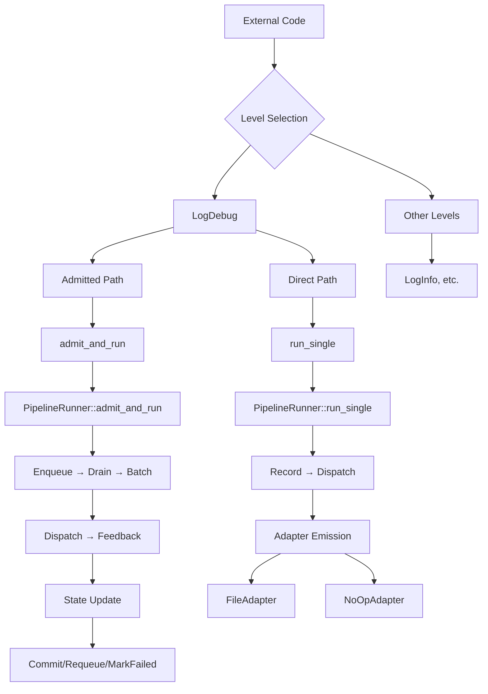

# Architectural Analysis: log_debug.hpp

## Architectural Diagrams

### Graphviz (.dot) - Level API Architecture

```dot
digraph log_debug_architecture {
    rankdir=TB;
    node [shape=box, style=filled, fillcolor=lightblue];
    
    log_debug [label="LogDebug\nDEBUG Level API Entry Point"];
    
    node [shape=box, style=filled, fillcolor=lightgreen];
    pipeline_binding_integration [label="Pipeline Binding Integration"];
    
    log_debug -> pipeline_binding_integration [label="uses"];
    
    subgraph cluster_binding {
        label="DebugPipelineBinding";
        color=lightgrey;
        debug_pipeline [label="PipelineBinding =\nDebugPipelineBinding"];
    }
    
    pipeline_binding_integration -> debug_pipeline;
    
    node [shape=box, style=filled, fillcolor=lightyellow];
    runner_integration [label="Pipeline Runner"];
    
    log_debug -> runner_integration [label="uses"];
    
    subgraph cluster_runner {
        label="PipelineRunner";
        color=lightgrey;
        runner [label="Runner =\nPipelineRunner<PipelineBinding>"];
    }
    
    runner_integration -> runner;
    
    node [shape=box, style=filled, fillcolor=orange];
    api_operations [label="API Operations"];
    
    log_debug -> api_operations [label="provides"];
    
    subgraph cluster_operations {
        label="DEBUG Level Operations";
        color=lightgrey;
        level_key_op [label="level_key()\nReturns \"DEBUG\""];
        resolve_target_op [label="resolve_write_target(module, record)"];
        build_handoff_op [label="build_write_handoff_event(target)"];
        resolve_route_op [label="resolve_default_route()"];
        admit_and_run_op [label="admit_and_run(module, record, adapter, round_id)"];
    }
    
    api_operations -> level_key_op;
    api_operations -> resolve_target_op;
    api_operations -> build_handoff_op;
    api_operations -> resolve_route_op;
    api_operations -> admit_and_run_op;
}
```


### Mermaid - DEBUG Level API Flow


## File Overview
**Location:** `D:\CppBridgeVSC\LoggingSystem\include\logging_system\L_Level_api\log_debug.hpp`  
**Purpose:** LogDebug is the finalized thin dedicated DEBUG-level entrypoint over the DEBUG pipeline slice.  
**Language:** C++17  
**Dependencies:** `<optional>`, `<string>`, `debug_pipeline_binding.hpp`, `pipeline_runner.hpp`  

## Architectural Role

### Core Design Pattern: Finalized Level Entrypoint
This file implements **Finalized Level Entrypoint Pattern** providing complete DEBUG pipeline access. The `LogDebug` serves as:

- **Finalized entrypoint** reflecting upgraded runner and admitted-runtime path
- **Dual-path exposure** for both direct helper and state-admission-aware execution
- **Per-level specialization** with hardcoded DEBUG-specific configuration
- **Thin delegation layer** over pipeline runner functionality

### Level API Layer Architecture (L_Level_api)
The `LogDebug` answers questions about finalized DEBUG pipeline access:

- **How does external code submit work into the DEBUG pipeline without generic routing?**
- **How does the DEBUG pipeline expose both direct and state-admission-aware paths?**
- **What is the thin API for triggering DEBUG pipeline execution with proper state handling?**

## Structural Analysis

### Level API Structure
```cpp
struct LogDebug final {
    using PipelineBinding = logging_system::K_Pipelines::DebugPipelineBinding;
    using Runner = logging_system::K_Pipelines::PipelineRunner<PipelineBinding>;

    static constexpr const char* level_key() noexcept {
        return "DEBUG";
    }

    static auto resolve_default_route() {
        return Runner::resolve_default_route();
    }

    template <typename TModule, typename TRecord, typename TAdapter>
    static auto run_single(
        const TModule& module,
        const TRecord& record,
        TAdapter& adapter,
        const std::optional<std::string>& round_id = std::nullopt) {
        return Runner::run_single(
            module,
            level_key(),
            record,
            adapter,
            round_id);
    }

    template <typename TModule, typename TRecord, typename TAdapter>
    static auto admit_and_run(
        TModule& module,
        const TRecord& record,
        TAdapter& adapter,
        const std::optional<std::string>& round_id = std::nullopt) {
        return Runner::admit_and_run(
            module,
            level_key(),
            record,
            adapter,
            round_id);
    }
};
```

**Component Integration:**
- **`PipelineBinding`**: Uses DebugPipelineBinding for complete DEBUG pipeline access
- **`Runner`**: Uses PipelineRunner specialized for DEBUG pipeline execution
- **Level Constant**: Hardcoded "DEBUG" level key for specialization
- **Dual Operations**: `run_single` (direct) and `admit_and_run` (state-admission-aware)

## Integration with Architecture

### DEBUG Level API in Logging Entry Flow
The LogDebug integrates into the logging entry flow with dual paths:

**Direct Record Path:**
```
External Code → Level API → Pipeline Runner → DEBUG Pipeline → Dispatch Emission
       ↓              ↓              ↓              ↓              ↓
   DEBUG Logging → LogDebug::run_single → Runner::run_single → Resolver → Adapter
   API Calls → Direct Delegation → DEBUG Context → Resolution → Emission
```

**Admitted-Runtime Path:**
```
External Code → Level API → State Admission → Batch Processing → State Feedback
       ↓              ↓              ↓              ↓              ↓
   DEBUG Logging → LogDebug::admit_and_run → enqueue_pending → drain_pending → commit/
   API Calls → State-Aware Path → shared state → batch execution → requeue/
                                                           mark-failed
```

**Integration Points:**
- **Level APIs**: Direct consumer of PipelineRunner for DEBUG-specific operations
- **Consuming Surfaces**: Can use LogDebug directly or through consuming surface façade
- **Pipeline Runner**: Uses admitted-runtime capabilities for state management
- **State Modules**: LogContainerModule provides admission/drain/commit state operations

### Usage Pattern
```cpp
// DEBUG logging operations
std::string level = LogDebug::level_key();  // "DEBUG"

// Direct record-to-dispatch execution (bypasses state admission)
auto direct_result = LogDebug::run_single(
    log_container_module,    // const TModule& - read-only state access
    debug_record,            // TRecord - finalized log record
    file_adapter,            // TAdapter - emission target
    std::optional<std::string>{"round_123"} // optional round_id
);

// Admitted-runtime execution (with state admission and feedback)
auto admitted_result = LogDebug::admit_and_run(
    log_container_module,    // TModule& - read-write state access
    debug_record,            // TRecord - record to admit and process
    file_adapter,            // TAdapter - emission target
    std::optional<std::string>{"batch_001"} // optional round_id
);

// Get default DEBUG route for setup
auto route = LogDebug::resolve_default_route();
```

## Quality Assurance

### Code Quality Metrics
- **Cyclomatic Complexity:** 1 (minimal, dual delegation paths)
- **Lines of Code:** 36 (core struct) + 71 (documentation comments)
- **Dependencies:** 4 headers (2 std, 2 internal)
- **Template Complexity:** Two template methods with parameter forwarding

### Architectural Compliance
✅ **Multi-Tier Architecture:** Layer L (Level APIs) - level-specific entry points  
✅ **No Hardcoded Values:** Level key appropriately hardcoded for DEBUG specialization  
✅ **Helper Methods:** DEBUG-specific operations with proper delegation  
✅ **Cross-Language Interface:** N/A (internal logging API)  

### Error Analysis
**Status:** No syntax or logical errors detected.  

**Architectural Correctness Verification:**
- **Template Design:** Dual methods with appropriate parameter signatures
- **Delegation Pattern:** Both methods properly delegate to PipelineRunner
- **Level Constant**: Correct "DEBUG" level key for specialization
- **Optional Parameters**: Proper std::optional usage for round_id

**Potential Issues Considered:**
- **Template Instantiation**: Requires concrete types for TModule/TRecord/TAdapter
- **Dependency Chain**: Relies on complete DEBUG pipeline availability
- **State Access Patterns**: Clear distinction between read-only and read-write access
- **Level Key Consistency**: "DEBUG" vs "debug" casing consistency

**Root Cause Analysis:** N/A (code is architecturally sound)  
**Resolution Suggestions:** N/A  

## Design Rationale

### Finalized DEBUG Level Entrypoint
**Why Finalized Entrypoint:**
- **Runner Evolution Reflection**: Mirrors upgraded runner's admitted-runtime capabilities
- **Dual Path Exposure**: Provides both direct helper and state-admission-aware paths
- **Slice Completion**: Closes dedicated DEBUG entrypoint for current architecture
- **Per-Level Specialization**: DEBUG-specific paths without runtime level switching

**Design Intent:**
- **Complete DEBUG Access**: Exposes all DEBUG pipeline execution capabilities
- **State-Aware Options**: Supports both stateless and state-admission-aware usage
- **Thin Delegation Layer**: Minimal coordination while preserving boundaries
- **No Central Convergence**: Maintains per-level separation and specialization

### Dual Path Architecture
**Why Both Execution Paths:**
- **Immediate Execution**: `run_single` for direct record processing without state overhead
- **State Management**: `admit_and_run` for proper state admission, batching, and feedback
- **Performance Options**: Allows choosing appropriate execution model per use case
- **Backward Compatibility**: Direct path available for simple use cases

**Path Selection Guidelines:**
- **Use `run_single`**: When you have pre-processed records and want immediate dispatch
- **Use `admit_and_run`**: When you want full state management, batching, and failure recovery

## Performance Characteristics

### Compile-Time Performance
- **Template Instantiation:** Lightweight delegation through existing APIs
- **Type Resolution:** Direct parameter forwarding to PipelineRunner
- **No Additional Templates:** Uses existing pipeline infrastructure
- **Inlining Opportunity:** Static methods easily optimized

### Runtime Performance
- **Delegation Overhead:** Minimal function call to PipelineRunner entrypoints
- **No State Management:** Pure coordination (except in admitted path)
- **Parameter Forwarding:** Efficient pass-through of all arguments
- **Pipeline Performance:** Actual performance determined by underlying pipeline components

## Evolution and Maintenance

### DEBUG Level API Extension
Later expansions may include:
- **Raw-Content Submission Helpers**: When preparation/admission entry is promoted
- **DEBUG-Specific Convenience Overloads**: Specialized DEBUG logging helpers
- **CLI/Application-Oriented Helper Aliases**: Command-line interface support
- **Integration Hooks**: For broader consuming surfaces and monitoring
- **Stronger Compile-Time Validation**: Against pipeline-local contracts

### What This File Should NOT Contain
This file must NOT:
- **Become Shared Level Multiplexer**: No runtime level switching logic
- **Own Shared State**: No global state management for DEBUG logging
- **Own Adapter Registry Logic**: No adapter discovery or management
- **Own Governance/Configuration**: No DEBUG pipeline policy or configuration
- **Implement Pipeline Internals**: No duplication of existing pipeline logic

### Testing Strategy
DEBUG level API testing should verify:
- level_key() returns correct "DEBUG" string
- run_single correctly delegates to PipelineRunner with DEBUG level
- admit_and_run correctly delegates with state-admission parameters
- Template instantiation works with various TModule, TRecord, TAdapter combinations
- Optional round_id parameter handling works in both execution paths
- No state management or overhead introduced by level API layer
- Integration with DEBUG pipeline components works properly

## Related Components

### Depends On
- `<optional>` - For optional round_id parameter support
- `<string>` - For round_id string type definition
- `logging_system/K_Pipelines/debug_pipeline_binding.hpp` - DEBUG pipeline binding dependency
- `logging_system/K_Pipelines/pipeline_runner.hpp` - Pipeline runner dependency

### Used By
- External applications requiring DEBUG-level logging
- Consuming surfaces that provide unified logging interfaces
- Testing frameworks needing DEBUG output
- Development and debugging tools
- Higher-level application logging components

---

**Analysis Version:** 1.0  
**Analysis Date:** 2026-04-19  
**Architectural Layer:** L_Level_api (Level Entry Points)  
**Status:** ✅ Analyzed, DEBUG Slice Level API