# Architectural Analysis: log_fatal.hpp

## Architectural Diagrams

### GraphViz (.dot) - FATAL Level API Architecture

```dot
digraph log_fatal_architecture {
    rankdir=TB;
    node [shape=box, style=filled, fillcolor=lightblue];

    log_fatal_api [label="LogFatal<TContent, TAssembler, TApiId>\nFATAL Level API Façade"];

    node [shape=box, style=filled, fillcolor=lightyellow];
    template_params [label="Template Parameters"];

    log_fatal_api -> template_params [label="parameterized by"];

    subgraph cluster_template_params {
        label="Composition Types";
        color=lightgrey;
        tcontent [label="TContent\nContent type"];
        tassembler [label="TAssembler\nAssembler type"];
        tapiid [label="TApiId\nAPI identity type"];
    }

    template_params -> tcontent;
    template_params -> tassembler;
    template_params -> tapiid;

    node [shape=box, style=filled, fillcolor=orange];
    public_interface [label="Public Interface"];

    log_fatal_api -> public_interface [label="exposes"];

    subgraph cluster_public_interface {
        label="User-Visible Methods";
        color=lightgrey;
        create_method [label="Create(api_id, assembler)\nFactory construction"];
        level_key_method [label="level_key()\nReturns 'FATAL'"];
        api_id_getter [label="api_id()\nIdentity access"];
        accept_log_method [label="AcceptLog(content)\nContent acceptance"];
    }

    public_interface -> create_method;
    public_interface -> level_key_method;
    public_interface -> api_id_getter;
    public_interface -> accept_log_method;

    node [shape=box, style=filled, fillcolor=red];
    composition_ownership [label="Composition Ownership"];

    log_fatal_api -> composition_ownership [label="owns"];

    subgraph cluster_composition {
        label="Internal Components";
        color=lightgrey;
        assembler_owned [label="TAssembler assembler_\nOwned assembler"];
        api_id_owned [label="TApiId api_id_\nAPI identity"];
        admin_controls [label="Administrative controls\nContent restrictions"];
    }

    composition_ownership -> assembler_owned;
    composition_ownership -> api_id_owned;
    composition_ownership -> admin_controls;

    node [shape=box, style=filled, fillcolor=lightgreen];
    architectural_integration [label="Architectural Integration"];

    log_fatal_api -> architectural_integration [label="connects"];

    subgraph cluster_integration {
        label="System Relationships";
        color=lightgrey;
        consuming_surface [label="ConsumingSurface\nAPI aggregation"];
        envelope_assembler [label="EnvelopeAssembler\nContent processing"];
        system_admin [label="SystemAdmin\nAdministrative control"];
        preparation_layer [label="D_Preparation\nAssembly components"];
    }

    architectural_integration -> consuming_surface;
    architectural_integration -> envelope_assembler;
    architectural_integration -> system_admin;
    architectural_integration -> preparation_layer;
}
```


### Mermaid - FATAL Level API Flow

```mermaid
flowchart TD
    A[Consuming Code] --> B[ConsumingSurface.LogFatal(content)]
    B --> C[LogFatal API]
    C --> D{API State}
    D --> E[Content Type Valid?]
    E -->|Invalid| F[Error/Undefined]
    E -->|Valid| G[Forward to Assembler]

    G --> H[TAssembler assembler_.accept_content(content)]
    H --> I[EnvelopeAssemblerBase.accept_content_impl()]
    I --> J[Metadata Injector + Timestamp Stabilizer]
    J --> K[Envelope Construction/Assignment]
    K --> L[Prepared Envelope]
    L --> M[Return to Consumer]

    subgraph "Administrative Setup"
        N[SystemAdmin] --> O[Create LogFatal API]
        O --> P[Assign Assembler]
        P --> Q[Set API Identity]
    end

    subgraph "Composition Pattern"
        R[TAssembler assembler_] --> H
        S[TApiId api_id_] --> C
    end

    subgraph "Template Flexibility"
        T[TContent] --> B
        U[Concrete Assembler] --> R
        V[Concrete API ID] --> S
    end
```

## File Overview
**Location:** `D:\CppBridgeVSC\LoggingSystem\include\logging_system\L_Level_api\log_fatal.hpp`  
**Purpose:** LogFatal provides the thin dedicated FATAL-level API façade for the consuming pipeline, enabling content-only submission to FATAL-specific processing while maintaining composition ownership of specialized assemblers.  
**Language:** C++17  
**Dependencies:** `<utility>` (standard library)

## Architectural Role

### Core Design Pattern: Template-Based API Façade with Composition
This file implements the **FATAL Level API Façade Pattern** as part of the consuming pipelines correction, providing a template-based surface that owns specialized assemblers while exposing only content acceptance to consumers.

The `LogFatal<TContent, TAssembler, TApiId>` provides:
- **Template Flexibility**: Generic over content, assembler, and identity types
- **Composition Ownership**: Internal assembler ownership with external construction control
- **Content-Only Interface**: Pure consumer-facing content acceptance
- **Administrative Controls**: Identity management and content type restrictions
- **Type Safety**: Compile-time verification of component compatibility

### L_Level_api Layer Architecture Context
The LogFatal answers specific architectural questions about FATAL-level processing:

- **How does FATAL content reach specialized FATAL processing without generic level routing?**
- **How can FATAL APIs maintain independence while participating in system composition?**
- **How does FATAL processing remain configurable through assembler specialization?**

## Structural Analysis

### Template Class Structure
```cpp
template <typename TContent, typename TAssembler, typename TApiId>
class LogFatal final {
public:
    using ContentType = TContent;
    using AssemblerType = TAssembler;
    using ApiIdType = TApiId;

    // Construction and identity
    LogFatal() = default;
    [[nodiscard]] static LogFatal Create(TApiId api_id, TAssembler assembler);
    [[nodiscard]] const TApiId& api_id() const noexcept;
    static constexpr const char* level_key() noexcept;

    // Content processing
    [[nodiscard]] auto AcceptLog(TContent content) const;

private:
    // Administrative controls
    friend class SystemAdmin;
    void set_api_id_(TApiId api_id_in);
    template <typename TRestrictedContent> void bind_content_type_restriction_();
    void clear_content_type_restriction_();
    [[nodiscard]] bool is_content_type_restricted_() const noexcept;

    // Composition members
    TApiId api_id_{};
    TAssembler assembler_{};
    bool content_type_restricted_{false};
};
```

**Design Characteristics:**
- **Template Parameters**: Three-parameter flexibility for different use cases
- **Factory Construction**: Controlled instantiation through static `Create()` method
- **Minimal Public Interface**: Only essential methods exposed to consumers
- **Administrative Friend Access**: SystemAdmin can modify internal state
- **Composition Ownership**: Assembler owned internally, not injected per call

### Construction and Factory Pattern

#### Default Construction
```cpp
LogFatal() = default;
```
**Purpose:** Enables default-constructible usage in containers and templates

#### Factory Construction
```cpp
[[nodiscard]] static LogFatal Create(TApiId api_id, TAssembler assembler)
```
**Purpose:** Controlled construction ensuring proper assembler ownership and identity assignment

**Construction Flow:**
1. Create empty API instance
2. Move assembler into composition ownership
3. Set API identity through private setter
4. Return fully configured API object

### Identity and Level Management

#### Level Identification
```cpp
static constexpr const char* level_key() noexcept
```
**Returns:** `"FATAL"` - Compile-time level identification

#### API Identity Access
```cpp
[[nodiscard]] const TApiId& api_id() const noexcept
```
**Purpose:** Read-only access to API identity for consumer inspection

### Content Processing Interface

#### Content Acceptance
```cpp
[[nodiscard]] auto AcceptLog(TContent content) const
```
**Purpose:** Primary consumer interface for FATAL content submission

**Processing Flow:**
1. Forward content to owned assembler via `assembler_.accept_content()`
2. Assembler handles envelope preparation (metadata injection, timestamp stabilization)
3. Return prepared envelope to consumer

### Administrative Controls

#### Identity Management
```cpp
friend class SystemAdmin;
void set_api_id_(TApiId api_id_in);
```
**Purpose:** Administrative API identity modification through friend access

#### Content Type Restrictions
```cpp
template <typename TRestrictedContent> void bind_content_type_restriction_();
void clear_content_type_restriction_();
[[nodiscard]] bool is_content_type_restricted_() const noexcept;
```
**Purpose:** Administrative control over acceptable content types for specialized FATAL processing

## Integration with Architecture

### FATAL Processing Pipeline
```
Consumer → LogFatal.AcceptLog(content) → TAssembler.accept_content(content)
    ↓              ↓                              ↓
Content → API Validation → EnvelopeAssemblerBase.accept_content_impl()
    ↓              ↓                              ↓
Forward → Admin Controls → MetadataInjector + TimestampStabilizer
    ↓              ↓                              ↓
Envelope → Preparation → Registry Admission → FATAL Pipeline Processing
```

### Integration Points
- **ConsumingSurface**: Aggregates LogFatal API with other level APIs
- **EnvelopeAssemblerBase**: Processes content through composed injector and stabilizer
- **SystemAdmin**: Administrative configuration and identity management
- **Preparation Layer**: Metadata and timestamp preparation components
- **FATAL Pipeline**: Specialized FATAL processing through owned assembler

### Usage Pattern
```cpp
// Administrative setup
auto fatal_assembler = EnvelopeAssemblerBase<
    FatalEnvelopeAssembler,
    FatalLogEnvelope,
    LogMetadata,
    UtcEpochMillisStabilizer,
    DefaultMetadataInjector>::Create(/* params */);

LogFatal fatal_api = LogFatal::Create("fatal_api_v1", std::move(fatal_assembler));

// Consumer usage
FatalLogContent content{"Fatal error message"};
auto envelope = fatal_api.AcceptLog(std::move(content));
// Envelope now contains: content + metadata + timestamp + schema
```

## Quality Assurance

### Code Quality Metrics
- **Cyclomatic Complexity:** 1 (simple delegation and access methods)
- **Lines of Code:** ~110 total (template class with comprehensive documentation)
- **Dependencies:** 1 standard header (`<utility>`)
- **Template Complexity:** Moderate (three template parameters with simple relationships)

### Architectural Compliance
✅ **Multi-Tier Architecture:** Layer L (Level_api) - level-specific API façades  
✅ **No Hardcoded Values:** Level key and identity provided through templates/parameters  
✅ **Helper Methods:** Factory construction and administrative control methods  
✅ **Cross-Language Interface:** N/A (C++ template API)

### Error Analysis
**Status:** No syntax or logical errors detected.

**Architectural Correctness Verification:**
- **Template Design**: Proper separation of content, assembler, and identity types
- **Factory Pattern**: Correct controlled construction with composition ownership
- **Friend Access**: Appropriate administrative controls through SystemAdmin
- **Const-Correctness**: Proper const qualification for read-only operations

**Potential Issues Considered:**
- **Template Instantiation**: Requires concrete types for all template parameters
- **Move Semantics**: Proper ownership transfer in factory method
- **Exception Safety**: Operations are noexcept or exception-safe

**Root Cause Analysis:** N/A (template class follows established patterns)  
**Resolution Suggestions:** N/A

## Design Rationale

### Template-Based API Façade
**Why Template Parameters:**
- **Type Safety**: Compile-time verification of content/assembler compatibility
- **Flexibility**: Different FATAL processing configurations through template specialization
- **Performance**: Optimal code generation for specific type combinations
- **Composition**: Enables assembler ownership without runtime polymorphism

**Why Three Template Parameters:**
- **TContent**: Enables different FATAL content schemas (text, structured, binary)
- **TAssembler**: Allows specialized FATAL assemblers (validating, high-performance, etc.)
- **TApiId**: Supports different identity schemes (string, UUID, custom types)

### Composition Ownership Pattern
**Why Owned Assembler:**
- **Performance**: Direct assembler access without indirection
- **Type Safety**: Compile-time assembler compatibility verification
- **Lifetime Management**: Assembler lifetime tied to API lifetime
- **Configuration**: Assembler configured once at API construction

**Why Factory Construction:**
- **Controlled Instantiation**: Ensures proper assembler ownership setup
- **Identity Assignment**: Guarantees API identity is set during construction
- **Move Optimization**: Efficient transfer of assembler ownership
- **Construction Validation**: Single point for API construction validation

### Administrative Controls
**Why Friend Access Pattern:**
- **Encapsulation**: Administrative operations hidden from consumers
- **Type Safety**: SystemAdmin can perform type-safe operations
- **Audit Trail**: Administrative changes traceable through SystemAdmin
- **Security**: Prevents accidental consumer modification of administrative state

**Why Content Type Restrictions:**
- **Specialization**: Enables FATAL-specific content validation rules
- **Performance**: Allows optimized processing for restricted content types
- **Flexibility**: Administrative control over acceptable FATAL content
- **Evolution**: Foundation for future FATAL-specific processing rules

## Performance Characteristics

### Compile-Time Performance
- **Template Instantiation**: Minimal overhead for FATAL API specialization
- **Inline Optimization**: Small methods easily inlined by compiler
- **Type Resolution**: Fast resolution of template parameters
- **Code Generation**: Optimal code for specific FATAL processing configurations

### Runtime Performance
- **Zero Overhead**: Pure composition with direct assembler delegation
- **No Dynamic Dispatch**: Template resolution eliminates virtual calls
- **Memory Efficiency**: Minimal memory footprint (assembler + identity + flag)
- **Cache Friendly**: Small object with predictable access patterns

## Evolution and Maintenance

### FATAL API Extensions
Future expansions may include:
- **FATAL-Specific Content Types**: Specialized schemas for FATAL information
- **Conditional Processing**: FATAL level filtering and sampling
- **Performance Monitoring**: FATAL operation metrics collection
- **Context Propagation**: FATAL context passing through processing pipeline
- **Integration Hooks**: FATAL-specific external system integration

### Template Specializations
- **High-Performance FATAL**: Optimized for high-volume FATAL logging
- **Structured FATAL**: Support for complex FATAL data structures
- **Distributed FATAL**: FATAL logging across distributed systems
- **Conditional FATAL**: Runtime-enabled FATAL processing

### Testing Strategy
FATAL API testing should verify:
- Template instantiation with various content/assembler/identity combinations
- Factory construction properly sets up composition ownership
- Content acceptance correctly delegates to owned assembler
- Administrative controls work through SystemAdmin friend access
- Const-correctness of public interface methods
- Move semantics in construction and content passing

## Related Components

### Depends On
- **SystemAdmin**: Friend class for administrative operations
- **EnvelopeAssemblerBase**: Target of assembler delegation
- **MetadataInjector**: Used in assembler composition
- **TimestampStabilizer**: Used in assembler composition

### Used By
- **ConsumingSurface**: Aggregates FATAL API with other level APIs
- **System Builders**: Construct FATAL APIs with appropriate assemblers
- **Test Frameworks**: Create FATAL APIs with test-specific configurations
- **Administrative Tools**: Configure FATAL processing through SystemAdmin
- **Monitoring Systems**: Track FATAL API usage and performance

---

**Analysis Version:** 1.0  
**Analysis Date:** 2026-04-20  
**Architectural Layer:** L_Level_api (Level-Specific API Surfaces)  
**Status:** ✅ Analyzed, New FATAL Level API Documentation