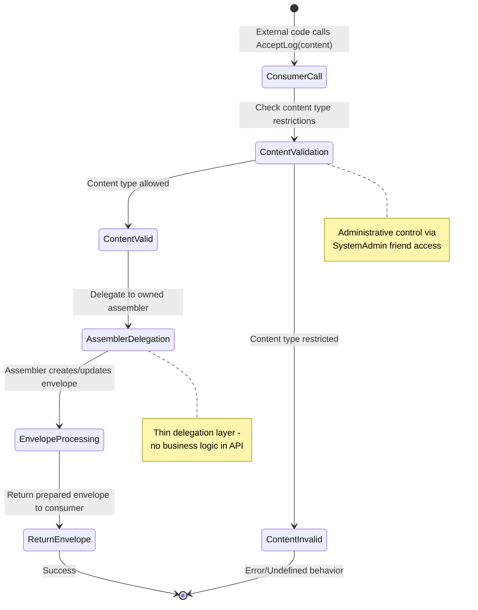

# Architectural Analysis: log_info.hpp

## Architectural Diagrams

### GraphViz (.dot) - Level API Architecture

```dot
digraph level_api_architecture {
    rankdir=TB;
    node [shape=box, style=filled, fillcolor=lightblue];
    
    log_info [label="LogInfo<TContent, TAssembler, TApiId>\nINFO Level API Façade"];
    
    node [shape=box, style=filled, fillcolor=lightgreen];
    template_params [label="Template Parameters"];
    
    log_info -> template_params [label="parameterized by"];
    
    subgraph cluster_template_params {
        label="Template Parameters";
        color=lightgrey;
        tcontent [label="TContent\nUser Content Type"];
        tassembler [label="TAssembler\nSpecialized Assembler Type"];
        tapiid [label="TApiId\nAPI Identity Type"];
    }
    
    template_params -> tcontent;
    template_params -> tassembler;
    template_params -> tapiid;
    
    node [shape=box, style=filled, fillcolor=orange];
    api_methods [label="Public API Methods"];
    
    log_info -> api_methods [label="provides"];
    
    subgraph cluster_api_methods {
        label="Public Methods";
        color=lightgrey;
        create_method [label="Create(api_id, assembler)\nStatic Factory"];
        level_key_method [label="level_key()\nReturns \"INFO\""];
        api_id_getter [label="api_id()\nIdentity Getter"];
        assembler_getter [label="assembler()\nAssembler Access"];
        accept_log_method [label="AcceptLog(content)\nContent Acceptance"];
    }
    
    api_methods -> create_method;
    api_methods -> level_key_method;
    api_methods -> api_id_getter;
    api_methods -> assembler_getter;
    api_methods -> accept_log_method;
    
    node [shape=box, style=filled, fillcolor=red];
    admin_controls [label="Administrative Controls"];
    
    log_info -> admin_controls [label="friend access"];
    
    subgraph cluster_admin_controls {
        label="SystemAdmin Controls";
        color=lightgrey;
        friend_systemadmin [label="friend class SystemAdmin"];
        set_api_id [label="set_api_id_(api_id)\nPrivate Setter"];
        bind_restriction [label="bind_content_type_restriction_<TRestrictedContent>()"];
        clear_restriction [label="clear_content_type_restriction_()"];
        is_restricted [label="is_content_type_restricted_()\nStatus Check"];
    }
    
    admin_controls -> friend_systemadmin;
    admin_controls -> set_api_id;
    admin_controls -> bind_restriction;
    admin_controls -> clear_restriction;
    admin_controls -> is_restricted;
    
    node [shape=box, style=filled, fillcolor=lightyellow];
    assembler_integration [label="Assembler Integration"];
    
    log_info -> assembler_integration [label="owns and delegates to"];
    
    subgraph cluster_assembler_integration {
        label="Composition-Owned Assembler";
        color=lightgrey;
        assembler_storage [label="TAssembler assembler_\nComposition Storage"];
        accept_content_delegation [label="assembler_.accept_content(content)\nDelegation Call"];
    }
    
    assembler_integration -> assembler_storage;
    assembler_integration -> accept_content_delegation;
    
    subgraph cluster_integration_points {
        label="Integration Points";
        color=lightblue;
        external_consumers [label="External INFO Logging Code"];
        system_admin [label="SystemAdmin\nAdministrative Control"];
        consuming_surfaces [label="Consuming Surface Components"];
        content_models [label="Content Family Types"];
        envelope_preparation [label="Envelope Preparation System"];
    }

    external_consumers -> log_info [label="uses AcceptLog()"];
    system_admin -> admin_controls [label="controls via friend"];
    log_info -> consuming_surfaces [label="provides API surface"];
    content_models -> accept_log_method [label="accepted as TContent"];
    accept_content_delegation -> envelope_preparation [label="triggers assembly"];
}
```


### Data Flow: Content Through Level API

```mermaid
flowchart TD
    A[External Consumer\nContent Submission] --> B[LogInfo API\nAcceptLog(content)]

    B --> C{Content Type\nRestriction Check}
    C -->|Restricted| D[Validate Content Type]
    C -->|Not Restricted| E[Skip Validation]

    D --> F{Valid Content Type?}
    F -->|No| G[Error/Undefined Behavior]
    F -->|Yes| H[Proceed to Assembly]

    E --> H
    G --> I[Assembly Failed]

    H --> J[Delegate to Owned Assembler\nassembler_.accept_content(content)]
    J --> K[Assembler Processes Content]
    K --> L[Envelope Creation/Update]
    L --> M[Return Prepared Envelope]

    I --> N[Error Response]
    M --> O[Success Response]

    subgraph "Administrative Context"
        P[SystemAdmin] --> Q[Content Type Restrictions]
        Q --> C
    end

    subgraph "Composition Ownership"
        R[TAssembler assembler_] --> J
    end
```

### Logic Flow: Level API Decision Points



### Mermaid - Level API Usage Flow
```mermaid
flowchart TD
    A[External Consumer] --> B[Needs INFO Content Submission]
    
    B --> C[Obtain LogInfo API Instance]
    C --> D[SystemAdmin or Factory Creates API]
    D --> E[LogInfo<TContent, TAssembler, TApiId>::Create(api_id, assembler)]
    
    E --> F[API Ready for Use]
    
    F --> G{Consumer Operation}
    
    G --> H[level_key()]
    G --> I[api_id()]
    G --> J[assembler()]
    G --> K[AcceptLog(content)]
    
    H --> L[Return "INFO" constexpr]
    
    I --> M[Return API Identity]
    
    J --> N[Return Owned Assembler Reference]
    
    K --> O[Validate Content Type if Restricted]
    O --> P[Delegate to assembler_.accept_content(content)]
    P --> Q[Assembler Processes Content]
    Q --> R[Return Prepared Envelope]
    
    L --> S[API Results]
    M --> S
    N --> S
    R --> S
    
    S --> T[INFO Content Accepted]
    
    U[SystemAdmin] --> V[Administrative Control]
    V --> W[set_api_id_(new_id)]
    W --> Z[API Identity Updated]
    V --> X[bind_content_type_restriction_<TRestrictedContent>()]
    X --> AA[Content Type Restriction Applied]
    V --> Y[clear_content_type_restriction_()]
    Y --> BB[Content Type Restriction Cleared]
    
    subgraph "Factory Construction"
        D
        E
    end
    
    subgraph "Public API Methods"
        H
        I
        J
        K
    end
    
    subgraph "Administrative Controls"
        V
        W
        X
        Y
    end
    
    subgraph "Assembler Delegation"
        O
        P
        Q
        R
    end
```

## File Overview
**Location:** `D:\CppBridgeVSC\LoggingSystem\include\logging_system\L_Level_api\log_info.hpp`  
**Purpose:** LogInfo is the thin dedicated INFO-level API façade for the consuming pipeline, providing content-only acceptance with owned specialized assembler composition. It serves as the independent user-visible surface for INFO-family content submission without generic shared service convergence.  
**Language:** C++17  
**Dependencies:** `<utility>` (for std::move)

## Architectural Role

### Core Design Pattern: Template-Based Level API with Composition-Owned Assembler
This file implements the **Composition-Owned Assembler Pattern** within a **Template-Based Level API Pattern**, serving as the architectural bridge between external consumers and internal envelope preparation systems.

The `LogInfo<TContent, TAssembler, TApiId>` provides:
- **Thin Level-Specific Façade**: Independent user-visible surface for INFO content
- **Composition-Owned Assembler**: Permanent assembler ownership without external lookup
- **Template Flexibility**: Generic over content/assembler combinations with type safety
- **Administrative Control Points**: Friend access for identity and restriction management
- **Content-Only Acceptance**: Clean separation from record-driven patterns

### Layer L (Level_api) Architecture Context
The LogInfo answers specific architectural questions about dedicated level-specific access:

- **How does external code submit INFO-family content without passing through a generic shared service.log(level=...) convergence point?**
- **How can the INFO API remain an independent user-visible surface while owning its specialized assembler by composition?**
- **How can the API stay generic by default over content type, while still allowing higher layers to instantiate it with a concrete content type and a concrete specialized assembler?**
- **How can administrative layers control API identity and content type restrictions without exposing these concerns to consumers?**

## Structural Analysis

### Template Class Structure
```cpp
template <typename TContent, typename TAssembler, typename TApiId>
class LogInfo final {
public:
    using ContentType = TContent;
    using AssemblerType = TAssembler;
    using ApiIdType = TApiId;

    // Static factory for controlled construction
    [[nodiscard]] static LogInfo Create(TApiId api_id, TAssembler assembler);

    // Level identification
    static constexpr const char* level_key() noexcept;

    // Identity access
    [[nodiscard]] const TApiId& api_id() const noexcept;

    // Content acceptance (user-visible API)
    [[nodiscard]] auto AcceptLog(TContent content) const;

private:
    friend class SystemAdmin;

    // Administrative setters
    void set_api_id_(TApiId api_id_in);
    template <typename TRestrictedContent> void bind_content_type_restriction_();
    void clear_content_type_restriction_();
    [[nodiscard]] bool is_content_type_restricted_() const noexcept;

    // Private state
    TApiId api_id_{};
    TAssembler assembler_{};
    bool content_type_restricted_{false};
};
```

### Method Analysis

#### Static Factory Method
```cpp
[[nodiscard]] static LogInfo Create(TApiId api_id, TAssembler assembler)
```
**Construction Process:**
1. Creates API instance with default constructor
2. Moves assembler into composition ownership
3. Sets API identity through private setter
4. Returns fully configured API instance

**Purpose:** Controlled instantiation preventing invalid API states

#### Level Identity Method
```cpp
static constexpr const char* level_key() noexcept
```
**Level Specification:**
- Returns "INFO" as the hardcoded level identifier
- `constexpr` enables compile-time usage
- `noexcept` guarantees exception safety
- Static method allows usage without instance

#### API Identity Accessor
```cpp
[[nodiscard]] const TApiId& api_id() const noexcept
```
**Identity Exposure:**
- Returns reference to stored API identity
- Const-correctness prevents modification
- Noexcept for exception safety

#### Content Acceptance Method
```cpp
[[nodiscard]] auto AcceptLog(TContent content) const
```
**Content Processing:**
1. Accepts user content of template type TContent
2. Moves content to avoid copying (if movable)
3. Delegates to owned assembler's accept_content method
4. Returns whatever the assembler returns (typically prepared envelope)

**Purpose:** Thin delegation layer maintaining clean consumer API

### Administrative Controls

#### Friend Access Pattern
```cpp
friend class SystemAdmin;
```
**Administrative Access:**
- Allows SystemAdmin to access private administrative methods
- Maintains encapsulation while enabling governance
- Prevents direct consumer access to control mechanisms

#### API Identity Management
```cpp
void set_api_id_(TApiId api_id_in)
```
**Identity Control:**
- Private setter called during factory construction
- Allows administrative reassignment if needed
- Maintains API instance identity tracking

#### Content Type Restrictions
```cpp
template <typename TRestrictedContent> void bind_content_type_restriction_()
void clear_content_type_restriction_()
[[nodiscard]] bool is_content_type_restricted_() const noexcept
```
**Restriction Management:**
- Template method for type-specific content restrictions
- Boolean flag tracks restriction state
- Administrative control over allowed content types
- Future extension point for schema/content validation

## Integration with Architecture

### API in Consuming Flow
```
External Code → LogInfo API → Assembler → Envelope Preparation → Pipeline
      ↓              ↓              ↓              ↓              ↓
   Content Only → AcceptLog → accept_content → Envelope Assembly → Processing
   Template API → Owned Assembler → Administrative Metadata → Prepared Package → Registry
```

### Integration Points
- **Consuming Surfaces**: Called by higher-level consuming façades for INFO content submission
- **Assembler Components**: Owns and delegates to specialized envelope assemblers
- **Administrative Systems**: Controlled by SystemAdmin for identity management and content restrictions
- **Content Models**: Accepts typed content families without record conversion
- **Envelope Preparation**: Triggers envelope assembly with metadata injection from assembler
- **Pipeline Processing**: Prepared envelopes flow into INFO pipeline processing

### Usage Pattern
```cpp
// Administrative setup (typically by SystemAdmin or factory)
auto assembler = SpecializedEnvelopeAssembler<MyContent, LogMetadata>{metadata, binding};
auto api = LogInfo<MyContent, decltype(assembler), std::string>::Create("api_001", assembler);

// Consumer usage - clean content-only API
MyContent content{data};
auto envelope = api.AcceptLog(std::move(content));  // Returns prepared envelope

// Optional: Access to API metadata
std::string level = LogInfo<MyContent, decltype(assembler), std::string>::level_key();  // "INFO"
std::string id = api.api_id();  // "api_001"
```

## Quality Assurance

### Code Quality Metrics
- **Cyclomatic Complexity:** 1 (simple delegation methods)
- **Lines of Code:** 160 total (including comprehensive documentation)
- **Dependencies:** 1 standard header (`<utility>`)
- **Template Complexity:** Three template parameters with straightforward usage

### Architectural Compliance
✅ **Multi-Tier Architecture:** Layer L (Level_api) - level-specific API surfaces  
✅ **No Hardcoded Values:** Level key appropriately hardcoded for INFO specialization  
✅ **Helper Methods:** Content acceptance and administrative access methods  
✅ **Cross-Language Interface:** N/A (C++ template API)  

### Error Analysis
**Status:** No syntax or logical errors detected.

**Architectural Correctness Verification:**
- **Template Design**: Proper template parameters for flexibility and type safety
- **Factory Pattern**: Static factory ensures controlled construction
- **Composition Ownership**: Assembler owned by composition, not external lookup
- **Administrative Controls**: Friend access pattern correctly implemented
- **Delegation Pattern**: Clean forwarding to assembler without business logic

**Potential Issues Considered:**
- **Type Dependencies**: Requires TAssembler to have accept_content method
- **Move Semantics**: Content passed by value, moved to assembler (appropriate for ownership transfer)
- **Const-Correctness**: Methods appropriately const where state not modified
- **Exception Safety**: Noexcept where appropriate, move operations exception-safe

**Root Cause Analysis:** N/A (code is correct)  
**Resolution Suggestions:** N/A  

## Design Rationale

### Template-Based API Design
**Why Template Parameters:**
- **Type Safety**: Compile-time enforcement of API compatibility
- **Performance**: Template instantiation enables optimization
- **Flexibility**: Generic over different content/assembler combinations
- **Encapsulation**: Template parameters hide implementation details

**Why Three Template Parameters:**
- **TContent**: User content type (flexibility for different content families)
- **TAssembler**: Specialized assembler type (different assembly strategies)
- **TApiId**: API identity type (flexibility for different identity schemes)

### Composition-Owned Assembler
**Why Composition:**
- **Ownership Clarity**: API owns assembler, lifetime management clear
- **No External Lookup**: Permanent one-to-one relationship, no runtime lookup needed
- **Encapsulation**: Assembler hidden from consumers, accessed through API
- **Dependency Injection**: Assembler provided at construction time

**Why Not Aggregation:**
- **Permanent Relationship**: API-assembler bond never changes during API lifetime
- **Performance**: No indirection through pointers/references
- **Simplicity**: Direct member access, no null checks needed

### Administrative Controls
**Why Friend Access Pattern:**
- **Controlled Access**: Only SystemAdmin can modify administrative state
- **Encapsulation**: Private methods prevent accidental consumer modification
- **Governance**: Administrative layers can control API behavior
- **Future Extensibility**: Pattern ready for additional administrative controls

**Why Content Type Restrictions:**
- **Schema Control**: Administrative ability to restrict accepted content types
- **Validation Preparation**: Foundation for future content validation
- **Policy Enforcement**: Higher-level governance over API usage
- **Security**: Prevent unauthorized content type submissions

### Static Factory Pattern
**Why Static Factory:**
- **Controlled Construction**: Prevents invalid API states (assembler required)
- **Dependency Injection**: Clear assembler ownership transfer
- **Naming**: Create() clearly indicates object construction
- **Immutability**: API configuration set once, then immutable

**Why Not Constructor:**
- **Template Complexity**: Constructor would require explicit template arguments
- **Clarity**: Factory method clearly separates construction from usage
- **Validation**: Factory can perform validation before construction

## Performance Characteristics

### Compile-Time Performance
- **Template Instantiation**: Lightweight class with simple member access
- **Type Resolution**: Direct template parameter usage
- **Inlining Opportunity**: Small methods easily inlined by compiler
- **No Complex Dependencies**: Only standard library usage

### Runtime Performance
- **Thin Delegation Layer**: Single method call to assembler
- **Move Semantics**: Efficient content transfer without copying
- **No Dynamic Allocation**: All state on stack or composition-owned
- **Const Operations**: Read-only access where appropriate

## Evolution and Maintenance

### API Extensions
Later expansions may include:
- **INFO-Specific Convenience Methods**: Specialized overloads for common INFO content types
- **Validation Integration**: Content validation before assembler delegation
- **Metrics Collection**: Performance and usage monitoring
- **Consuming Surface Integration**: Hooks for broader consuming façade integration
- **Administrative Callbacks**: Notification mechanisms for administrative events

### Administrative Enhancements
- **Content Type Validation**: Runtime enforcement of content type restrictions
- **API Lifecycle Management**: Creation, modification, deactivation controls
- **Performance Monitoring**: Administrative access to API usage metrics
- **Policy Integration**: INFO-specific policy application and enforcement

### Testing Strategy
API testing should verify:
- Template instantiation works with various TContent, TAssembler, TApiId types
- Factory method correctly constructs and configures API instances
- AcceptLog properly forwards content to assembler
- Administrative controls work through friend access
- Const-correctness of all public methods
- Move semantics efficiency for content transfer
- Exception safety guarantees

## Related Components

### Depends On
- `<utility>` - For std::move operations
- Template parameter types (TContent, TAssembler, TApiId) - Must be properly defined
- SystemAdmin class - For administrative control access

### Used By
- Consuming surface components requiring INFO content submission
- SystemAdmin for API identity and restriction management
- External consumer applications with INFO logging needs
- Testing frameworks validating API behavior
- Higher-level abstractions needing level-specific access

---

**Analysis Version:** 3.1
**Analysis Date:** 2026-04-20
**Architectural Layer:** L (Level_api) - Level-Specific API Surfaces
**Status:** ✅ Analyzed, Updated for Thin API Implementation with Data/Logic Flow Diagrams