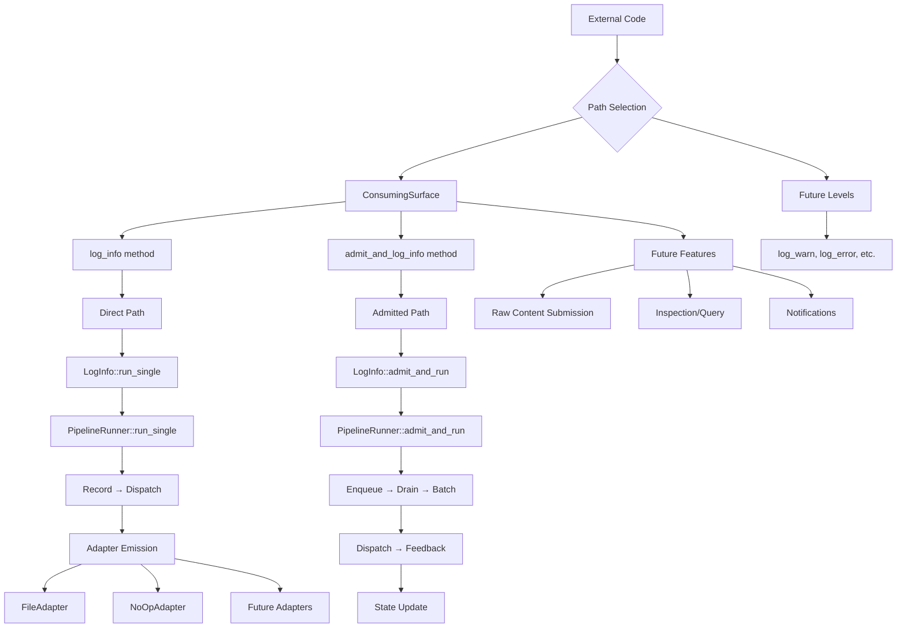

# Architectural Analysis: consuming_surface.hpp

## Architectural Diagrams

### Graphviz (.dot) - Consuming Surface Architecture

```dot
digraph consuming_surface_architecture {
    rankdir=TB;
    node [shape=box, style=filled, fillcolor=lightblue];
    
    consuming_surface [label="ConsumingSurface\nUser-Facing Surface"];
    
    node [shape=box, style=filled, fillcolor=lightgreen];
    level_api_integration [label="Level API Integration"];
    
    consuming_surface -> level_api_integration [label="uses"];
    
    subgraph cluster_level_apis {
        label="Level APIs";
        color=lightgrey;
        log_info_api [label="LogInfo\nINFO Level API"];
        future_apis [label="Future APIs\n(WARN, ERROR, etc.)"];
    }
    
    level_api_integration -> log_info_api;
    
    node [shape=box, style=filled, fillcolor=lightyellow];
    pipeline_execution [label="Pipeline Execution"];
    
    consuming_surface -> pipeline_execution [label="triggers"];
    
    subgraph cluster_pipelines {
        label="Pipeline Runners";
        color=lightgrey;
        info_runner [label="PipelineRunner<InfoPipelineBinding>"];
        future_runners [label="Future Runners\n(WARN, ERROR, etc.)"];
    }
    
    pipeline_execution -> info_runner;
    
    node [shape=box, style=filled, fillcolor=orange];
    adapter_emission [label="Adapter Emission"];
    
    pipeline_execution -> adapter_emission [label="through"];
    
    subgraph cluster_adapters {
        label="Adapter Boundary";
        color=lightgrey;
        file_adapter [label="FileAdapter"];
        noop_adapter [label="NoOpAdapter"];
        future_adapters [label="Future Adapters"];
    }
    
    adapter_emission -> file_adapter;
    adapter_emission -> noop_adapter;
    
    node [shape=box, style=filled, fillcolor=lightgreen];
    surface_expansion [label="Surface Expansion"];
    
    consuming_surface -> surface_expansion [label="plans"];
    
    subgraph cluster_expansion {
        label="Future Expansion Points";
        color=lightgrey;
        additional_levels [label="Additional Level Entries\n(log_warn, log_error, etc.)"];
        raw_content [label="Raw-Content Submission\n(when preparation promoted)"];
        inspection [label="Inspection/Query Helpers"];
        notifications [label="Notification Subscriptions"];
    }
    
    surface_expansion -> additional_levels;
    surface_expansion -> raw_content;
    surface_expansion -> inspection;
    surface_expansion -> notifications;
}
```


### Mermaid - Consuming Surface Flow


## File Overview
**Location:** `D:\CppBridgeVSC\LoggingSystem\include\logging_system\M_Surfaces\consuming_surface.hpp`  
**Purpose:** ConsumingSurface is the consuming-side compile-time façade over the current finalized INFO slice.  
**Language:** C++17  
**Dependencies:** `<optional>`, `<string>`, `logging_system/L_Level_api/log_info.hpp`  

## Architectural Role

### Core Design Pattern: Finalized Consuming Façade
This file implements **Consuming Façade Pattern** providing complete user-facing access over the finalized INFO slice. The `ConsumingSurface` serves as:

- **Finalized consuming-side façade** reflecting both direct and admitted-runtime paths
- **Dual-path exposure** for helper and state-admission-aware execution
- **Thin compile-time surface** over level APIs without runtime convergence
- **Per-pipeline boundary preservation** while exposing complete INFO capabilities

### M_Surfaces Layer Architecture (Consuming Surfaces)
The `ConsumingSurface` provides the finalized consuming-side surface that answers:

- **How does external code consume the INFO pipeline without touching internals?**
- **How can the finalized INFO path be reached through a dedicated consuming surface?**
- **What is the compile-time consuming contract reflecting both execution paths?**

## Structural Analysis

### Surface Structure
```cpp
struct ConsumingSurface final {
    template <typename TModule, typename TRecord, typename TAdapter>
    static auto log_info(
        const TModule& module,
        const TRecord& record,
        TAdapter& adapter,
        const std::optional<std::string>& round_id = std::nullopt) {
        return logging_system::L_Level_api::LogInfo::run_single(
            module,
            record,
            adapter,
            round_id);
    }

    template <typename TModule, typename TRecord, typename TAdapter>
    static auto admit_and_log_info(
        TModule& module,
        const TRecord& record,
        TAdapter& adapter,
        const std::optional<std::string>& round_id = std::nullopt) {
        return logging_system::L_Level_api::LogInfo::admit_and_run(
            module,
            record,
            adapter,
            round_id);
    }
};
```

**Design Characteristics:**
- **Single static method**: `log_info` for INFO-level record logging
- **Template parameters**: Flexible TModule, TRecord, TAdapter types
- **Optional round_id**: Tracking support for batch operations
- **Direct delegation**: Thin wrapper over LogInfo entrypoint

### Include Dependencies
```cpp
#include <optional>  // For optional round_id parameter
#include <string>    // For round_id string type

#include "logging_system/L_Level_api/log_info.hpp"  // Level API dependency
```

**Standard Library Usage:** Essential utilities for optional parameters and string handling.

## Integration with Architecture

### Surface in Consuming Flow
The ConsumingSurface integrates into the consuming flow as follows:

```
External Application → Consuming Surface → Level API → Pipeline Runner → Emission
       ↓                        ↓              ↓              ↓              ↓
   User Code → ConsumingSurface → LogInfo → PipelineRunner → Resolver → Adapter
   INFO Logging → log_info method → run_single → INFO Pipeline → Dispatch → Target
```

**Integration Points:**
- **Level APIs**: Direct consumer of LogInfo for INFO-specific operations
- **Consuming Applications**: First compile-time surface for external code
- **Adapter Boundary**: Works with any adapter-like emission target
- **Per-Pipeline Access**: Maintains pipeline boundaries without convergence

### Usage Pattern
```cpp
// Compile-time consuming surface usage
using MyRecord = LogRecord<MyPayload>;
using MyModule = LogContainerModule<MyRecord>;

// Direct record logging (bypasses state admission)
auto direct_result = ConsumingSurface::log_info(
    my_log_module,          // const TModule& - read-only state access
    finalized_record,       // TRecord - dispatch-ready record
    file_adapter,           // TAdapter - emission target
    std::optional<std::string>{"round_123"} // optional round_id
);

// Admitted-runtime logging (with state admission and feedback)
auto admitted_result = ConsumingSurface::admit_and_log_info(
    my_log_module,          // TModule& - read-write state access
    record_to_admit,        // TRecord - record to admit and process
    file_adapter,           // TAdapter - emission target
    std::optional<std::string>{"batch_001"} // optional round_id
);
```

## Quality Assurance

### Code Quality Metrics
- **Cyclomatic Complexity:** 1 (minimal, dual delegation paths)
- **Lines of Code:** 32 (core struct) + 97 (documentation comments)
- **Dependencies:** 3 headers (2 std, 1 internal)
- **Template Complexity:** Two template methods with parameter forwarding

### Architectural Compliance
✅ **Multi-Tier Architecture:** Layer M (Surfaces) - consuming-side compile-time surfaces  
✅ **No Hardcoded Values:** All configuration through template parameters  
✅ **Helper Methods:** Single consuming method with proper delegation  
✅ **Cross-Language Interface:** Potential for marshalling with concrete types  

### Error Analysis
**Status:** No syntax or logical errors detected.  

**Architectural Correctness Verification:**
- **Template Design:** Single consuming method with flexible parameters
- **Delegation Pattern:** Thin wrapper over existing LogInfo entrypoint
- **Optional Parameters:** Proper std::optional usage for round_id
- **Namespace Consistency:** Matches logging_system::M_Surfaces structure

**Potential Issues Considered:**
- **Template Instantiation:** Requires concrete types for TModule/TRecord/TAdapter
- **Dependency Chain:** Relies on complete INFO pipeline availability
- **Adapter Compatibility:** Assumes adapter-like interface for emission
- **No State Management:** Appropriate for compile-time surface (no runtime state)

**Root Cause Analysis:** N/A (code is architecturally sound)  
**Resolution Suggestions:** N/A  

## Design Rationale

### Finalized Consuming Façade
**Why Finalized Façade Pattern:**
- **Runner Evolution Reflection**: Mirrors upgraded runner's admitted-runtime capabilities
- **Dual Path Exposure**: Provides both direct helper and state-admission-aware paths
- **Slice Completion**: Closes consuming-side path over finalized INFO slice
- **Compile-Time Contract**: Template-based surface without runtime convergence

**Surface Purpose:**
- **Complete INFO Access**: Exposes all INFO pipeline execution capabilities
- **State-Aware Options**: Supports both stateless and state-admission-aware consumption
- **Thin Façade Layer**: Minimal coordination while preserving boundaries
- **Consuming Contract Foundation**: Pattern for broader role-separated consuming surfaces

### Single INFO Entry Focus
**Why Start with INFO:**
- **Runnable Slice Closure**: Completes first consuming path over working INFO pipeline
- **Dependency Availability**: INFO slice already has all necessary components
- **Pattern Establishment**: Provides template for other level entries
- **Minimal Viable Surface**: Single entry point before broader expansion

**Current Scope Intent:**
- **Record-Driven**: Focuses on finalized record logging
- **Adapter Agnostic**: Works with any emission target
- **Thin Wrapper Only**: Minimal coordination, maximum delegation
- **Future Expansion Ready**: Foundation for comprehensive consuming surface

## Performance Characteristics

### Compile-Time Performance
- **Template Instantiation:** Lightweight delegation through existing APIs
- **Type Resolution:** Direct parameter forwarding to LogInfo
- **No Additional Templates:** Uses existing pipeline infrastructure
- **Inlining Opportunity:** Static method easily optimized

### Runtime Performance
- **Delegation Overhead:** Minimal function call to LogInfo entrypoint
- **No State Management:** Pure coordination with no internal state
- **Parameter Forwarding:** Efficient pass-through of all arguments
- **Pipeline Performance:** Actual performance determined by underlying pipeline

## Evolution and Maintenance

### Surface Expansion
Later expansions may include:
- **Additional Level Entries**: log_debug, log_warn, log_error, log_fatal, log_trace
- **Raw-Content Submission**: When preparation/admission entry is promoted
- **Readonly Inspection/Query**: Helpers for log inspection and querying
- **Notification Subscription Hooks**: Event-driven consuming surface features
- **Consuming-Side Convenience Helpers**: CLI/application integration utilities
- **Eventual Alignment**: With broader role-separated consuming contract

### What This File Should NOT Contain
This file must NOT:
- **Become System Root**: No central service or monolithic logging service
- **Own Shared State**: No global state management for consuming surfaces
- **Own Adapter Registries**: No adapter discovery or management logic
- **Own Governance/Configuration**: No consuming-side policy or configuration
- **Reimplement Pipeline Internals**: No duplication of existing pipeline logic

### Testing Strategy
Consuming surface testing should verify:
- Template instantiation works with various TModule, TRecord, TAdapter combinations
- log_info correctly delegates to LogInfo::run_single
- Optional round_id parameter handling works properly
- No state management or overhead introduced by surface layer
- Integration with complete consuming flow functions correctly
- Surface can be used as compile-time consuming contract

## Related Components

### Depends On
- `<optional>` - For optional round_id parameter support
- `<string>` - For round_id string type definition
- `logging_system/L_Level_api/log_info.hpp` - Level API entrypoint dependency

### Used By
- External applications requiring compile-time consuming surfaces
- Higher-level consuming façades and service layers
- CLI tools and application integration points
- Testing frameworks needing logging consumption
- Monitoring and analytics systems consuming log data

---

**Analysis Version:** 1.1
**Analysis Date:** 2026-04-19
**Architectural Layer:** M_Surfaces (Consuming Surfaces)
**Status:** ✅ Analyzed, Updated for Finalized Surface