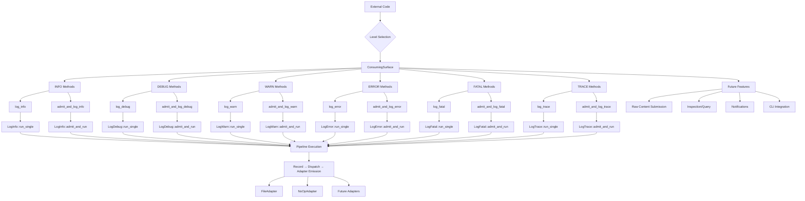

# Architectural Analysis: consuming_surface.hpp

## Architectural Diagrams

### Graphviz (.dot) - Multi-Level Consuming Surface Architecture

```dot
digraph consuming_surface_architecture {
    rankdir=TB;
    node [shape=box, style=filled, fillcolor=lightblue];

    consuming_surface [label="ConsumingSurface\nMulti-Level User-Facing Surface"];

    node [shape=box, style=filled, fillcolor=lightgreen];
    level_api_integration [label="Level API Integration"];

    consuming_surface -> level_api_integration [label="uses"];

    subgraph cluster_level_apis {
        label="All Level APIs";
        color=lightgrey;
        log_info_api [label="LogInfo\nINFO Level API"];
        log_debug_api [label="LogDebug\nDEBUG Level API"];
        log_warn_api [label="LogWarn\nWARN Level API"];
        log_error_api [label="LogError\nERROR Level API"];
        log_fatal_api [label="LogFatal\nFATAL Level API"];
        log_trace_api [label="LogTrace\nTRACE Level API"];
    }

    level_api_integration -> log_info_api;
    level_api_integration -> log_debug_api;
    level_api_integration -> log_warn_api;
    level_api_integration -> log_error_api;
    level_api_integration -> log_fatal_api;
    level_api_integration -> log_trace_api;

    node [shape=box, style=filled, fillcolor=lightyellow];
    pipeline_execution [label="Pipeline Execution"];

    consuming_surface -> pipeline_execution [label="triggers"];

    subgraph cluster_pipelines {
        label="All Pipeline Runners";
        color=lightgrey;
        info_runner [label="PipelineRunner<InfoPipelineBinding>"];
        debug_runner [label="PipelineRunner<DebugPipelineBinding>"];
        warn_runner [label="PipelineRunner<WarnPipelineBinding>"];
        error_runner [label="PipelineRunner<ErrorPipelineBinding>"];
        fatal_runner [label="PipelineRunner<FatalPipelineBinding>"];
        trace_runner [label="PipelineRunner<TracePipelineBinding>"];
    }

    pipeline_execution -> info_runner;
    pipeline_execution -> debug_runner;
    pipeline_execution -> warn_runner;
    pipeline_execution -> error_runner;
    pipeline_execution -> fatal_runner;
    pipeline_execution -> trace_runner;

    node [shape=box, style=filled, fillcolor=orange];
    adapter_emission [label="Adapter Emission"];

    pipeline_execution -> adapter_emission [label="through"];

    subgraph cluster_adapters {
        label="Adapter Boundary";
        color=lightgrey;
        file_adapter [label="FileAdapter"];
        noop_adapter [label="NoOpAdapter"];
        future_adapters [label="Future Adapters"];
    }

    adapter_emission -> file_adapter;
    adapter_emission -> noop_adapter;

    node [shape=box, style=filled, fillcolor=lightgreen];
    surface_expansion [label="Surface Expansion"];

    consuming_surface -> surface_expansion [label="plans"];

    subgraph cluster_expansion {
        label="Future Expansion Points";
        color=lightgrey;
        raw_content [label="Raw-Content Submission\n(when preparation promoted)"];
        inspection [label="Inspection/Query Helpers"];
        notifications [label="Notification Subscriptions"];
        consuming_convenience [label="Consuming-Side Convenience\n(CLI/application integration)"];
    }

    surface_expansion -> raw_content;
    surface_expansion -> inspection;
    surface_expansion -> notifications;
    surface_expansion -> consuming_convenience;
}
```


### Mermaid - Multi-Level Consuming Surface Flow


## File Overview
**Location:** `D:\CppBridgeVSC\LoggingSystem\include\logging_system\M_Surfaces\consuming_surface.hpp`  
**Purpose:** ConsumingSurface is the consuming-side compile-time façade over the currently closed per-level pipeline slices.  
**Language:** C++17  
**Dependencies:** `<optional>`, `<string>`, All 6 Level API headers  

## Architectural Role

### Core Design Pattern: Multi-Level Consuming Façade
This file implements **Multi-Level Consuming Façade Pattern** providing complete user-facing access over all finalized logging level slices. The `ConsumingSurface` serves as:

- **Multi-level consuming-side façade** reflecting all closed per-level pipeline slices
- **Dual-path exposure** for helper and state-admission-aware execution across all levels
- **Thin compile-time surface** over level APIs without runtime convergence
- **Per-pipeline boundary preservation** while exposing complete logging capabilities

### M_Surfaces Layer Architecture (Consuming Surfaces)
The `ConsumingSurface` provides the finalized consuming-side surface that answers:

- **How does external code consume dedicated log-level pipelines without touching pipeline internals?**
- **How can finalized per-level paths be reached through one consuming-side surface without reintroducing a monolithic service root?**
- **What is the compile-time consuming contract reflecting both execution paths across all levels?**

## Structural Analysis

### Surface Structure
```cpp
struct ConsumingSurface final {
    // INFO Level Methods
    template <typename TModule, typename TRecord, typename TAdapter>
    static auto log_info(...); // Direct path
    template <typename TModule, typename TRecord, typename TAdapter>
    static auto admit_and_log_info(...); // Admitted path

    // DEBUG Level Methods
    template <typename TModule, typename TRecord, typename TAdapter>
    static auto log_debug(...); // Direct path
    template <typename TModule, typename TRecord, typename TAdapter>
    static auto admit_and_log_debug(...); // Admitted path

    // WARN Level Methods
    template <typename TModule, typename TRecord, typename TAdapter>
    static auto log_warn(...); // Direct path
    template <typename TModule, typename TRecord, typename TAdapter>
    static auto admit_and_log_warn(...); // Admitted path

    // ERROR Level Methods
    template <typename TModule, typename TRecord, typename TAdapter>
    static auto log_error(...); // Direct path
    template <typename TModule, typename TRecord, typename TAdapter>
    static auto admit_and_log_error(...); // Admitted path

    // FATAL Level Methods
    template <typename TModule, typename TRecord, typename TAdapter>
    static auto log_fatal(...); // Direct path
    template <typename TModule, typename TRecord, typename TAdapter>
    static auto admit_and_log_fatal(...); // Admitted path

    // TRACE Level Methods
    template <typename TModule, typename TRecord, typename TAdapter>
    static auto log_trace(...); // Direct path
    template <typename TModule, typename TRecord, typename TAdapter>
    static auto admit_and_log_trace(...); // Admitted path
};
```

**Design Characteristics:**
- **12 Static Methods**: 2 per level (direct + admitted paths) × 6 levels
- **Template Parameters**: Consistent `<TModule, TRecord, TAdapter>` across all methods
- **Optional round_id**: Tracking support for batch operations on all levels
- **Direct Delegation**: Thin wrappers over respective Level API entrypoints

### Include Dependencies
```cpp
#include <optional>  // For optional round_id parameter
#include <string>    // For round_id string type

// All Level API dependencies
#include "logging_system/L_Level_api/log_debug.hpp"
#include "logging_system/L_Level_api/log_error.hpp"
#include "logging_system/L_Level_api/log_fatal.hpp"
#include "logging_system/L_Level_api/log_info.hpp"
#include "logging_system/L_Level_api/log_trace.hpp"
#include "logging_system/L_Level_api/log_warn.hpp"
```

**Standard Library Usage:** Essential utilities for optional parameters and string handling across all level operations.

## Integration with Architecture

### Surface in Multi-Level Consuming Flow
The ConsumingSurface integrates into the consuming flow as follows:

```
External Application → Consuming Surface → Level APIs → Pipeline Runners → Emission
       ↓                        ↓              ↓              ↓              ↓
   User Code → ConsumingSurface → LogXxx → PipelineRunner → Resolver → Adapter
   Level Logging → log_<level> method → run_single → Level Pipeline → Dispatch → Target
```

**Integration Points:**
- **All Level APIs**: Direct consumers of LogInfo, LogDebug, LogWarn, LogError, LogFatal, LogTrace
- **Consuming Applications**: First compile-time surface for external code across all levels
- **Adapter Boundary**: Works with any adapter-like emission target
- **Per-Pipeline Access**: Maintains pipeline boundaries without convergence

### Usage Pattern
```cpp
// Compile-time consuming surface usage across all levels
using MyRecord = LogRecord<MyPayload>;
using MyModule = LogContainerModule<MyRecord>;

// Direct record logging (bypasses state admission)
auto info_result = ConsumingSurface::log_info(module, record, adapter);
auto debug_result = ConsumingSurface::log_debug(module, record, adapter);
auto warn_result = ConsumingSurface::log_warn(module, record, adapter);
auto error_result = ConsumingSurface::log_error(module, record, adapter);
auto fatal_result = ConsumingSurface::log_fatal(module, record, adapter);
auto trace_result = ConsumingSurface::log_trace(module, record, adapter);

// Admitted-runtime logging (with state admission and feedback)
auto admitted_info = ConsumingSurface::admit_and_log_info(module, record, adapter);
auto admitted_debug = ConsumingSurface::admit_and_log_debug(module, record, adapter);
// ... and so on for all levels
```

## Quality Assurance

### Code Quality Metrics
- **Cyclomatic Complexity:** 1 (minimal, uniform delegation across all levels)
- **Lines of Code:** ~250 (core struct with 12 methods) + documentation
- **Dependencies:** 8 headers (2 std, 6 internal level APIs)
- **Template Complexity:** Twelve consistent template methods with parameter forwarding

### Architectural Compliance
✅ **Multi-Tier Architecture:** Layer M (Surfaces) - consuming-side compile-time surfaces  
✅ **No Hardcoded Values:** All configuration through template parameters  
✅ **Helper Methods:** Twelve consuming methods with proper delegation  
✅ **Cross-Language Interface:** Potential for marshalling with concrete types  

### Error Analysis
**Status:** No syntax or logical errors detected.  

**Architectural Correctness Verification:**
- **Template Design:** Consistent template methods across all 6 levels
- **Delegation Pattern:** Thin wrappers over existing Level API entrypoints
- **Optional Parameters:** Proper std::optional usage for round_id on all methods
- **Namespace Consistency:** Matches logging_system::M_Surfaces structure
- **Level Coverage:** Complete coverage of all implemented logging levels

**Potential Issues Considered:**
- **Template Instantiation:** Requires concrete types for TModule/TRecord/TAdapter across all levels
- **Dependency Chain:** Relies on complete pipeline availability for all 6 levels
- **Adapter Compatibility:** Assumes adapter-like interface for emission across all levels
- **No State Management:** Appropriate for compile-time surface (no runtime state)

**Root Cause Analysis:** N/A (code is architecturally sound)  
**Resolution Suggestions:** N/A  

## Design Rationale

### Multi-Level Consuming Façade
**Why Multi-Level Façade Pattern:**
- **Slice Completion Reflection**: Mirrors all closed per-level pipeline slices
- **Dual Path Exposure**: Provides both direct helper and state-admission-aware paths for every level
- **Complete System Access**: Exposes all logging level capabilities through one surface
- **Compile-Time Contract**: Template-based surface without runtime convergence

**Surface Purpose:**
- **Complete Level Access**: Exposes all logging pipeline execution capabilities
- **State-Aware Options**: Supports both stateless and state-admission-aware consumption
- **Thin Façade Layer**: Minimal coordination while preserving boundaries
- **Consuming Contract Foundation**: Pattern for broader role-separated consuming surfaces

### All Level Entry Implementation
**Why Implement All Levels:**
- **System Completeness**: Provides consuming access to entire logging level hierarchy
- **Dependency Availability**: All 6 level slices now have complete pipeline implementations
- **Pattern Consistency**: Same dual-path approach across all levels (INFO through TRACE)
- **Consuming Surface Maturity**: Transforms from single-level to comprehensive surface

**Current Scope Achievement:**
- **Record-Driven**: Focuses on finalized record logging across all levels
- **Adapter Agnostic**: Works with any emission target for all logging levels
- **Thin Wrapper Only**: Minimal coordination, maximum delegation to level APIs
- **Future Expansion Ready**: Foundation for advanced consuming features

## Performance Characteristics

### Compile-Time Performance
- **Template Instantiation:** Lightweight delegation through existing APIs for all levels
- **Type Resolution:** Direct parameter forwarding to all Level API entrypoints
- **No Additional Templates:** Uses existing pipeline infrastructure across all levels
- **Inlining Opportunity:** All static methods easily optimized

### Runtime Performance
- **Delegation Overhead:** Minimal function calls to Level API entrypoints
- **No State Management:** Pure coordination with no internal state
- **Parameter Forwarding:** Efficient pass-through of all arguments across all levels
- **Pipeline Performance:** Actual performance determined by underlying level pipelines

## Evolution and Maintenance

### Surface Expansion
Future expansions may include:
- **Raw-Content Submission**: When preparation/admission entry is promoted for advanced use cases
- **Readonly Inspection/Query**: Helpers for log inspection and querying across levels
- **Notification Subscription Hooks**: Event-driven consuming surface features
- **Consuming-Side Convenience Helpers**: CLI/application integration utilities
- **Eventual Alignment**: With broader role-separated consuming contract

### What This File Should NOT Contain
This file must NOT:
- **Become System Root**: No central service or monolithic logging service
- **Own Shared State**: No global state management for consuming surfaces
- **Own Adapter Registries**: No adapter discovery or management logic
- **Own Governance/Configuration**: No consuming-side policy or configuration
- **Reimplement Pipeline Internals**: No duplication of existing pipeline logic
- **Perform Runtime Level Switching**: No string/enum-based multiplexing

### Testing Strategy
Consuming surface testing should verify:
- Template instantiation works with various TModule, TRecord, TAdapter combinations across all levels
- All 12 methods correctly delegate to respective Level API entrypoints
- Optional round_id parameter handling works properly on all methods
- No state management or overhead introduced by surface layer
- Integration with complete consuming flow functions correctly for all levels
- Surface can be used as compile-time consuming contract across all logging levels

## Related Components

### Depends On
- `<optional>` - For optional round_id parameter support across all methods
- `<string>` - For round_id string type definition
- All 6 Level API headers - Complete level entrypoint dependencies

### Used By
- External applications requiring compile-time consuming surfaces for any logging level
- Higher-level consuming façades and service layers
- CLI tools and application integration points
- Testing frameworks needing comprehensive logging consumption
- Monitoring and analytics systems consuming log data across all levels

---

**Analysis Version:** 2.0
**Analysis Date:** 2026-04-19
**Architectural Layer:** M_Surfaces (Consuming Surfaces)
**Status:** ✅ Analyzed, Updated for Multi-Level Surface