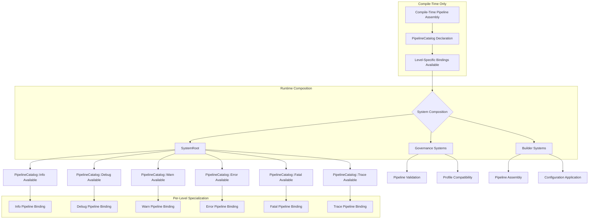

# Architectural Analysis: pipeline_catalog.hpp

## Architectural Diagrams

### GraphViz (.dot) - Pipeline Catalog Architecture

```dot
digraph pipeline_catalog_architecture {
    rankdir=TB;
    node [shape=box, style=filled, fillcolor=lightblue];

    pipeline_catalog [label="PipelineCatalog\nCompile-time Pipeline Registry"];

    node [shape=box, style=filled, fillcolor=lightyellow];
    level_apis [label="Level API Types"];

    pipeline_catalog -> level_apis [label="exposes"];

    subgraph cluster_level_apis {
        label="Per-Level Pipeline Bindings";
        color=lightgrey;
        info_api [label="Info\nInfoPipelineBinding"];
        debug_api [label="Debug\nDebugPipelineBinding"];
        warn_api [label="Warn\nWarnPipelineBinding"];
        error_api [label="Error\nErrorPipelineBinding"];
        fatal_api [label="Fatal\nFatalPipelineBinding"];
        trace_api [label="Trace\nTracePipelineBinding"];
    }

    level_apis -> info_api;
    level_apis -> debug_api;
    level_apis -> warn_api;
    level_apis -> error_api;
    level_apis -> fatal_api;
    level_apis -> trace_api;

    node [shape=box, style=filled, fillcolor=orange];
    system_integration [label="System Integration"];

    pipeline_catalog -> system_integration [label="used by"];

    subgraph cluster_integration {
        label="Integration Points";
        color=lightgrey;
        system_root [label="SystemRoot\nComposition root"];
        governance [label="Governance Systems\nPipeline validation"];
        builder [label="System Builder\nPipeline assembly"];
    }

    system_integration -> system_root;
    system_integration -> governance;
    system_integration -> builder;
}
```


### Mermaid - Pipeline Catalog Flow



## File Overview
**Location:** `D:\CppBridgeVSC\LoggingSystem\include\logging_system\N_System\pipeline_catalog.hpp`  
**Purpose:** PipelineCatalog provides compile-time type-safe access to the complete set of level-specialized pipeline bindings available in the logging system, enabling system composition without runtime string-based dispatch.  
**Language:** C++17  
**Dependencies:** All pipeline binding headers (K_Pipelines layer)

## Architectural Role

### Core Design Pattern: Compile-Time Pipeline Registry
This file implements the **Compile-Time Pipeline Registry Pattern** that makes the system's per-level pipeline specialization explicit at compile time without introducing runtime dispatch or string-based routing.

The `PipelineCatalog` provides:
- **Type-Safe Level Access**: Compile-time access to all specialized pipeline bindings
- **Composition Support**: Enables system root to reference complete pipeline pack
- **No Runtime Dispatch**: Eliminates need for string-based level routing
- **Specialization Visibility**: Makes per-level pipeline intent explicit in C++

### N_System Layer Architecture Context
The PipelineCatalog answers specific architectural questions about system composition:

- **How does the system root refer to the full set of available pipelines without collapsing them into a generic shared level-dispatch function?**
- **How can compile-time composition work with the complete pipeline pack without runtime lookup?**
- **How does the system make per-level pipeline specialization visible without recreating monolithic dispatch?**

## Structural Analysis

### PipelineCatalog Structure
```cpp
struct PipelineCatalog final {
    // Level-specific pipeline type aliases
    using Info = logging_system::K_Pipelines::InfoPipelineBinding;
    using Debug = logging_system::K_Pipelines::DebugPipelineBinding;
    using Warn = logging_system::K_Pipelines::WarnPipelineBinding;
    using Error = logging_system::K_Pipelines::ErrorPipelineBinding;
    using Fatal = logging_system::K_Pipelines::FatalPipelineBinding;
    using Trace = logging_system::K_Pipelines::TracePipelineBinding;
};
```

**Design Characteristics:**
- **Simple Struct**: No runtime state, only compile-time type information
- **Complete Level Coverage**: All 6 logging levels (INFO through TRACE)
- **Type Aliases Only**: Pure compile-time registry without implementation
- **Namespace Qualification**: Explicit pipeline binding references

### Level Pipeline Bindings

#### INFO Pipeline
```cpp
using Info = logging_system::K_Pipelines::InfoPipelineBinding;
```
**Purpose:** Type-safe access to INFO-specific pipeline specialization

#### DEBUG Pipeline
```cpp
using Debug = logging_system::K_Pipelines::DebugPipelineBinding;
```
**Purpose:** Type-safe access to DEBUG-specific pipeline specialization

#### WARN Pipeline
```cpp
using Warn = logging_system::K_Pipelines::WarnPipelineBinding;
```
**Purpose:** Type-safe access to WARN-specific pipeline specialization

#### ERROR Pipeline
```cpp
using Error = logging_system::K_Pipelines::ErrorPipelineBinding;
```
**Purpose:** Type-safe access to ERROR-specific pipeline specialization

#### FATAL Pipeline
```cpp
using Fatal = logging_system::K_Pipelines::FatalPipelineBinding;
```
**Purpose:** Type-safe access to FATAL-specific pipeline specialization

#### TRACE Pipeline
```cpp
using Trace = logging_system::K_Pipelines::TracePipelineBinding;
```
**Purpose:** Type-safe access to TRACE-specific pipeline specialization

## Integration with Architecture

### Catalog in System Composition
```
Compile-Time Assembly → PipelineCatalog → SystemRoot<T...> → Runtime Composition
       ↓                      ↓              ↓                      ↓
Type Registry → Level Access → Template Args → Specialized Instances
Explicit Intent → Type Safety → No Dispatch → Pipeline Execution
```

### Integration Points
- **SystemRoot**: Uses PipelineCatalog as type parameter for template composition
- **Governance Systems**: Validate pipeline compatibility against catalog
- **Builder Systems**: Assemble systems using catalog types
- **Profile Management**: Ensure active profiles are compatible with catalog pipelines
- **Testing Frameworks**: Use catalog for comprehensive pipeline testing

### Usage Pattern
```cpp
// System composition using pipeline catalog
template <typename TStateCore, typename TGovernance, typename TAdapterBoundary>
struct SystemRoot {
    using PipelinePack = PipelineCatalog;  // Complete pipeline visibility

    // Template composition with all level pipelines available
    // PipelinePack::Info, PipelinePack::Debug, etc. all accessible
};

// Governance validation
class GovernanceSystem {
    void validate_system(const PipelineCatalog& catalog) {
        // Validate all pipeline bindings are compatible
        validate_pipeline(PipelineCatalog::Info{});
        validate_pipeline(PipelineCatalog::Debug{});
        // ... for all levels
    }
};
```

## Quality Assurance

### Code Quality Metrics
- **Cyclomatic Complexity:** 1 (simple type aliases only)
- **Lines of Code:** 100 total (minimal struct with comprehensive documentation)
- **Dependencies:** 6 pipeline binding headers
- **Template Complexity:** None (simple type aliases)

### Architectural Compliance
✅ **Multi-Tier Architecture:** Layer N (System) - system composition support  
✅ **No Hardcoded Values:** All pipeline types referenced explicitly  
✅ **Helper Methods:** N/A (type-only interface)  
✅ **Cross-Language Interface:** N/A (C++ compile-time types)

### Error Analysis
**Status:** No syntax or logical errors detected.

**Architectural Correctness Verification:**
- **Type Safety**: All pipeline bindings properly qualified and accessible
- **Complete Coverage**: All 6 logging levels represented
- **Composition Compatibility**: Compatible with SystemRoot template parameters
- **Header Dependencies**: All required pipeline binding headers included

**Potential Issues Considered:**
- **Header Inclusion Order**: Pipeline binding headers must be available
- **Type Consistency**: All referenced pipeline bindings must exist
- **Namespace Qualification**: Full qualification prevents naming conflicts

**Root Cause Analysis:** N/A (struct is architecturally sound)  
**Resolution Suggestions:** N/A

## Design Rationale

### Compile-Time Pipeline Registry
**Why Compile-Time Registry:**
- **Type Safety**: Eliminates runtime string-based dispatch errors
- **Performance**: No runtime lookups or type checking
- **Composition Support**: Enables template-based system assembly
- **Intent Clarity**: Makes pipeline specialization explicit

**Why Struct with Type Aliases:**
- **Minimal Surface**: Only essential type information exposed
- **Zero Runtime Cost**: No instantiation or state management
- **Template Compatibility**: Works seamlessly with template metaprogramming
- **Evolution Safety**: New pipeline types can be added without breaking existing code

### Complete Level Coverage
**Why All 6 Levels:**
- **System Completeness**: Represents the full logging level hierarchy
- **API Consistency**: Matches the consuming surface's level coverage
- **Testing Coverage**: Enables comprehensive system testing
- **Profile Compatibility**: Supports all possible logging level combinations

**Why Explicit Naming:**
- **Clarity**: `Info`, `Debug`, etc. clearly identify logging levels
- **Convention**: Follows standard logging level naming conventions
- **Type Safety**: Prevents level confusion at compile time

## Performance Characteristics

### Compile-Time Performance
- **Zero Overhead**: Pure type aliases with no runtime implications
- **Fast Compilation**: Minimal header dependencies and simple declarations
- **Template Instantiation**: No complex template metaprogramming
- **Header Optimization**: Simple includes with forward declarations where possible

### Runtime Performance
- **Zero Runtime Cost**: No instantiated objects or state
- **No Memory Allocation**: Pure compile-time construct
- **No Virtual Dispatch**: Direct type access without indirection
- **Optimal Caching**: Type information resolved at compile time

## Evolution and Maintenance

### Pipeline Extensions
Future expansions may include:
- **Custom Level Support**: Additional logging levels beyond the standard 6
- **Conditional Pipelines**: Profile-based pipeline inclusion/exclusion
- **Pipeline Traits**: Compile-time pipeline capability detection
- **Version Compatibility**: Pipeline version compatibility checking
- **Performance Profiles**: Pipeline performance characteristic metadata

### System Integration Enhancements
- **Builder Integration**: Enhanced system builder support for pipeline assembly
- **Validation Frameworks**: Comprehensive pipeline compatibility validation
- **Profile Integration**: Dynamic pipeline selection based on active profiles
- **Monitoring Integration**: Pipeline health and performance monitoring hooks

### Testing Strategy
Pipeline catalog testing should verify:
- All pipeline type aliases resolve correctly
- Header dependencies are properly included
- SystemRoot composition works with catalog types
- Governance validation functions correctly
- Profile compatibility checking works
- No runtime performance overhead introduced

## Related Components

### Depends On
- `logging_system/K_Pipelines/info_pipeline_binding.hpp` - INFO pipeline binding
- `logging_system/K_Pipelines/debug_pipeline_binding.hpp` - DEBUG pipeline binding
- `logging_system/K_Pipelines/warn_pipeline_binding.hpp` - WARN pipeline binding
- `logging_system/K_Pipelines/error_pipeline_binding.hpp` - ERROR pipeline binding
- `logging_system/K_Pipelines/fatal_pipeline_binding.hpp` - FATAL pipeline binding
- `logging_system/K_Pipelines/trace_pipeline_binding.hpp` - TRACE pipeline binding

### Used By
- **SystemRoot**: Template parameter for complete pipeline visibility
- **Governance Systems**: Pipeline validation and compatibility checking
- **Builder Systems**: System assembly with proper pipeline types
- **Profile Management**: Profile-to-pipeline compatibility verification
- **Testing Frameworks**: Comprehensive pipeline testing coverage
- **Documentation Systems**: Architecture analysis and dependency mapping

---

**Analysis Version:** 1.0  
**Analysis Date:** 2026-04-20  
**Architectural Layer:** N_System (System Composition)  
**Status:** ✅ Analyzed, New Component Documentation