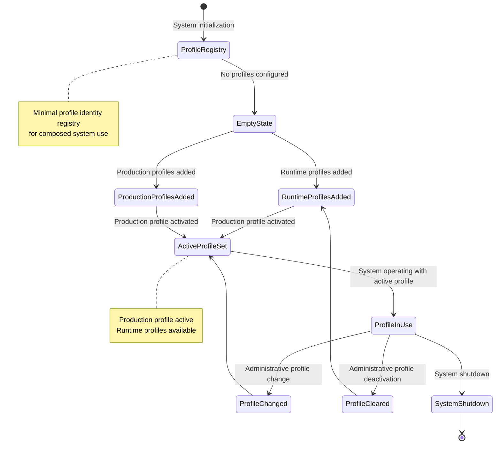

# Architectural Analysis: profile_registry.hpp

## Architectural Diagrams

### GraphViz (.dot) - Profile Registry Architecture

```dot
digraph profile_registry_architecture {
    rankdir=TB;
    node [shape=box, style=filled, fillcolor=lightblue];

    profile_registry [label="ProfileRegistry\nRuntime Profile Identity"];

    node [shape=box, style=filled, fillcolor=lightyellow];
    profile_state [label="Profile State"];

    profile_registry -> profile_state [label="manages"];

    subgraph cluster_profile_state {
        label="Profile Identity State";
        color=lightgrey;
        active_production [label="active_production_profile_id\nOptional<string>"];
        runtime_profiles [label="runtime_profile_ids\nvector<string>"];
        production_profiles [label="production_profile_ids\nvector<string>"];
    }

    profile_state -> active_production;
    profile_state -> runtime_profiles;
    profile_state -> production_profiles;

    node [shape=box, style=filled, fillcolor=orange];
    profile_operations [label="Profile Operations"];

    profile_registry -> profile_operations [label="provides"];

    subgraph cluster_operations {
        label="State Management";
        color=lightgrey;
        set_active [label="set_active_production_profile()\nSet active profile"];
        clear_active [label="clear_active_production_profile()\nClear active profile"];
        get_active [label="get_active_production_profile()\nGet active profile"];
        list_runtime [label="list_runtime_profiles()\nGet runtime profiles"];
        list_production [label="list_production_profiles()\nGet production profiles"];
    }

    profile_operations -> set_active;
    profile_operations -> clear_active;
    profile_operations -> get_active;
    profile_operations -> list_runtime;
    profile_operations -> list_production;

    node [shape=box, style=filled, fillcolor=lightgreen];
    system_integration [label="System Integration"];

    profile_registry -> system_integration [label="used by"];

    subgraph cluster_integration {
        label="Integration Points";
        color=lightgrey;
        system_root [label="SystemRoot\nProfile visibility"];
        governance [label="Governance Systems\nProfile CRUD"];
        builder [label="System Builder\nProfile application"];
        monitoring [label="Monitoring Systems\nProfile metrics"];
    }

    system_integration -> system_root;
    system_integration -> governance;
    system_integration -> builder;
    system_integration -> monitoring;
}
```


### Mermaid - Profile Registry Lifecycle



## File Overview
**Location:** `D:\CppBridgeVSC\LoggingSystem\include\logging_system\N_System\profile_registry.hpp`  
**Purpose:** ProfileRegistry provides minimal typed access to runtime and production profile identity within the composed system, keeping profile identity visible without collapsing full governance CRUD logic into the system root.  
**Language:** C++17  
**Dependencies:** `<optional>`, `<string>`, `<utility>`, `<vector>` (standard library)

## Architectural Role

### Core Design Pattern: Profile Identity Registry
This file implements the **Profile Identity Registry Pattern** that provides typed access to profile identity information for composed systems while keeping full governance logic separate.

The `ProfileRegistry` provides:
- **Active Profile Identity**: Current production profile visibility
- **Profile Lists**: Available runtime and production profile identifiers
- **Minimal Surface**: Identity-only operations without full governance
- **System Integration**: Profile visibility for system components

### N_System Layer Architecture Context
The ProfileRegistry answers specific architectural questions about profile management in composed systems:

- **What production profile is currently active?**
- **How can the system root keep profile identity visible without embedding full governance CRUD logic?**
- **How are available runtime and production profile identifiers made accessible to system components?**

## Structural Analysis

### ProfileRegistry Structure
```cpp
struct ProfileRegistry final {
    // Profile identity state
    std::optional<std::string> active_production_profile_id{std::nullopt};
    std::vector<std::string> runtime_profile_ids{};
    std::vector<std::string> production_profile_ids{};

    // Profile operations...
};
```

**Design Characteristics:**
- **Simple Struct**: Direct state management without complex encapsulation
- **Optional Active Profile**: Production profile may or may not be active
- **Profile Collections**: Vectors for available runtime and production profiles
- **Minimal Interface**: Only essential identity operations

### Profile State Management

#### Active Production Profile
```cpp
std::optional<std::string> active_production_profile_id{std::nullopt};
```
**Purpose:** Tracks the currently active production profile identifier

#### Runtime Profile Identifiers
```cpp
std::vector<std::string> runtime_profile_ids{};
```
**Purpose:** List of available runtime profile identifiers

#### Production Profile Identifiers
```cpp
std::vector<std::string> production_profile_ids{};
```
**Purpose:** List of available production profile identifiers

### Profile Operations

#### Active Profile Management
```cpp
void set_active_production_profile(std::string profile_id);
void clear_active_production_profile();
[[nodiscard]] const std::optional<std::string>& get_active_production_profile() const noexcept;
```

**Administrative Workflow:**
1. **Profile Activation**: `set_active_production_profile()` establishes active profile
2. **Profile Query**: `get_active_production_profile()` retrieves current profile
3. **Profile Deactivation**: `clear_active_production_profile()` removes active profile

#### Profile List Access
```cpp
[[nodiscard]] const std::vector<std::string>& list_runtime_profiles() const noexcept;
[[nodiscard]] const std::vector<std::string>& list_production_profiles() const noexcept;
```

**Profile Discovery:**
- **Runtime Profiles**: Available profiles for runtime configuration
- **Production Profiles**: Available profiles for production deployment
- **Read-Only Access**: Const references prevent accidental modification

## Integration with Architecture

### Registry in System Composition
```
Governance Layer → ProfileRegistry → SystemRoot → System Components
       ↓                ↓              ↓              ↓
Profile CRUD → Identity Surface → Profile Visibility → Profile-Aware Behavior
Administrative → Read-Only Access → No Governance → Profile Integration
```

### Integration Points
- **SystemRoot**: Exposes profile registry to system components
- **Governance Systems**: Set and update profile identity through registry
- **Builder Systems**: Use profile identity for system configuration
- **Monitoring Systems**: Report active profile in system metrics
- **Profile-Aware Components**: Query registry for profile-specific behavior

### Usage Pattern
```cpp
// System composition with profile visibility
template <typename TStateCore, typename TGovernance, typename TAdapterBoundary, typename TSurfaces>
struct SystemRoot {
    ProfileRegistry profile_registry;

    // Expose profile identity to system components
    ProfileRegistry& expose_profile_registry() noexcept {
        return profile_registry;
    }
};

// Governance system updates profile identity
class GovernanceSystem {
    void activate_production_profile(ProfileRegistry& registry, const std::string& profile_id) {
        registry.set_active_production_profile(profile_id);
    }
};

// System components query profile identity
class ProfileAwareComponent {
    void configure_for_profile(const ProfileRegistry& registry) {
        if (auto active = registry.get_active_production_profile()) {
            configure_for_production_profile(*active);
        }
    }
};
```

## Quality Assurance

### Code Quality Metrics
- **Cyclomatic Complexity:** 1 (simple state access and modification)
- **Lines of Code:** 108 total (minimal struct with comprehensive documentation)
- **Dependencies:** 4 standard library headers
- **Template Complexity:** None (simple struct operations)

### Architectural Compliance
✅ **Multi-Tier Architecture:** Layer N (System) - system composition identity  
✅ **No Hardcoded Values:** All profile identifiers provided externally  
✅ **Helper Methods:** Profile state management operations  
✅ **Cross-Language Interface:** N/A (C++ state management)

### Error Analysis
**Status:** No syntax or logical errors detected.

**Architectural Correctness Verification:**
- **State Management**: Proper optional and vector usage for profile state
- **Const-Correctness**: Read operations properly const-qualified
- **Move Semantics**: Efficient string assignment in operations
- **Memory Management**: Standard library containers handle memory correctly

**Potential Issues Considered:**
- **Thread Safety**: Struct operations not thread-safe (appropriate for system composition)
- **State Consistency**: No validation of profile identifier relationships
- **Memory Growth**: Vectors may grow but appropriate for profile lists

**Root Cause Analysis:** N/A (struct is architecturally sound)  
**Resolution Suggestions:** N/A

## Design Rationale

### Profile Identity Registry
**Why Separate Identity Registry:**
- **Separation of Concerns**: Identity visibility separate from governance logic
- **Minimal Surface**: System components see only necessary profile information
- **Governance Isolation**: Full CRUD operations remain in governance layer
- **Composition Support**: Enables profile-aware system composition

**Why Struct with Direct State Access:**
- **Simplicity**: Direct field access without complex getter/setter patterns
- **Performance**: No indirection or virtual dispatch overhead
- **POD-like Semantics**: Easy to copy, move, and serialize if needed
- **Evolution Safety**: New profile fields can be added without breaking interface

### Profile State Design
**Why Optional Active Profile:**
- **Flexibility**: System can operate without active production profile
- **Gradual Activation**: Profile can be set during system lifecycle
- **Error Safety**: Clear distinction between "no profile" and "invalid profile"

**Why Separate Runtime/Production Lists:**
- **Profile Types**: Different profiles serve different purposes
- **Validation Separation**: Different validation rules for different profile types
- **Deployment Flexibility**: Runtime and production profiles can differ

### Administrative Operations
**Why Direct State Modification:**
- **Administrative Context**: Profile changes are governance decisions
- **Performance**: Direct assignment without validation overhead in registry
- **Simplicity**: Clear, simple operations for profile state management
- **Audit Trail**: Changes can be tracked at governance layer

## Performance Characteristics

### Compile-Time Performance
- **Minimal Overhead**: Simple struct with standard library usage
- **Fast Compilation**: No complex templates or metaprogramming
- **Header Efficiency**: Standard library includes only
- **Inline Optimization**: Small operations easily inlined

### Runtime Performance
- **Memory Efficient**: Small struct with SSO strings and small vectors
- **Copy-on-Write**: String operations optimized for common cases
- **Cache Friendly**: Small data structure fits in cache lines
- **No Dynamic Allocation**: For common operations (optional access)

## Evolution and Maintenance

### Profile Extensions
Future expansions may include:
- **Profile Metadata**: Additional profile descriptive information
- **Profile Validation**: Basic identifier format validation
- **Profile Dependencies**: Profile compatibility and dependency information
- **Profile Metrics**: Usage and performance statistics per profile
- **Profile History**: Previous profile activation tracking

### Administrative Enhancements
- **Profile Transitions**: Controlled profile switching with validation
- **Profile Rollback**: Ability to revert to previous profiles
- **Profile Testing**: Profile-specific test configuration
- **Profile Monitoring**: Profile usage and performance monitoring

### Testing Strategy
Profile registry testing should verify:
- Active profile setting and clearing operations work correctly
- Profile list access returns correct collections
- Const-correctness of read operations
- Move semantics for string operations
- Memory management and vector operations
- Integration with system root composition

## Related Components

### Depends On
- `<optional>` - For optional active production profile
- `<string>` - For profile identifier storage
- `<utility>` - For move semantics in operations
- `<vector>` - For profile identifier collections

### Used By
- **SystemRoot**: Exposes profile registry to system components
- **Governance Systems**: Update profile identity state
- **Builder Systems**: Query profile identity for system configuration
- **Monitoring Systems**: Report active profile in system metrics
- **Profile-Aware Components**: Adapt behavior based on active profile
- **Testing Frameworks**: Configure test scenarios with specific profiles

---

**Analysis Version:** 1.0  
**Analysis Date:** 2026-04-20  
**Architectural Layer:** N_System (System Composition)  
**Status:** ✅ Analyzed, New Component Documentation