# Architectural Analysis: system_root.hpp

## Architectural Diagrams

### GraphViz (.dot) - System Root Architecture

```dot
digraph system_root_architecture {
    rankdir=TB;
    node [shape=box, style=filled, fillcolor=lightblue];

    system_root [label="SystemRoot<T...>\nSystem Composition Root"];

    node [shape=box, style=filled, fillcolor=lightyellow];
    template_params [label="Template Parameters"];

    system_root -> template_params [label="parameterized by"];

    subgraph cluster_template_params {
        label="Composition Components";
        color=lightgrey;
        state_core [label="TStateCore\nState management core"];
        governance [label="TGovernance\nAdministrative governance"];
        adapter_boundary [label="TAdapterBoundary\nEmission boundary"];
        surfaces [label="TSurfaces\nUser-facing surfaces"];
    }

    template_params -> state_core;
    template_params -> governance;
    template_params -> adapter_boundary;
    template_params -> surfaces;

    node [shape=box, style=filled, fillcolor=orange];
    owned_components [label="Owned Components"];

    system_root -> owned_components [label="owns"];

    subgraph cluster_owned_components {
        label="Composition Members";
        color=lightgrey;
        state_core_instance [label="state_core\nTStateCore instance"];
        governance_instance [label="governance\nTGovernance instance"];
        adapter_boundary_instance [label="adapter_boundary\nTAdapterBoundary instance"];
        profile_registry_instance [label="profile_registry\nProfileRegistry instance"];
        surfaces_instance [label="surfaces\nTSurfaces instance"];
    }

    owned_components -> state_core_instance;
    owned_components -> governance_instance;
    owned_components -> adapter_boundary_instance;
    owned_components -> profile_registry_instance;
    owned_components -> surfaces_instance;

    node [shape=box, style=filled, fillcolor=lightgreen];
    access_methods [label="Component Access"];

    system_root -> access_methods [label="provides"];

    subgraph cluster_access_methods {
        label="Access Methods";
        color=lightgrey;
        expose_surfaces [label="expose_surfaces()\nSurface access"];
        expose_state_core [label="expose_state_core()\nState access"];
        expose_governance [label="expose_governance()\nGovernance access"];
        expose_adapter_boundary [label="expose_adapter_boundary()\nAdapter access"];
        expose_profile_registry [label="expose_profile_registry()\nProfile access"];
    }

    access_methods -> expose_surfaces;
    access_methods -> expose_state_core;
    access_methods -> expose_governance;
    access_methods -> expose_adapter_boundary;
    access_methods -> expose_profile_registry;

    node [shape=box, style=filled, fillcolor=red];
    type_aliases [label="Type Aliases"];

    system_root -> type_aliases [label="defines"];

    subgraph cluster_type_aliases {
        label="Compile-Time Types";
        color=lightgrey;
        pipeline_pack [label="PipelinePack\nPipelineCatalog alias"];
        profile_registry_type [label="ProfileRegistryType\nProfileRegistry alias"];
    }

    type_aliases -> pipeline_pack;
    type_aliases -> type_aliases;
}
```


### Mermaid - System Root Composition Flow

```mermaid
flowchart TD
    A[Template Parameters] --> B[SystemRoot Template]
    B --> C[Component Ownership]

    C --> D[TStateCore state_core]
    C --> E[TGovernance governance]
    C --> F[TAdapterBoundary adapter_boundary]
    C --> G[ProfileRegistry profile_registry]
    C --> H[TSurfaces surfaces]

    D --> I[State Management Core]
    E --> J[Administrative Governance]
    F --> K[Emission Boundary]
    G --> L[Profile Identity Registry]
    H --> M[User-Facing Surfaces]

    B --> N[Access Methods]
    N --> O[expose_surfaces()]
    N --> P[expose_state_core()]
    N --> Q[expose_governance()]
    N --> R[expose_adapter_boundary()]
    N --> S[expose_profile_registry()]

    B --> T[Type Aliases]
    T --> U[PipelinePack = PipelineCatalog]
    T --> V[ProfileRegistryType = ProfileRegistry]

    O --> M
    P --> I
    Q --> J
    R --> K
    S --> L

    subgraph "Template Composition"
        A
        B
        T
    end

    subgraph "Runtime Ownership"
        C
        D
        E
        F
        G
        H
    end

    subgraph "Component Access"
        N
        O
        P
        Q
        R
        S
    end
```

## File Overview
**Location:** `D:\CppBridgeVSC\LoggingSystem\include\logging_system\N_System\system_root.hpp`  
**Purpose:** SystemRoot provides the composition root of the logging system, binding together major subsystems (state, governance, adapters, surfaces) while preserving the decomposed pipeline-centered architecture without creating a monolithic runtime service.  
**Language:** C++17  
**Dependencies:** `pipeline_catalog.hpp`, `profile_registry.hpp` (N_System layer)

## Architectural Role

### Core Design Pattern: System Composition Root
This file implements the **Composition Root Pattern** that serves as the central binding point for all major logging system subsystems while maintaining clean separation and avoiding monolithic convergence.

The `SystemRoot<TStateCore, TGovernance, TAdapterBoundary, TSurfaces>` provides:
- **Subsystem Composition**: Template-based binding of all major system components
- **Component Ownership**: RAII management of composed subsystem instances
- **Surface Exposure**: Controlled access to composed components
- **Type Safety**: Compile-time composition with template parameters

### N_System Layer Architecture Context
The SystemRoot answers specific architectural questions about system composition:

- **Which major subsystems are bound together in this system build?**
- **How are pipeline catalog, profile identity, state, adapters, governance, and user-facing surfaces made available without recreating a monolithic runtime service object?**
- **How does the system preserve subsystem separation while providing unified composition?**

## Structural Analysis

### SystemRoot Template Structure
```cpp
template <
    typename TStateCore,
    typename TGovernance,
    typename TAdapterBoundary,
    typename TSurfaces>
struct SystemRoot final {
    using PipelinePack = PipelineCatalog;
    using ProfileRegistryType = logging_system::N_System::ProfileRegistry;

    // Owned component instances
    TStateCore state_core;
    TGovernance governance;
    TAdapterBoundary adapter_boundary;
    ProfileRegistryType profile_registry;
    TSurfaces surfaces;

    // Constructor and access methods...
};
```

**Design Characteristics:**
- **Template Parameters**: Four major subsystem types for flexible composition
- **Component Ownership**: Direct member ownership with RAII lifecycle
- **Type Aliases**: Compile-time access to pipeline and profile types
- **Simple Construction**: Constructor accepts all components by move

### Component Ownership

#### State Core
```cpp
TStateCore state_core;
```
**Purpose:** State management and record storage subsystem

#### Governance
```cpp
TGovernance governance;
```
**Purpose:** Administrative governance and configuration management

#### Adapter Boundary
```cpp
TAdapterBoundary adapter_boundary;
```
**Purpose:** Emission boundary and adapter management

#### Profile Registry
```cpp
ProfileRegistryType profile_registry;
```
**Purpose:** Runtime and production profile identity management

#### Surfaces
```cpp
TSurfaces surfaces;
```
**Purpose:** User-facing consuming surfaces and APIs

### Access Methods

#### Surface Exposure
```cpp
[[nodiscard]] TSurfaces& expose_surfaces() noexcept;
[[nodiscard]] const TSurfaces& expose_surfaces() const noexcept;
```
**Purpose:** Provide access to user-facing consuming surfaces

#### State Core Access
```cpp
[[nodiscard]] TStateCore& expose_state_core() noexcept;
[[nodiscard]] const TStateCore& expose_state_core() const noexcept;
```
**Purpose:** Provide access to state management core

#### Governance Access
```cpp
[[nodiscard]] TGovernance& expose_governance() noexcept;
[[nodiscard]] const TGovernance& expose_governance() const noexcept;
```
**Purpose:** Provide access to administrative governance

#### Adapter Boundary Access
```cpp
[[nodiscard]] TAdapterBoundary& expose_adapter_boundary() noexcept;
[[nodiscard]] const TAdapterBoundary& expose_adapter_boundary() const noexcept;
```
**Purpose:** Provide access to emission boundary and adapters

#### Profile Registry Access
```cpp
[[nodiscard]] ProfileRegistryType& expose_profile_registry() noexcept;
[[nodiscard]] const ProfileRegistryType& expose_profile_registry() const noexcept;
```
**Purpose:** Provide access to profile identity registry

### Type Aliases

#### Pipeline Pack
```cpp
using PipelinePack = PipelineCatalog;
```
**Purpose:** Compile-time access to complete pipeline catalog

#### Profile Registry Type
```cpp
using ProfileRegistryType = logging_system::N_System::ProfileRegistry;
```
**Purpose:** Explicit type alias for profile registry

## Integration with Architecture

### SystemRoot in Overall Architecture
```
Builder/Governance → SystemRoot → Subsystem Access → Component Usage
         ↓                ↓              ↓              ↓
Composition Assembly → Template Binding → expose_*() → Specialized Behavior
Runtime Construction → RAII Ownership → Type Safety → Subsystem Integration
```

### Integration Points
- **System Builders**: Construct SystemRoot with appropriate template parameters
- **Governance Systems**: Access governance component for administrative operations
- **Runtime Consumers**: Access surfaces for logging operations
- **Monitoring Systems**: Access state core for metrics and observability
- **Adapter Systems**: Access adapter boundary for emission configuration

### Usage Pattern
```cpp
// Template-based system composition
using MyStateCore = RecordRegistry<LogRecord<LogEnvelope>>;
using MyGovernance = GovernanceBundle<ProfileManager, ConfigManager>;
using MyAdapterBoundary = AdapterBoundary<FileAdapter, NetworkAdapter>;
using MySurfaces = ConsumingSurface<LogInfo, LogDebug, LogWarn, LogError, LogFatal, LogTrace>;

using MySystemRoot = SystemRoot<
    MyStateCore,
    MyGovernance,
    MyAdapterBoundary,
    MySurfaces>;

// Runtime construction
auto system = MySystemRoot{
    MyStateCore{record_storage},
    MyGovernance{profile_manager, config_manager},
    MyAdapterBoundary{file_adapter, network_adapter},
    MySurfaces{log_info, log_debug, log_warn, log_error, log_fatal, log_trace},
    ProfileRegistry{}  // Default constructed
};

// Component access
auto& surfaces = system.expose_surfaces();
auto& governance = system.expose_governance();
auto& state_core = system.expose_state_core();
```

## Quality Assurance

### Code Quality Metrics
- **Cyclomatic Complexity:** 1 (simple composition and access)
- **Lines of Code:** 155 total (template struct with comprehensive documentation)
- **Dependencies:** 2 N_System headers (pipeline_catalog, profile_registry)
- **Template Complexity:** 4 template parameters with simple composition

### Architectural Compliance
✅ **Multi-Tier Architecture:** Layer N (System) - system composition root  
✅ **No Hardcoded Values:** All behavior provided through template parameters  
✅ **Helper Methods:** Component access methods with proper const-correctness  
✅ **Cross-Language Interface:** N/A (C++ composition template)

### Error Analysis
**Status:** No syntax or logical errors detected.

**Architectural Correctness Verification:**
- **Template Design**: Proper template parameters for subsystem composition
- **Ownership Model**: RAII ownership through member variables
- **Access Pattern**: Const and non-const access methods appropriately provided
- **Type Aliases**: Correct aliases for pipeline and profile types

**Potential Issues Considered:**
- **Template Instantiation**: Requires concrete types for all template parameters
- **Construction Order**: Constructor parameter order matches member declaration order
- **Reference Lifetime**: Access methods return references to owned members

**Root Cause Analysis:** N/A (template is architecturally sound)  
**Resolution Suggestions:** N/A

## Design Rationale

### Composition Root Pattern
**Why Template-Based Composition:**
- **Type Safety**: Compile-time verification of subsystem compatibility
- **Performance**: No runtime polymorphism or dynamic dispatch
- **Flexibility**: Different subsystem combinations for different deployments
- **Composition Clarity**: Template parameters make dependencies explicit

**Why Direct Member Ownership:**
- **RAII Compliance**: Automatic resource management through composition
- **Performance**: Direct member access without indirection
- **Simplicity**: No smart pointers or complex ownership semantics
- **Exception Safety**: Automatic cleanup on system destruction

### Component Access Design
**Why expose_*() Methods:**
- **Encapsulation**: Controlled access to internal components
- **Const-Correctness**: Separate const and non-const access
- **Naming Convention**: Clear indication of exposure intent
- **Future Flexibility**: Can add access control or monitoring later

**Why Reference Returns:**
- **Performance**: No copying of potentially large objects
- **Direct Access**: Users get direct access to real components
- **Lifetime Management**: References valid as long as SystemRoot exists
- **Type Safety**: Template system ensures type-correct access

### Type Aliases
**Why PipelinePack Alias:**
- **Convenience**: Shorter name for frequently used type
- **Clarity**: Makes pipeline catalog usage explicit
- **Consistency**: Matches naming patterns in other components

**Why ProfileRegistryType Alias:**
- **Explicit Qualification**: Clear about which ProfileRegistry is being used
- **Namespace Safety**: Avoids potential naming conflicts
- **Documentation**: Makes component relationships clear

## Performance Characteristics

### Compile-Time Performance
- **Template Instantiation**: Composition template instantiated once per system type
- **Type Resolution**: All component types resolved at compile time
- **Zero Runtime Overhead**: Pure composition with no added logic
- **Header Optimization**: Minimal includes with forward declarations

### Runtime Performance
- **Zero Overhead**: Pure composition with direct member access
- **No Dynamic Dispatch**: All calls resolved at compile time
- **Memory Layout**: Contiguous memory for all components
- **Cache Efficiency**: Related components likely in same cache lines

## Evolution and Maintenance

### System Extensions
Future expansions may include:
- **Additional Subsystems**: New major components (monitoring, tracing, etc.)
- **Component Validation**: Construction-time validation of component compatibility
- **Dependency Injection**: More sophisticated component wiring
- **Lifecycle Management**: Component startup/shutdown coordination
- **Health Monitoring**: System-wide health checks and status reporting

### Composition Enhancements
- **Builder Pattern**: Fluent construction API for complex system assembly
- **Configuration Integration**: Automatic component configuration from profiles
- **Validation Frameworks**: Component compatibility and requirement validation
- **Monitoring Integration**: System-level metrics and observability hooks

### Testing Strategy
System root testing should verify:
- Template instantiation works with various component combinations
- Component ownership and RAII behavior functions correctly
- Access methods return correct component references
- Type aliases resolve to expected types
- Construction and destruction work properly
- Component compatibility is maintained

## Related Components

### Depends On
- `logging_system/N_System/pipeline_catalog.hpp` - Pipeline type registry
- `logging_system/N_System/profile_registry.hpp` - Profile identity management

### Used By
- **System Builders**: Construct complete systems with appropriate components
- **Application Entry Points**: Provide unified access to logging system
- **Testing Frameworks**: Create test systems with mock components
- **Integration Systems**: Compose logging with other system components
- **Deployment Systems**: Configure systems for different environments

---

**Analysis Version:** 1.0  
**Analysis Date:** 2026-04-20  
**Architectural Layer:** N_System (System Composition)  
**Status:** ✅ Analyzed, New Component Documentation